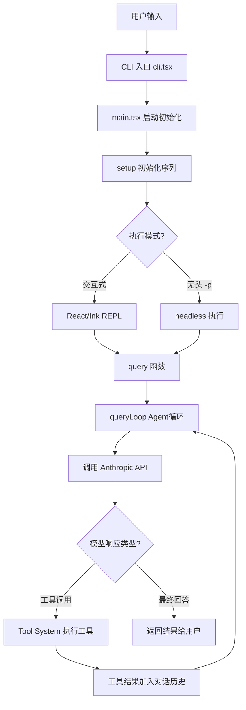
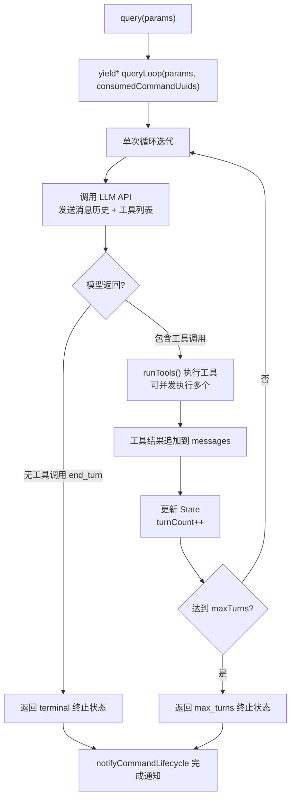
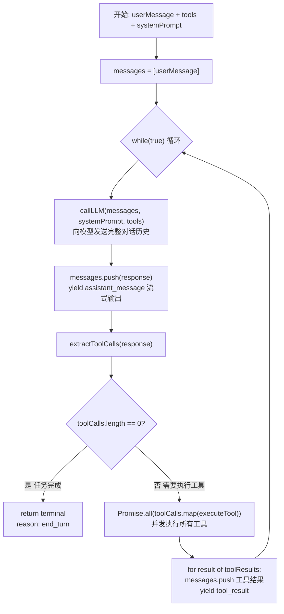
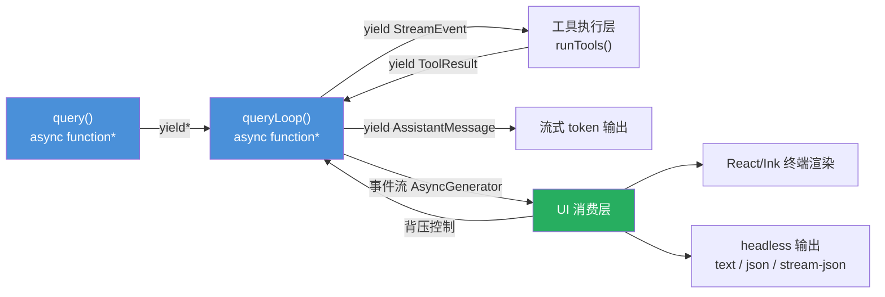
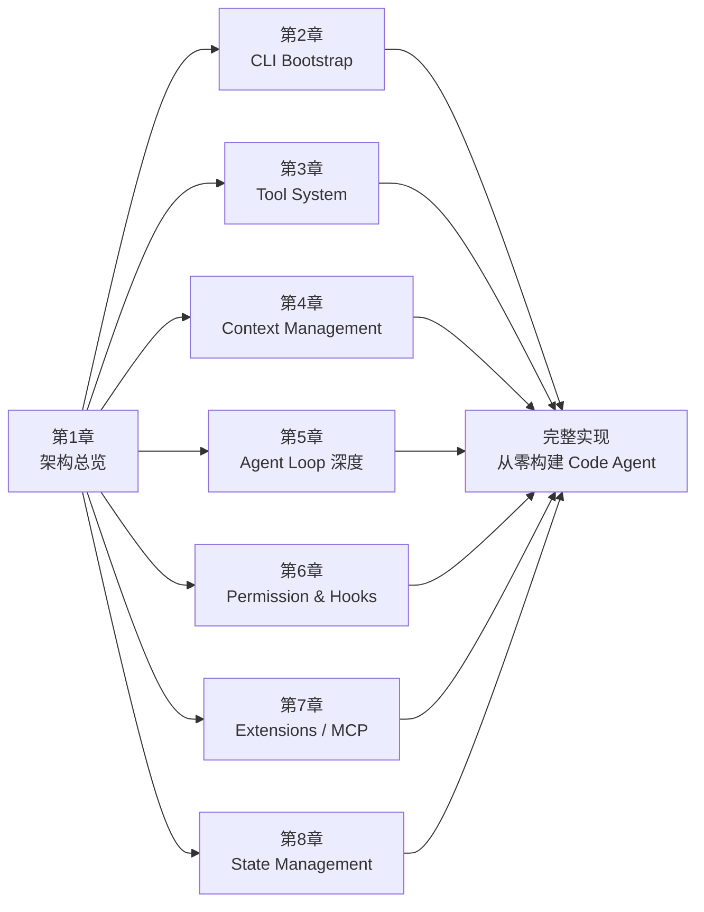

# 第一章：全局架构鸟瞰——什么是 Code Agent？

> 本系列基于 Claude Code v2.1.88 源码（`@anthropic-ai/claude-code`）进行分析，所有代码示例均来自真实源文件。

---

## 你的 IDE 如果会"思考"，会是什么样子？

2023 年之前，我们能想象到的最好的编程辅助工具，是一个聪明的自动补全——它能猜出你下一行要写什么。

2024 年，Copilot 出现了，它能写完整的函数。我们觉得已经很厉害了。

然后 Claude Code 出现了。

你敲下一句话："帮我把这个 REST API 重构成 GraphQL，顺便把测试也补上。"

然后你去倒了杯咖啡。

回来之后，它已经读了你的代码库，修改了十几个文件，跑了测试，发现有两个用例失败，自己修好了，然后在终端里等你 review。

这就是 **Code Agent**。



---

## Chatbot、Copilot 和 Agent：三种不同的东西

很多人把这三个概念混用，但它们在架构上截然不同。

**Chatbot**（如早期的 ChatGPT）是一问一答的模式。你发一条消息，模型回复一条消息，然后结束。它没有能力主动做任何事，只能生成文字。

**Copilot**（如 GitHub Copilot）是嵌入在 IDE 里的补全工具。它感知你当前的上下文（打开的文件、光标位置），但本质上还是"被动"的——你写代码，它提建议，决定权在你手里。

**Code Agent** 是另一个层次。它能够：

- **主动调用工具**：读文件、写文件、执行命令、搜索代码
- **多轮迭代**：根据工具返回的结果，继续思考，再次调用工具
- **自主决策**：在一定权限范围内，自己判断下一步该做什么
- **处理错误**：测试失败了？自己修；命令报错了？分析原因重试

> 一句话概括：Chatbot 是嘴，Copilot 是手，Agent 是一个会思考、会行动、会反思的协作者。

---

## Claude Code 的设计哲学：工具调用循环

Claude Code 的核心思想可以用一句话概括：**让 LLM 在一个工具调用的循环里不断迭代，直到任务完成。**

这个循环的逻辑极其简单：

1. 把用户的问题和当前上下文发给模型
2. 模型要么返回最终答案，要么说"我需要调用某个工具"
3. 如果需要调用工具，就执行这个工具，把结果加入对话历史
4. 回到步骤 1，继续循环
5. 直到模型认为任务完成，返回最终答案

这个模式有个正式名字：**ReAct（Reasoning + Acting）**。但 Claude Code 的实现远比教科书上的例子复杂——它需要处理流式输出、权限控制、上下文压缩、并发工具调用、错误恢复……

我们来看看这个循环在真实源码里长什么样。

---

## 从源码看：`query()` 函数是循环的心脏

在 `src/query.ts` 里，有一个叫 `query()` 的函数，它是整个 Agent 循环的入口：

```typescript
// src/query.ts（简化版）
export async function* query(
  params: QueryParams,
): AsyncGenerator<StreamEvent | RequestStartEvent | Message | ...> {
  const consumedCommandUuids: string[] = []
  const terminal = yield* queryLoop(params, consumedCommandUuids)
  // 循环结束后，通知所有已消费的命令生命周期完成
  for (const uuid of consumedCommandUuids) {
    notifyCommandLifecycle(uuid, 'completed')
  }
  return terminal
}
```

注意这个函数签名：它是一个 `async function*`，也就是**异步生成器函数**。

这意味着它不是一次性返回结果，而是通过 `yield` 不断地"吐出"事件流——每一条消息、每一个工具调用结果、每一个流式 token，都会即时地传递给调用方。

这是 Claude Code 架构中最核心的设计决策之一，我们稍后会详细讲。

真正的循环逻辑在 `queryLoop()` 里，它维护着一个 `State` 对象：

```typescript
// src/query.ts
type State = {
  messages: Message[]           // 完整对话历史
  toolUseContext: ToolUseContext // 工具执行上下文
  autoCompactTracking: AutoCompactTrackingState | undefined  // 上下文压缩状态
  maxOutputTokensRecoveryCount: number  // 恢复重试计数
  turnCount: number             // 当前轮次
  transition: Continue | undefined      // 上一次迭代的继续原因
  // ... 其他状态
}
```

每一次循环迭代，`State` 都会被更新——新的消息加入历史，工具结果被记录，直到达到终止条件（模型不再调用工具，或者达到 `maxTurns` 上限）。



---

## Tool 系统：Agent 的"手脚"

没有工具，Agent 什么都做不了。工具是 Agent 与外部世界交互的唯一接口。

在 `src/Tool.ts` 里，定义了工具的基础类型结构：

```typescript
// src/Tool.ts（节选）
export type ToolInputJSONSchema = {
  [x: string]: unknown
  type: 'object'
  properties?: {
    [x: string]: unknown
  }
}
```

每个工具都遵循 Anthropic 的 tool-use API 规范，本质上是一个 JSON Schema 描述的接口：你告诉模型"这个工具能做什么、需要什么参数"，模型决定是否调用、传什么参数，然后你执行并把结果还给模型。

Claude Code 内置了大量工具，覆盖开发的全流程：

| 工具类别 | 典型工具 | 用途 |
|---------|---------|------|
| 文件操作 | `Read`, `Write`, `Edit` | 读写修改代码文件 |
| Shell 执行 | `Bash` | 运行终端命令、测试、构建 |
| 代码智能 | `GlobTool`, `GrepTool` | 搜索文件和代码内容 |
| Web 访问 | `WebSearch`, `WebFetch` | 查文档、搜资料 |
| 子 Agent | `AgentTool` | 创建子 Agent 处理子任务 |
| MCP | `MCPTool` | 接入外部 MCP 服务器 |

工具调用的并发也是 Claude Code 的一个亮点。当模型在一轮中返回多个工具调用时，`toolOrchestration.ts` 里的 `runTools()` 可以并行执行它们，显著提升效率。

---

## 高层架构图：七大子系统

下面是 Claude Code 整体架构的示意图。请把它理解为一张"地图"，后续每一章都会深入其中的某个区域。

```
┌─────────────────────────────────────────────────────────────┐
│                     Claude Code 架构                         │
│                                                             │
│  ┌──────────────┐    ┌─────────────────────────────────┐   │
│  │  CLI & 启动  │───>│           Agent Loop             │   │
│  │  (main.tsx)  │    │   ┌─────────────────────────┐   │   │
│  └──────────────┘    │   │  query() / queryLoop()  │   │   │
│                      │   │  (query.ts)             │   │   │
│  ┌──────────────┐    │   └────────────┬────────────┘   │   │
│  │  上下文管理  │───>│                │                 │   │
│  │  (context.ts)│    │   ┌────────────▼────────────┐   │   │
│  └──────────────┘    │   │      Tool System        │   │   │
│                      │   │  (tools/ + Tool.ts)     │   │   │
│  ┌──────────────┐    │   └────────────┬────────────┘   │   │
│  │  权限 & Hooks│<───│                │                 │   │
│  │  (hooks/)    │    │   ┌────────────▼────────────┐   │   │
│  └──────────────┘    │   │   Anthropic API / LLM   │   │   │
│                      │   │   (services/api/)       │   │   │
│  ┌──────────────┐    │   └─────────────────────────┘   │   │
│  │  扩展系统    │<───│                                 │   │
│  │  Skills/MCP  │    └─────────────────────────────────┘   │
│  └──────────────┘                                          │
│                                                             │
│  ┌──────────────┐    ┌──────────────────────────────────┐  │
│  │  状态管理    │    │  UI Layer (Ink/React + TUI)       │  │
│  │  (AppState)  │    │  实时流式渲染终端界面              │  │
│  └──────────────┘    └──────────────────────────────────┘  │
└─────────────────────────────────────────────────────────────┘
```

七大子系统，每一个都值得单独一章来讲。

---

## 子系统速览：后续章节的预告

### 子系统一：CLI & Bootstrap（第 2 章）

入口文件 `main.tsx` 的前 100 行代码就说明了一切——**启动速度被当作一等公民**。

```typescript
// src/main.tsx：启动时并行预取，不等待
profileCheckpoint('main_tsx_entry');  // 性能打点：入口
startMdmRawRead();   // 并行读取 MDM 企业配置
startKeychainPrefetch();  // 并行预取 OAuth token 和 API key
```

三件事同时开始，因为等待任何一件都会拖慢冷启动时间。整个 bootstrap 过程包括权限校验、feature flag 初始化、MCP 服务连接、GrowthBook 实验分组……全部以并行为优先。

### 子系统二：Tool System（第 3 章）

工具不只是"函数"。每个工具都有完整的生命周期：权限校验、参数校验、执行、结果序列化、进度报告……

`Tool.ts` 中的类型定义揭示了工具有多复杂：它需要处理 `BashProgress`、`AgentToolProgress`、`MCPProgress` 等多种进度事件类型，还要支持流式工具执行（`StreamingToolExecutor`）。

### 子系统三：Context Management（第 4 章）

如何在有限的 Token 窗口里塞进最有用的上下文？Claude Code 有完整的上下文管理策略：自动压缩（auto-compact）、反应式压缩（reactive compact）、上下文折叠（context collapse），还有基于使用频率的 snip 策略。

`query.ts` 里的 `autoCompactTracking` 状态就是这套机制的运行时体现。

### 子系统四：Agent Loop 深度解析（第 5 章）

`queryLoop()` 里有多少细节？Token budget 追踪、`max_output_tokens` 错误恢复、思考块（thinking block）的特殊规则、任务预算（task budget）的跨压缩边界计算……每一个都是血泪教训的产物。

源码注释里甚至有这样一段话：

```typescript
/**
 * The rules of thinking are lengthy and fortuitous. They require plenty of
 * thinking of most long duration and deep meditation for a wizard to wrap
 * one's noggin around.
 * ...
 * Heed these rules well, young wizard. For they are the rules of thinking,
 * and the rules of thinking are the rules of the universe.
 */
```

### 子系统五：Permission & Hooks（第 6 章）

Claude Code 有一套细粒度的权限系统：`alwaysAllowRules`、`alwaysDenyRules`、`alwaysAskRules`，还有基于工具类型的 `PermissionMode`（`default`、`auto`、`plan` 等）。

Hooks 系统允许在工具调用前后插入自定义逻辑——`PreToolUse`、`PostToolUse`、`PostSampling`……这是 Claude Code 可扩展性的核心机制之一。

### 子系统六：Extensions（第 7 章）

三种扩展方式：**Skills**（本地脚本/markdown 定义的技能）、**Plugins**（bundled 插件系统）、**MCP**（Model Context Protocol，接入外部服务）。

`main.tsx` 启动时会并行预取 MCP 官方注册表 URL：

```typescript
prefetchOfficialMcpUrls()  // 后台预取 MCP 注册表
initBuiltinPlugins()       // 初始化内置插件
initBundledSkills()        // 初始化内置技能
```

### 子系统七：State Management（第 8 章）

`AppState` 是整个应用的状态中枢，与 React/Ink 的 UI 层深度集成。状态如何在多个 Agent 并发运行时保持一致？Swarm 模式下多个子 Agent 如何协调？

---

## 伪代码：30 行理解 Agent 循环本质

在深入细节之前，先用伪代码建立一个直觉模型。这是 `queryLoop()` 的骨架逻辑：

```typescript
async function* agentLoop(userMessage, tools, systemPrompt) {
  const messages = [userMessage]

  while (true) {
    // 1. 把当前消息历史发给 LLM
    const response = await callLLM({
      messages,
      systemPrompt,
      tools,       // 告诉模型有哪些工具可用
    })

    // 2. 把模型的回复加入历史
    messages.push(response)

    // 3. 流式输出模型的思考过程
    yield { type: 'assistant_message', content: response }

    // 4. 检查模型是否调用了工具
    const toolCalls = extractToolCalls(response)

    if (toolCalls.length === 0) {
      // 模型没有调用工具 → 任务完成，退出循环
      return { type: 'terminal', reason: 'end_turn' }
    }

    // 5. 执行所有工具调用（可并发）
    const toolResults = await Promise.all(
      toolCalls.map(call => executeTool(call, tools))
    )

    // 6. 把工具结果加入消息历史
    for (const result of toolResults) {
      messages.push({ role: 'user', type: 'tool_result', ...result })
      yield { type: 'tool_result', ...result }
    }

    // 7. 回到循环顶部，让模型根据工具结果继续思考
  }
}
```

这就是核心。真实的 `queryLoop()` 在这个骨架上叠加了：错误处理、token 计数、权限检查、上下文压缩、流式恢复、并发控制……但本质逻辑从未改变。



---

## 这个架构有什么特别之处？

### 异步生成器无处不在

Claude Code 的整个数据流基于 `AsyncGenerator`。从 `query()` 到工具执行，再到 UI 渲染，全都是生成器链。

```typescript
// query() 是生成器，它 yield* queryLoop()，queryLoop 又 yield* 各种子流
export async function* query(...): AsyncGenerator<StreamEvent | Message | ...> {
  yield* queryLoop(...)
}
```

这个设计的好处是：**背压（backpressure）天然存在**。下游消费者没准备好，上游就不会生产。Terminal UI 来不及渲染，数据流自然暂停。这比回调或 Promise 链要干净得多。

### 流式优先，而非事后流式

很多系统是先把结果算好，再"假装"流式输出。Claude Code 是真正的流式优先——API 响应的每一个 token 都会即时通过生成器传递给 UI，`StreamingToolExecutor` 甚至支持工具执行过程中的实时进度更新。

### 并发但有序

多个工具可以并发执行，但消息历史的追加必须有序。这个"并发执行 + 有序归约"的模式在 `toolOrchestration.ts` 里有精心设计的实现，是整个系统吞吐量的关键。

### Feature Flag 驱动的渐进演进

注意 `query.ts` 里大量的 `feature('XXX')` 判断：

```typescript
const reactiveCompact = feature('REACTIVE_COMPACT') ? require(...) : null
const contextCollapse = feature('CONTEXT_COLLAPSE') ? require(...) : null
const snipModule = feature('HISTORY_SNIP') ? require(...) : null
```

新功能通过 feature flag 灰度上线，不影响主路径稳定性。这是一个在高速迭代中保持质量的工程实践。



---

## `QueryParams`：一次调用携带的信息量

看看发起一次 Agent 循环需要传递什么参数：

```typescript
// src/query.ts
export type QueryParams = {
  messages: Message[]            // 完整对话历史
  systemPrompt: SystemPrompt     // 系统提示词
  userContext: { [k: string]: string }   // 用户环境变量
  systemContext: { [k: string]: string } // 系统环境变量
  canUseTool: CanUseToolFn       // 工具权限检查函数
  toolUseContext: ToolUseContext  // 工具执行上下文（权限规则等）
  fallbackModel?: string         // 备用模型（主模型失败时）
  querySource: QuerySource       // 调用来源（CLI/SDK/API...）
  maxOutputTokensOverride?: number  // Token 上限覆盖
  maxTurns?: number              // 最大迭代轮次
  taskBudget?: { total: number } // 任务预算（Token 总量控制）
  deps?: QueryDeps               // 依赖注入（方便测试替换）
}
```

这个类型签名本身就是一份架构文档——它告诉你一次 Agent 运行需要知道哪些事情：历史、权限、预算、来源、备用方案。

---

## 这个系列要构建什么？

理解 Claude Code 的架构，不是为了膜拜，而是为了**真正掌握构建 Code Agent 的能力**。

这个系列的目标：读完之后，你能从零设计并实现一个具备以下能力的 Code Agent：

- 解析用户意图，规划多步行动
- 调用文件读写、命令执行等工具
- 处理工具失败和错误恢复
- 管理上下文窗口，避免 Token 溢出
- 支持流式输出和实时进度反馈
- 通过 MCP 接入外部服务

接下来的章节里，我们会逐一拆解七大子系统，每一章都会有**真实源码分析 + 可运行的最小实现**。



---

第一章到这里就结束了。

你现在知道 Code Agent 是什么、为什么工具调用循环是核心、以及 Claude Code 用异步生成器构建了一个怎样精妙的数据流管道。

但这只是地图。真正的探险从下一章开始——我们将进入 `main.tsx`，看看一个 CLI 工具如何在 135 毫秒内完成从 "用户敲下回车" 到 "Agent 准备就绪" 的全部初始化工作。

**如果你曾经好奇：为什么 Claude Code 的启动速度这么快，即便它背后有这么多复杂的初始化逻辑——答案就藏在那 100 行代码里。**

---

*本章涉及的核心文件：*
- *`src/src/main.tsx`：CLI 入口和启动逻辑*
- *`src/src/query.ts`：Agent 循环核心*
- *`src/src/Tool.ts`：工具类型定义*
- *`package/package.json`：版本 v2.1.88，`@anthropic-ai/claude-code`*
