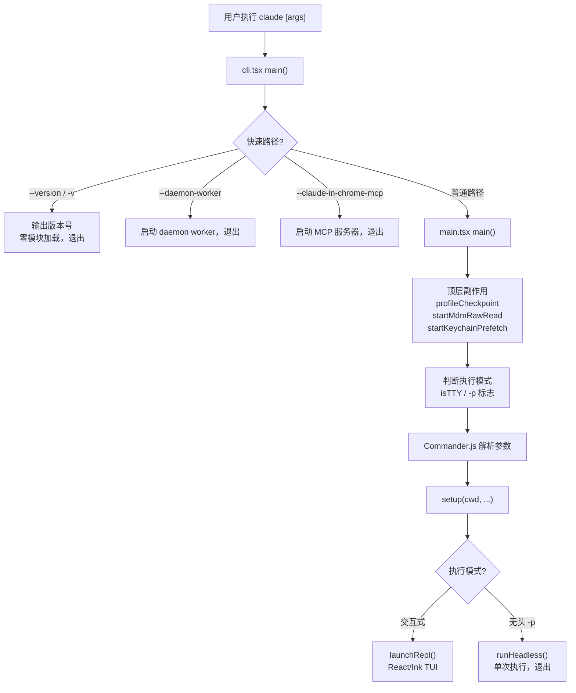
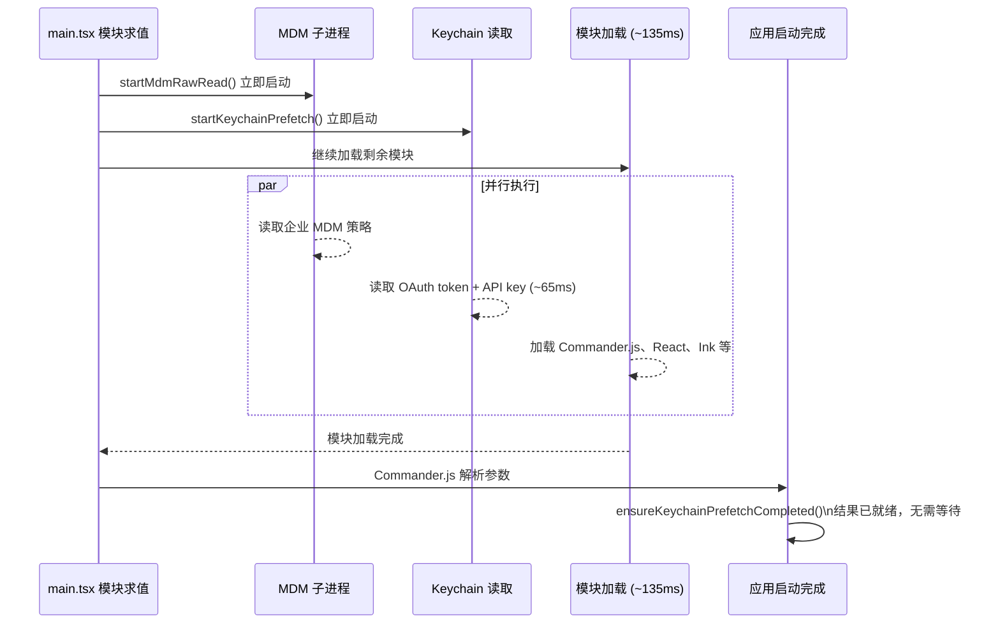
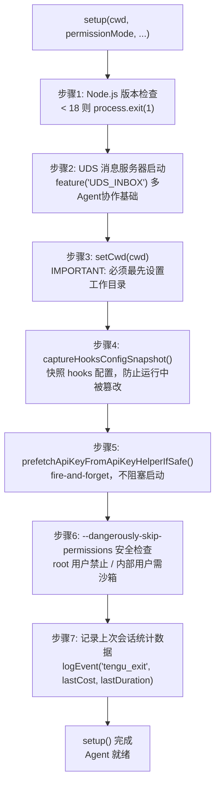
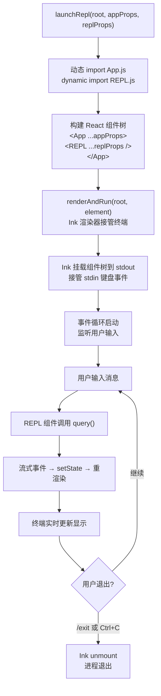
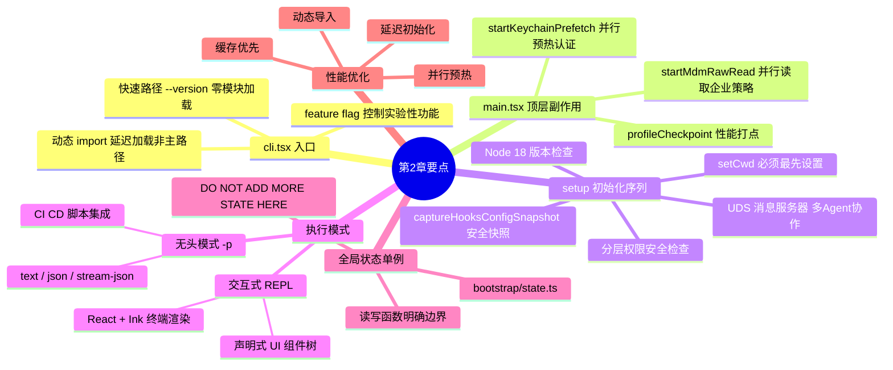

# 第二章：CLI 入口与启动流程——Agent 的第一次呼吸

> 每一个伟大的旅程，都从一个命令开始。对 Claude Code 而言，那个命令就是 `claude`。

当你在终端敲下这四个字母并按下回车，一场精心设计的初始化序列悄然展开。在你看到第一行输出之前，代码已经完成了十几项工作：检查运行环境、解析参数、预热缓存、初始化状态……这一章，我们将这个过程拆开来看，理解一个 Code Agent 是如何从零开始"醒来"的。



---

## 2.1 入口点：一切从 `cli.tsx` 开始

Claude Code 的真正入口并不是 `main.tsx`，而是 `src/entrypoints/cli.tsx`。这个文件短小精悍，却蕴含一个重要的设计决策：**零依赖快速路径**。

```typescript
// cli.tsx - 第 33-42 行
async function main(): Promise<void> {
  const args = process.argv.slice(2);

  // Fast-path for --version/-v: zero module loading needed
  if (args.length === 1 && (args[0] === '--version' || args[0] === '-v' || args[0] === '-V')) {
    // MACRO.VERSION is inlined at build time
    console.log(`${MACRO.VERSION} (Claude Code)`);
    return;
  }
  // ...
}
```

注意这里对 `--version` 的处理：**没有任何 `import`，没有任何模块加载**，`MACRO.VERSION` 是在构建时由 Bun 直接内联到字节码里的宏。这意味着 `claude --version` 的响应时间接近于零——不需要初始化 Commander.js，不需要加载配置文件，不需要启动任何异步任务。

这不是偶然的优化，而是一种工程哲学：**用户体验中的快速路径值得专门对待**。

---

## 2.2 快速路径的设计哲学

`cli.tsx` 里有一系列这样的快速路径分支，每一个都有清晰的注释说明为什么要提前处理：

```typescript
// cli.tsx - 快速路径集合（精简版）

// 1. --version: 零模块加载
if (args[0] === '--version') { /* 直接输出版本号，return */ }

// 2. 内部 MCP 服务器
if (process.argv[2] === '--claude-in-chrome-mcp') {
  const { runClaudeInChromeMcpServer } = await import('../utils/claudeInChrome/mcpServer.js');
  await runClaudeInChromeMcpServer();
  return;
}

// 3. Daemon worker（被 supervisor 进程派生）
if (feature('DAEMON') && args[0] === '--daemon-worker') {
  const { runDaemonWorker } = await import('../daemon/workerRegistry.js');
  await runDaemonWorker(args[1]);
  return;
}

// 4. 后台会话管理（ps/logs/attach/kill）
if (feature('BG_SESSIONS') && (args[0] === 'ps' || /* ... */)) {
  // 只加载 bg.js，不加载整个 CLI
}
```

这些分支有一个共同特点：**用动态 `import()` 替代顶层静态导入**。对于只在特定条件下执行的代码路径，延迟加载可以避免在普通交互场景中承担不必要的模块求值开销。

> **洞察**：CLI 工具的启动延迟是用户体验的重要指标。Claude Code 在 `cli.tsx` 层面就做了大量工作来确保非主路径不拖累主路径。在你构建自己的 Agent CLI 时，这个模式值得借鉴。

---

## 2.3 进入主战场：`main.tsx` 与 Commander.js

通过了快速路径的筛选之后，控制流进入 `main.tsx`。这个文件是整个 Claude Code 的核心启动逻辑所在，有将近 4000 行代码。

`main.tsx` 的顶部做了三件必须最先完成的事情：

```typescript
// main.tsx - 第 9-20 行（顶层副作用，注释解释了为什么这么做）
import { profileCheckpoint, profileReport } from './utils/startupProfiler.js';
profileCheckpoint('main_tsx_entry');  // 标记模块求值开始时间

import { startMdmRawRead } from './utils/settings/mdm/rawRead.js';
startMdmRawRead();  // 立即启动 MDM 子进程（macOS 企业策略读取），让它在后台并行执行

import { ensureKeychainPrefetchCompleted, startKeychainPrefetch } from './utils/secureStorage/keychainPrefetch.js';
startKeychainPrefetch();  // 立即启动 macOS Keychain 读取（OAuth token + API key），并行预热
```

这三行是在模块求值阶段（即所有 `import` 执行完之前）就开始运行的**顶层副作用**。代码注释非常直白地解释了原因：keychain 读取是同步阻塞的，串行执行会增加约 65ms 的启动延迟，提前并行化可以把这个时间隐藏在后续 135ms 的模块加载过程中。

这种"**把等待时间与工作时间重叠**"的思路，贯穿了整个启动流程。



---

## 2.4 CLI 参数解析：Commander.js 的注册表

`main.tsx` 使用 **Commander.js**（`@commander-js/extra-typings` 版本，带完整 TypeScript 类型）来定义和解析命令行参数。核心命令的定义大约在文件的 968 行：

```typescript
// main.tsx - 第 968-1006 行（精简展示核心选项）
program
  .name('claude')
  .description('Claude Code - starts an interactive session by default, use -p/--print for non-interactive output')
  .argument('[prompt]', 'Your prompt', String)
  .helpOption('-h, --help', 'Display help for command')

  // 调试模式
  .option('-d, --debug [filter]', 'Enable debug mode with optional category filtering')
  .option('--verbose', 'Override verbose mode setting from config', () => true)

  // 核心执行模式
  .option('-p, --print', 'Print response and exit (useful for pipes)...', () => true)
  .option('--bare', 'Minimal mode: skip hooks, LSP, plugin sync...', () => true)

  // 输出格式
  .addOption(new Option('--output-format <format>', 'Output format (only works with --print)')
    .choices(['text', 'json', 'stream-json']))
  .addOption(new Option('--input-format <format>', 'Input format (only works with --print)')
    .choices(['text', 'stream-json']))

  // 权限控制
  .option('--dangerously-skip-permissions', 'Bypass all permission checks...', () => true)
  .addOption(new Option('--permission-mode <mode>', 'Permission mode')
    .choices(PERMISSION_MODES))

  // 会话管理
  .option('-c, --continue', 'Continue the most recent conversation', () => true)
  .option('-r, --resume [value]', 'Resume a conversation by session ID...', value => value || true)
  .option('--session-id <uuid>', 'Use a specific session ID')

  // 模型选择
  .option('--model <model>', `Model for the current session...`)
  .addOption(new Option('--effort <level>', 'Effort level (low, medium, high, max)').argParser(...))

  // 工具控制
  .option('--allowed-tools <tools...>', '...')
  .option('--disallowed-tools <tools...>', '...')
  .option('--mcp-config <configs...>', '...')

  // 目录与文件
  .option('--add-dir <directories...>', 'Additional directories to allow tool access to')
  .option('--plugin-dir <path>', 'Load plugins from a directory...', collect, [])
```

值得注意的几个细节：

**参数验证在注册时完成**。`--effort` 使用 `.argParser()` 在解析阶段就验证枚举值；`--max-budget-usd` 确保传入正数。这比在业务逻辑中检查参数更早，错误信息更清晰。

**`--bare` 模式**是一个重要的"极简模式"开关。一旦设置，会跳过 hooks、LSP、插件同步、自动内存、后台预取、keychain 读取、CLAUDE.md 自动发现……几乎所有"锦上添花"的功能都被关闭，只保留核心 AI 调用能力。这对脚本化、CI 场景非常有用。

**隐藏选项**（`.hideHelp()`）用于内部或实验性功能，不在 `--help` 输出中显示，但仍然可以使用。这是一种平衡"用户体验简洁"与"内部灵活性"的常见做法。

---

## 2.5 决定执行模式：交互式还是无头？

在解析参数后，程序需要尽早判断自己处于哪种执行模式。这个判断在 `main.tsx` 约第 800 行：

```typescript
// main.tsx - 第 800-812 行
const cliArgs = process.argv.slice(2);
const hasPrintFlag = cliArgs.includes('-p') || cliArgs.includes('--print');
const hasInitOnlyFlag = cliArgs.includes('--init-only');
const hasSdkUrl = cliArgs.some(arg => arg.startsWith('--sdk-url'));
const isNonInteractive = hasPrintFlag || hasInitOnlyFlag || hasSdkUrl || !process.stdout.isTTY;

if (isNonInteractive) {
  stopCapturingEarlyInput();
}

const isInteractive = !isNonInteractive;
setIsInteractive(isInteractive);
```

这里有一个有趣的点：**`!process.stdout.isTTY`**。即使用户没有传 `-p`，如果标准输出不是一个终端（比如被重定向到文件，或者在 CI 环境中），程序也会自动切换到非交互模式。这种对管道友好的设计让 Claude Code 可以无缝集成到 shell 脚本中。

两种模式的行为差异是显著的：

| 特性 | 交互式 REPL | 无头模式（`-p`）|
|------|------------|----------------|
| 信任对话框 | 必须接受 | 跳过（隐含信任） |
| UI 渲染 | React/Ink TUI | 无 |
| 输出格式 | 终端彩色输出 | text/json/stream-json |
| 会话持久化 | 默认启用 | 可通过 `--no-session-persistence` 关闭 |
| stdin 读取 | 键盘输入 | 管道数据 |

---

## 2.6 `setup()` 函数：Agent 真正的初始化仪式

在 Commander.js 解析完参数、触发 `.action()` 回调之后，第一个重要的异步操作就是调用 `setup()`。这个函数定义在 `src/setup.ts`，是 Agent 启动过程中最关键的初始化序列。

```typescript
// setup.ts - 函数签名
export async function setup(
  cwd: string,
  permissionMode: PermissionMode,
  allowDangerouslySkipPermissions: boolean,
  worktreeEnabled: boolean,
  worktreeName: string | undefined,
  tmuxEnabled: boolean,
  customSessionId?: string | null,
  worktreePRNumber?: number,
  messagingSocketPath?: string,
): Promise<void>
```

`setup()` 内部按照严格的顺序执行以下步骤：

### 步骤 1：Node.js 版本检查

```typescript
// setup.ts - 第 70-79 行
const nodeVersion = process.version.match(/^v(\d+)\./)?.[1];
if (!nodeVersion || parseInt(nodeVersion) < 18) {
  console.error(chalk.bold.red(
    'Error: Claude Code requires Node.js version 18 or higher.',
  ));
  process.exit(1);
}
```

这是最早的硬性检查。Node 18 是 Claude Code 的最低版本要求，因为它依赖了 Node 18 才引入的 `fetch` API 和 ES 模块增强。

### 步骤 2：UDS 消息服务器启动

```typescript
// setup.ts - 第 89-102 行
if (!isBareMode() || messagingSocketPath !== undefined) {
  if (feature('UDS_INBOX')) {
    const m = await import('./utils/udsMessaging.js');
    await m.startUdsMessaging(
      messagingSocketPath ?? m.getDefaultUdsSocketPath(),
      { isExplicit: messagingSocketPath !== undefined },
    );
  }
}
```

Unix Domain Socket（UDS）消息服务器是 Claude Code 多 Agent 协作（"swarm"）功能的基础设施。它在 `setup()` 阶段就必须启动，原因注释写得很清楚：`SessionStart` hook 可能会派生子进程并快照 `process.env`，而这个 socket 的路径需要在那之前就写入环境变量。**顺序在这里是正确性的保证**，而不只是性能优化。

### 步骤 3：设置工作目录

```typescript
// setup.ts - 第 161 行
// IMPORTANT: setCwd() must be called before any other code that depends on the cwd
setCwd(cwd);
```

注释中的 `IMPORTANT` 是认真的。`setCwd()` 把当前工作目录写入全局状态，几乎所有后续操作——从加载配置文件到解析工具路径——都依赖这个值。

### 步骤 4：Hooks 配置快照

```typescript
// setup.ts - 第 165-169 行
// IMPORTANT: Must be called AFTER setCwd() so hooks are loaded from the correct directory
const hooksStart = Date.now();
captureHooksConfigSnapshot();
logForDiagnosticsNoPII('info', 'setup_hooks_captured', {
  duration_ms: Date.now() - hooksStart,
});
```

**Hooks 配置快照**是一个防御性机制。Claude Code 支持在 `.claude/settings.json` 中配置 hooks（在特定事件触发时执行的脚本）。如果在会话过程中配置文件被修改，为了避免"隐式 hook 修改"带来的安全问题，系统在启动时就拍了一个快照，后续使用快照而不是实时读取配置。

### 步骤 5：API Key 预取

```typescript
// setup.ts - 第 380 行
void prefetchApiKeyFromApiKeyHelperIfSafe(getIsNonInteractiveSession());
```

`void` 前缀意味着这是"fire-and-forget"：发起请求，不等待结果。结果会在需要时自动从缓存读取。这把网络 I/O 的等待时间隐藏在用户阅读欢迎界面、输入第一条消息的过程中。

### 步骤 6：`--dangerously-skip-permissions` 安全检查

```typescript
// setup.ts - 第 396-441 行
if (permissionMode === 'bypassPermissions' || allowDangerouslySkipPermissions) {
  // 禁止 root/sudo 用户使用此选项（沙箱除外）
  if (process.platform !== 'win32' && process.getuid() === 0 && process.env.IS_SANDBOX !== '1') {
    console.error('--dangerously-skip-permissions cannot be used with root/sudo...');
    process.exit(1);
  }
  // 内部用户必须在 Docker/沙箱且无互联网访问
  if (process.env.USER_TYPE === 'ant' && /* ... */) {
    const [isDocker, hasInternet] = await Promise.all([
      envDynamic.getIsDocker(),
      env.hasInternetAccess(),
    ]);
    if (!isSandboxed || hasInternet) {
      console.error('--dangerously-skip-permissions can only be used in Docker/sandbox...');
      process.exit(1);
    }
  }
}
```

这个检查的逻辑体现了**分层安全模型**：外部用户不能以 root 身份绕过权限；内部用户（Anthropic 员工）必须在无网络的容器环境中才能使用。权限越大，限制越严。

### 步骤 7：记录上一次会话的统计数据

```typescript
// setup.ts - 第 449-476 行
const projectConfig = getCurrentProjectConfig();
if (projectConfig.lastCost !== undefined && projectConfig.lastDuration !== undefined) {
  logEvent('tengu_exit', {
    last_session_cost: projectConfig.lastCost,
    last_session_duration: projectConfig.lastDuration,
    last_session_total_input_tokens: projectConfig.lastTotalInputTokens,
    // ...
  });
}
```

在新会话开始时记录上一次会话的退出数据——这是个聪明的设计。上一次会话退出时可能来不及上报，或者进程被强制终止。下次启动时补报，既保证了数据完整性，又不会因为"关闭时的上报"影响退出速度。



---

## 2.7 全局状态的单例模式：`bootstrap/state.ts`

Claude Code 使用一个集中的**全局状态单例**来跨模块共享运行时信息。这个状态定义在 `src/bootstrap/state.ts`：

```typescript
// bootstrap/state.ts - State 类型定义（精简版）
type State = {
  originalCwd: string        // 启动时的工作目录（不可变）
  projectRoot: string        // 项目根目录（--worktree 可以改变它）
  totalCostUSD: number       // 本次会话的 API 花费
  totalAPIDuration: number   // API 调用总耗时
  cwd: string                // 当前工作目录（可变）
  sessionId: SessionId       // 会话唯一标识符
  isInteractive: boolean     // 是否是交互模式
  initialMainLoopModel: ModelSetting  // 启动时选定的模型
  // ... 还有数十个字段
}
```

文件顶部有一条明确的约束注释：

```typescript
// DO NOT ADD MORE STATE HERE - BE JUDICIOUS WITH GLOBAL STATE
```

这不是客气话。全局状态是架构腐化的温床——一旦养成"往全局丢状态"的习惯，代码很快就会变得难以测试、难以推理。Claude Code 的团队用注释明确表达了这种约束意识。

状态初始化的核心逻辑展示了一个微妙的细节：

```typescript
// bootstrap/state.ts - getInitialState() 第 260-280 行
function getInitialState(): State {
  let resolvedCwd = '';
  if (typeof process !== 'undefined' && typeof realpathSync === 'function') {
    const rawCwd = cwd();
    try {
      resolvedCwd = realpathSync(rawCwd).normalize('NFC');
    } catch {
      // File Provider EPERM on CloudStorage mounts (lstat per path component)
      resolvedCwd = rawCwd.normalize('NFC');
    }
  }
  // ...
}
```

`realpathSync` 解析符号链接，`.normalize('NFC')` 处理 Unicode 字符的规范化形式——这是 macOS 文件系统的特殊性（它使用 NFD 存储路径，但比较时是 NFC）。在 iCloud Drive 或 CloudStorage 挂载点上，`lstat` 可能会失败，所以有 try/catch 降级处理。这些细节都不起眼，但每一个都是真实 bug 的补丁。

> **洞察**：全局状态是 Agent 系统中不可避免的组件，但要为它设立明确的边界。Claude Code 的做法是：一个文件、一个类型、明确的读写函数，并用注释禁止随意扩展。

---

## 2.8 REPL 的启动：React 渲染到终端

如果是交互模式，最终会走到 REPL 的渲染路径。这里发生了一件有趣的事：**用 React 渲染 UI 到终端**。

这由 [Ink](https://github.com/vadimdemedes/ink) 库实现，它提供了一个针对终端的 React 渲染器。`replLauncher.tsx` 封装了这个过程：

```typescript
// replLauncher.tsx
export async function launchRepl(
  root: Root,
  appProps: AppWrapperProps,
  replProps: REPLProps,
  renderAndRun: (root: Root, element: React.ReactNode) => Promise<void>,
): Promise<void> {
  const { App } = await import('./components/App.js');
  const { REPL } = await import('./screens/REPL.js');

  await renderAndRun(
    root,
    <App {...appProps}>
      <REPL {...replProps} />
    </App>,
  );
}
```

`App` 是应用级别的 Provider 容器（状态、错误边界等），`REPL` 是实际的交互界面。通过 React 的组件树，整个 TUI 可以用声明式的方式描述：输入框是一个组件，消息列表是一个组件，工具调用的进度展示是一个组件。状态变化驱动重渲染，就像 Web 开发一样。

`renderAndRun` 是 Ink 提供的函数，它把这个 React 元素树挂载到终端，接管标准输入输出，并开始事件循环——直到用户输入 `/exit` 或按 Ctrl+C。

从这一刻起，Agent 开始了它真正的生命：**监听输入，调用工具，输出结果，等待下一轮**。



---

## 2.9 无头模式：`-p` 的执行路径

与交互式 REPL 并行的是无头（headless）执行路径，由 `-p`/`--print` 标志触发。在这个模式下，没有 TUI，没有等待用户输入——程序接收一条 prompt，执行，输出结果，退出。

这是将 Claude Code 集成到脚本、CI/CD 流水线或其他工具中的主要方式：

```bash
# 基本用法
claude -p "解释这段代码的功能" < main.py

# 输出 JSON 格式（适合程序解析）
claude -p --output-format json "列出所有 TODO 注释"

# 流式 JSON（适合实时处理）
claude -p --output-format stream-json "重构这个函数" | jq '.content'

# 限制执行轮数（防止无限循环）
claude -p --max-turns 5 "自动修复所有 lint 错误"
```

无头模式跳过了信任对话框（注释中明确写了"只在信任的目录中使用此标志"），减少了大量交互式 UI 的初始化工作，但核心 Agent 逻辑是完全相同的——同样的工具调用、同样的模型请求、同样的会话状态管理。

---

## 2.10 动手实践：构建你自己的最小化 CLI 入口

理解了 Claude Code 的启动流程，我们可以用同样的模式构建一个最小化的 Agent CLI 入口：

```typescript
// my-agent-cli.ts - 最小化示例
import { Command, Option } from 'commander';

// 顶层副作用：尽早启动需要时间的工作
void prefetchApiKey(); // 不等待，让它在后台跑

async function main() {
  const args = process.argv.slice(2);

  // 快速路径：--version 不需要加载任何东西
  if (args[0] === '--version') {
    console.log('my-agent 0.1.0');
    return;
  }

  // 正常路径：加载 CLI 框架
  const program = new Command();

  program
    .name('my-agent')
    .description('My custom code agent')
    .argument('[prompt]', 'Initial prompt')
    .option('-p, --print', 'Non-interactive mode', false)
    .option('--model <model>', 'Model to use', 'claude-sonnet-4-6')
    .addOption(
      new Option('--output-format <format>', 'Output format')
        .choices(['text', 'json'])
        .default('text')
    )
    .action(async (prompt, options) => {
      // 判断执行模式
      const isInteractive = !options.print && process.stdout.isTTY;

      // 初始化全局状态
      initializeState({
        cwd: process.cwd(),
        isInteractive,
        model: options.model,
      });

      // 执行 setup
      await setup(process.cwd());

      if (isInteractive) {
        // 启动 REPL（使用 Ink 渲染 React 组件）
        await launchRepl({ initialPrompt: prompt });
      } else {
        // 无头模式：执行一次，输出结果
        const result = await runHeadless(prompt, options);
        outputResult(result, options.outputFormat);
      }
    });

  await program.parseAsync();
}

main().catch(err => {
  console.error(err);
  process.exit(1);
});
```

这个骨架覆盖了 Claude Code 启动流程的核心结构：

1. **快速路径**在最开始处理
2. **Commander.js** 负责参数声明和解析
3. **执行模式判断**基于 `-p` 标志和 `isTTY`
4. **`setup()`** 在真正执行之前完成初始化
5. **两条分支**：交互式 REPL 或无头执行

```mermaid
graph TD
    A["my-agent-cli.ts 入口"] --> B["顶层副作用\nvoid prefetchApiKey()"]
    A --> C{args[0] == --version?}
    C -->|是| D["输出版本号，return\n零模块加载"]
    C -->|否| E["new Command()\nCommander.js 注册参数"]
    E --> F[".action() 回调触发"]
    F --> G["判断 isInteractive\n!options.print && isTTY"]
    G --> H["initializeState(cwd, model, ...)"]
    H --> I["await setup(cwd)"]
    I --> J{isInteractive?}
    J -->|是| K["launchRepl()\nInk + React TUI"]
    J -->|否| L["runHeadless(prompt)\n单次执行"]
    L --> M["outputResult(result, format)\ntext / json 输出，退出"]
```

---

## 2.11 启动性能的秘密

Claude Code 在启动性能上投入了相当多的工程努力，贯穿整个启动流程的 `profileCheckpoint()` 调用就是证明：

```typescript
profileCheckpoint('cli_entry');
// ... 一些工作 ...
profileCheckpoint('main_tsx_entry');
profileCheckpoint('main_tsx_imports_loaded');
profileCheckpoint('main_client_type_determined');
profileCheckpoint('main_before_run');
// ...
```

这些检查点让团队可以精确测量每个阶段花了多少时间，快速定位启动延迟的来源。当你构建自己的 Agent 时，在早期就建立这样的性能测量基础设施会节省大量调试时间。

几个在代码中能观察到的关键优化策略：

- **动态导入**：只在需要时加载模块，快速路径绕过大部分模块树
- **并行预热**：MDM 读取、keychain 读取、API key 预取同时进行
- **延迟初始化**：不需要在第一次渲染前完成的工作，推迟到 REPL 渲染后
- **缓存优先**：配置、git 状态、系统信息都有缓存层，避免重复计算

```mermaid
flowchart LR
    A["cli_entry\n▶ 0ms"] --> B["main_tsx_entry\n模块求值开始"]
    B --> C["main_tsx_imports_loaded\n~135ms 模块加载完成"]
    C --> D["main_client_type_determined\n执行模式判断"]
    D --> E["main_before_run\nCommander 解析完成"]
    E --> F["setup() 开始\nNode版本/UDS/setCwd"]
    F --> G["hooks_captured\nhooks 快照完成"]
    G --> H["api_key_prefetch\nfire-and-forget 发起"]
    H --> I["setup 完成\nAgent 就绪"]
    I --> J["首次渲染\n用户看到界面"]

    style A fill:#e74c3c,color:#fff
    style J fill:#27ae60,color:#fff
```



---

## 2.12 完整启动链路回顾

至此，我们完整走过了 Claude Code 从命令行到"Agent 醒来"的全部路径：

```
claude [args]
    │
    ▼
cli.tsx::main()
    ├── --version / -v      → 输出版本号，退出（零模块加载）
    ├── --daemon-worker     → 启动 daemon worker，退出
    ├── remote-control      → 启动 bridge 模式，退出
    └── [普通路径]
            │
            ▼
        main.tsx::main()
            ├── 顶层副作用：profileCheckpoint / startMdmRawRead / startKeychainPrefetch
            ├── 判断执行模式（interactive vs non-interactive）
            ├── Commander.js 解析参数
            └── .action() 回调
                    │
                    ▼
                setup(cwd, ...)
                    ├── Node.js 版本检查
                    ├── UDS 消息服务器启动
                    ├── setCwd() 设置工作目录
                    ├── captureHooksConfigSnapshot()
                    ├── API key 预取（fire-and-forget）
                    ├── 权限安全检查
                    └── 上一次会话数据上报
                            │
                            ▼
                    ┌───────┴───────┐
                    │               │
              交互式 REPL       无头模式 (-p)
                    │               │
              launchRepl()    runHeadless()
                    │               │
              React/Ink TUI   单次执行，输出，退出
```

---

## 2.13 Agent 醒来了，然后呢？

Agent 现在处于"就绪"状态：全局状态已初始化，工作目录已确定，API key 已预取，hooks 已快照。无论是交互式等待用户输入，还是无头模式处理传入的 prompt，下一步都是相同的：**构建系统提示、发送 API 请求、处理工具调用、生成输出**。

这正是下一章要深入的内容。在那里，我们将看到 Claude Code 如何把一条用户消息转化成一次完整的 AI 对话轮次——包括系统提示的组装、工具的注册与执行、以及如何在保持会话状态的同时处理多轮对话。

Agent 已经睁开了眼睛。现在，它要开始思考了。

---

## 本章要点

- **`cli.tsx` 是真正的入口**，专门处理快速路径（`--version` 等），通过动态 `import()` 避免加载不必要的模块
- **`setup()` 函数**是 Agent 初始化的核心，按严格顺序执行：版本检查 → 目录设置 → hooks 快照 → API key 预取 → 权限验证
- **全局状态单例**（`bootstrap/state.ts`）集中管理运行时信息，但附有"不要随意添加状态"的约束
- **两种执行模式**：交互式 REPL（React/Ink 渲染）和无头模式（`-p` 标志），共用同一套初始化逻辑
- **性能优化**贯穿全程：并行预取、动态导入、延迟初始化，把等待时间与有效工作重叠

---

*下一章：[系统提示的构建——Agent 的世界观从哪里来](./03-system-prompt.md)*


