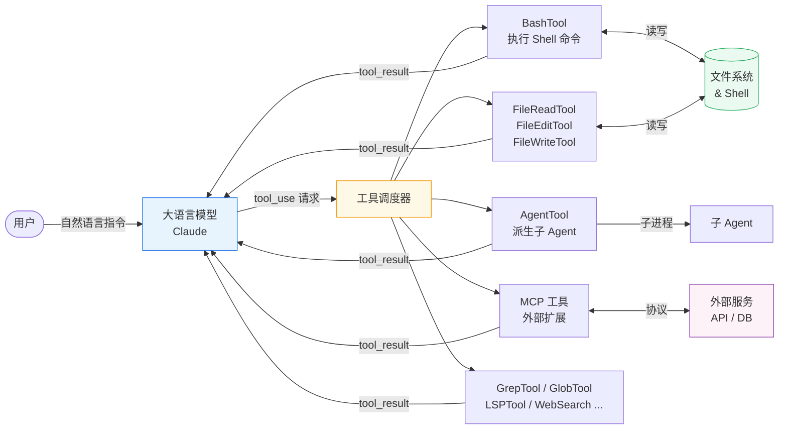
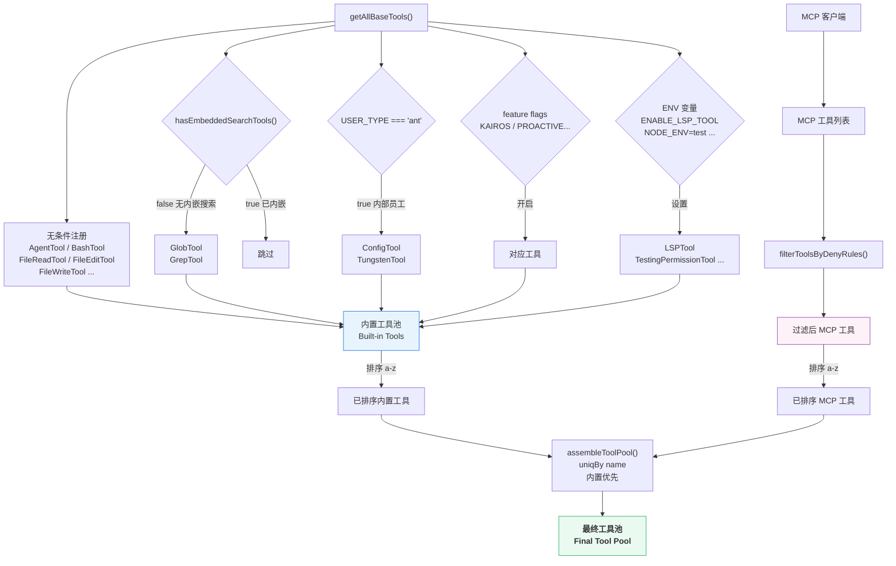
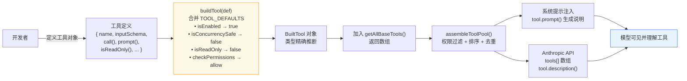
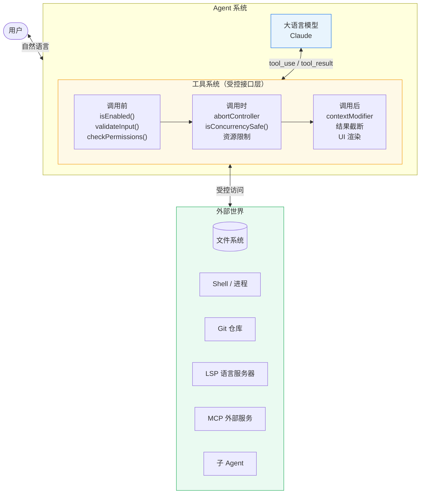

# 第三章：工具系统——赋予 Agent 改变世界的能力

如果说大语言模型是 Agent 的大脑，那工具就是它的手脚。没有工具，模型只能生成文字；有了工具，它可以读写文件、执行命令、搜索代码库，甚至派生出新的子 Agent。Claude Code 的工具系统是整个项目里设计最精细的部分之一，本章将带你从接口定义一路读到具体实现。



---

## 一、从一个问题出发

为什么工具需要一套完整的接口规范，而不是简单地"给模型一个函数调用"？

答案在于生产环境的复杂性。一个工具在真实系统里需要回答至少这些问题：

- 它当前可以被调用吗？（`isEnabled`）
- 调用之前需要用户确认吗？（`checkPermissions`）
- 它会写入磁盘还是只读数据？（`isReadOnly`）
- 多个工具可以同时运行吗？（`isConcurrencySafe`）
- 如何在终端 UI 里渲染它的输入和输出？（`renderToolUseMessage` / `renderToolResultMessage`）
- 模型应该怎么使用它，用哪种语言描述？（`prompt`）

这些问题分散在代码库里处理会是一场噩梦。Claude Code 的做法是把所有这些关切收进一个 `Tool` 类型。

---

## 二、`Tool` 接口：一个工具的完整生命周期

`src/Tool.ts` 里定义的 `Tool` 类型是整个工具系统的核心契约。它不是一个类，而是一个 TypeScript 接口——这个选择本身就很有意思。接口让工具实现可以用纯对象字面量，避免了继承链带来的耦合。

```typescript
export type Tool<
  Input extends AnyObject = AnyObject,
  Output = unknown,
  P extends ToolProgressData = ToolProgressData,
> = {
  readonly name: string
  call(
    args: z.infer<Input>,
    context: ToolUseContext,
    canUseTool: CanUseToolFn,
    parentMessage: AssistantMessage,
    onProgress?: ToolCallProgress<P>,
  ): Promise<ToolResult<Output>>
  checkPermissions(
    input: z.infer<Input>,
    context: ToolUseContext,
  ): Promise<PermissionResult>
  prompt(options: { ... }): Promise<string>
  description(input: z.infer<Input>, options: { ... }): Promise<string>
  isConcurrencySafe(input: z.infer<Input>): boolean
  isReadOnly(input: z.infer<Input>): boolean
  isEnabled(): boolean
  renderToolUseMessage(input: Partial<z.infer<Input>>, options: { ... }): React.ReactNode
  renderToolResultMessage?(content: Output, ...): React.ReactNode
  // ... 还有 20 多个方法
}
```

### 2.1 `call()` — 执行核心

`call()` 是每个工具最重要的方法，它接收五个参数：

- `args`：经过 Zod schema 校验的输入
- `context`：包含整个运行时状态的"上下文背包"（下一节详述）
- `canUseTool`：一个回调，子工具可以调用它来检查自己是否有权限
- `parentMessage`：触发这次工具调用的 AssistantMessage
- `onProgress`：可选的进度回调，用于流式更新 UI

返回值 `ToolResult<Output>` 包含三个字段：

```typescript
export type ToolResult<T> = {
  data: T
  newMessages?: (UserMessage | AssistantMessage | AttachmentMessage | SystemMessage)[]
  contextModifier?: (context: ToolUseContext) => ToolUseContext
}
```

`contextModifier` 是一个巧妙的设计——工具执行完成后可以修改上下文，但只有在它不是并发安全工具时才会生效（注释里明确写着 *contextModifier is only honored for tools that aren't concurrency safe*）。

### 2.2 `checkPermissions()` — 安全闸门

这是工具执行前的权限检查。它返回一个 `PermissionResult`，决定是直接允许、直接拒绝还是弹出用户确认框。

**重点**：`checkPermissions` 只包含工具特定的逻辑。通用的权限逻辑（比如 `--dangerously-skip-permissions` 模式）在 `permissions.ts` 里单独处理。两层分离，职责清晰。

### 2.3 `prompt()` vs `description()` — 两种模型可见文本

这两个方法容易混淆：

- **`prompt()`**：完整的工具使用说明，出现在系统提示里，教模型什么时候用这个工具、怎么用。通常是几百字的详细描述。
- **`description()`**：传给 Anthropic API 的 tool description 字段，出现在 `tools` 数组里，作为工具的简短介绍。

换句话说，`prompt()` 是发给模型的"培训手册"，`description()` 是 API 协议里的"工具签名"。

### 2.4 `isConcurrencySafe()` / `isReadOnly()` — 并发与安全提示

```typescript
isConcurrencySafe(input: z.infer<Input>): boolean
isReadOnly(input: z.infer<Input>): boolean
isDestructive?(input: z.infer<Input>): boolean
```

这三个方法都接收**具体的输入**，而不是静态返回值。这意味着同一个工具，用不同参数调用时可能有不同的安全级别。比如 BashTool 执行 `cat file.txt` 是只读的，执行 `rm -rf /` 则完全不同。

> 工具的安全性是参数相关的，不是工具名相关的。这个设计让权限系统可以做精细化判断。

### 2.5 UI 渲染方法簇

`Tool` 接口里有大量 `render*` 方法，全部返回 `React.ReactNode`。这是 Claude Code 终端 UI 的特殊之处——它直接在 terminal 里渲染 React 组件（基于 Ink）。

| 方法 | 触发时机 |
|------|---------|
| `renderToolUseMessage` | 工具开始执行，输入参数刚流式完成时 |
| `renderToolUseProgressMessage` | 执行过程中，有进度更新时 |
| `renderToolResultMessage` | 执行完成，显示结果时 |
| `renderToolUseRejectedMessage` | 用户拒绝了权限请求时 |
| `renderToolUseErrorMessage` | 工具执行报错时 |
| `renderGroupedToolUse` | 多个同类工具并发时，批量渲染 |

```mermaid
sequenceDiagram
    participant M as 模型 (LLM)
    participant D as 调度器
    participant T as 工具实例
    participant UI as 终端 UI (Ink)
    participant U as 用户

    M->>D: tool_use { name, input (流式) }
    D->>T: isEnabled() → true
    D->>UI: renderToolUseMessage(Partial<Input>)
    Note over UI: 参数尚未完全到达，先渲染已知部分

    D->>T: checkPermissions(input, context)
    alt 需要用户确认
        T-->>U: 弹出权限确认框
        U-->>T: 用户批准 / 拒绝
    else 直接允许
        T-->>D: { behavior: "allow" }
    end

    alt 用户拒绝
        D->>UI: renderToolUseRejectedMessage()
        D-->>M: tool_result { error }
    else 执行工具
        D->>T: call(args, context, canUseTool, parentMsg, onProgress)
        loop 进度更新
            T-->>UI: onProgress() → renderToolUseProgressMessage()
        end
        alt 执行成功
            T-->>D: ToolResult { data, newMessages?, contextModifier? }
            D->>UI: renderToolResultMessage(data)
            D-->>M: tool_result { content }
        else 执行报错
            T-->>D: throw Error
            D->>UI: renderToolUseErrorMessage()
            D-->>M: tool_result { error }
        end
    end
```

注意 `renderToolUseMessage` 接收的是 `Partial<Input>`——因为 UI 会在工具参数**还没完全流式完成**时就开始渲染，这是流式体验的重要细节。



---

## 三、`ToolUseContext`：运行时的"上下文背包"

每次工具调用都会收到一个 `ToolUseContext` 对象。读完它的类型定义，你会意识到这是整个应用运行时状态的集合地：

```typescript
export type ToolUseContext = {
  options: {
    commands: Command[]
    debug: boolean
    mainLoopModel: string
    tools: Tools
    verbose: boolean
    thinkingConfig: ThinkingConfig
    mcpClients: MCPServerConnection[]
    mcpResources: Record<string, ServerResource[]>
    isNonInteractiveSession: boolean
    agentDefinitions: AgentDefinitionsResult
    maxBudgetUsd?: number
    customSystemPrompt?: string
    appendSystemPrompt?: string
    refreshTools?: () => Tools
  }
  abortController: AbortController
  readFileState: FileStateCache
  getAppState(): AppState
  setAppState(f: (prev: AppState) => AppState): void
  setAppStateForTasks?: (f: (prev: AppState) => AppState) => void
  messages: Message[]
  agentId?: AgentId
  agentType?: string
  toolUseId?: string
  // ... 还有很多
}
```

几个值得注意的字段：

**`abortController`**：所有工具共享同一个 abort 信号。用户按 Ctrl+C 时，这个信号会广播给所有正在运行的工具。

**`setAppState` vs `setAppStateForTasks`**：这是一个微妙的设计。对于异步 Agent（在后台运行的子 Agent），`setAppState` 是个 no-op，避免它们在后台偷偷修改主线程的 UI 状态。`setAppStateForTasks` 则是"总能到达根 store 的通道"，用于生命周期比单次 turn 更长的基础设施（比如后台任务注册）。

**`fileReadingLimits` / `globLimits`**：工具级别的资源限制，防止某个工具读入海量数据把上下文窗口撑爆。

**`contentReplacementState`**：工具结果的预算追踪。当工具输出超过阈值时，结果会被持久化到磁盘，模型收到的是一个文件路径预览而非完整内容。

> ToolUseContext 不是一个传参的便利包，而是 Agent 运行时的"世界观"。工具通过它看到当前的权限状态、消息历史、abort 信号、UI 回调——几乎一切。

---

## 四、工具注册表：40+ 工具的组织方式

`src/tools.ts` 是工具的总目录。它的核心函数是 `getAllBaseTools()`。

### 4.1 `getAllBaseTools()` — 条件注册

```typescript
export function getAllBaseTools(): Tools {
  return [
    AgentTool,
    TaskOutputTool,
    BashTool,
    ...(hasEmbeddedSearchTools() ? [] : [GlobTool, GrepTool]),
    FileReadTool,
    FileEditTool,
    FileWriteTool,
    // ...
    ...(process.env.USER_TYPE === 'ant' ? [ConfigTool] : []),
    ...(process.env.USER_TYPE === 'ant' ? [TungstenTool] : []),
    ...(SleepTool ? [SleepTool] : []),
    ...(process.env.NODE_ENV === 'test' ? [TestingPermissionTool] : []),
    // ...
  ]
}
```

工具注册不是平铺直叙的列表，而是充满了条件门控：

- **用户类型门控**：`USER_TYPE === 'ant'` 只对内部员工开放某些工具
- **Feature flag 门控**：`feature('PROACTIVE')`、`feature('KAIROS')` 等，通过 GrowthBook 动态控制
- **环境变量门控**：`process.env.ENABLE_LSP_TOOL`、`process.env.CLAUDE_CODE_VERIFY_PLAN`
- **能力检测门控**：`hasEmbeddedSearchTools()` 检测是否有内嵌的搜索工具（ant 内部构建有 bfs/ugrep 内嵌在 Bun 二进制里）

注意 `GlobTool` 和 `GrepTool` 这个细节：`...(hasEmbeddedSearchTools() ? [] : [GlobTool, GrepTool])`。当内部构建里已经把高速搜索工具嵌入 shell 环境时，独立的 Grep/Glob 工具就是冗余的，直接省掉。

### 4.2 懒加载与循环依赖的处理

有些工具用了懒加载模式：

```typescript
// Lazy require to break circular dependency
const getTeamCreateTool = () =>
  require('./tools/TeamCreateTool/TeamCreateTool.js').TeamCreateTool
const getTeamDeleteTool = () =>
  require('./tools/TeamDeleteTool/TeamDeleteTool.js').TeamDeleteTool
```

这是在处理模块循环依赖——`tools.ts` 引用 `TeamCreateTool`，而 `TeamCreateTool` 的依赖链最终又会引用回 `tools.ts`。用工厂函数延迟 require 是打破这个循环的标准做法。

### 4.3 `assembleToolPool()` — 合并内置与 MCP 工具

```typescript
export function assembleToolPool(
  permissionContext: ToolPermissionContext,
  mcpTools: Tools,
): Tools {
  const builtInTools = getTools(permissionContext)
  const allowedMcpTools = filterToolsByDenyRules(mcpTools, permissionContext)

  const byName = (a: Tool, b: Tool) => a.name.localeCompare(b.name)
  return uniqBy(
    [...builtInTools].sort(byName).concat(allowedMcpTools.sort(byName)),
    'name',
  )
}
```

这个函数做了三件事：

1. 获取经过权限过滤的内置工具
2. 对 MCP 工具也做权限过滤
3. 排序后合并，用 `uniqBy` 去重（内置工具优先）

排序不只是美观问题。注释解释了为什么要把内置工具和 MCP 工具分两段排序而非混合排序：服务端在系统提示里有一个针对内置工具的缓存断点（prompt cache breakpoint）。如果内置工具和 MCP 工具混合排序，每次 MCP 工具列表变化都会插入到内置工具之间，让所有下游缓存失效。保持"内置在前，MCP 在后"的结构，MCP 工具的增减就不会影响内置工具段的缓存命中率。



---

## 五、案例一：BashTool — 安全执行 Shell 命令

BashTool 是 Claude Code 里最复杂的工具之一，光是它的目录里就有 17 个文件。

### 输入 schema

```typescript
const inputSchema = z.object({
  command: z.string().describe('The bash command to run'),
  timeout: z.number().optional().describe('Timeout in milliseconds'),
  description: z.string().optional(),
})
```

### 并发与只读判断

BashTool 的 `isReadOnly` 和 `isConcurrencySafe` 都基于对命令的静态分析。代码里定义了几个命令集合：

```typescript
const BASH_SEARCH_COMMANDS = new Set(['find', 'grep', 'rg', 'ag', 'ack', ...])
const BASH_READ_COMMANDS = new Set(['cat', 'head', 'tail', 'less', 'jq', 'awk', ...])
const BASH_LIST_COMMANDS = new Set(['ls', 'tree', 'du'])
const BASH_SILENT_COMMANDS = new Set(['mv', 'cp', 'rm', 'mkdir', ...])
```

对于管道命令（`cat file | grep pattern`），**所有**片段都必须是只读命令，整体才被判断为只读。只要有一个片段是写入操作，整个命令就升级为写入。

### 权限检查的分层

`bashPermissions.ts` 实现了一套精细的权限匹配机制。用户可以配置规则如 `Bash(git *)` 来允许所有以 `git` 开头的命令。这个匹配逻辑需要：

1. 解析命令为 AST（利用 `parseForSecurity`）
2. 提取命令前缀（`git commit`、`git push` 等）
3. 用通配符规则匹配

除了规则匹配，还有一个 **AI 分类器**（`bashClassifier.ts`）在 auto 模式下运行，用语义理解来判断命令是否安全——纯规则匹配无法覆盖所有情况。

### 后台执行

BashTool 实现了智能的后台化逻辑：

```typescript
// In assistant mode, blocking bash auto-backgrounds after this many ms
const ASSISTANT_BLOCKING_BUDGET_MS = 15_000
```

如果一个 Bash 命令在主 Agent 里运行超过 15 秒，它会自动转入后台，主 Agent 继续处理其他任务。这避免了长时间的编译、测试等命令把整个对话卡住。

```mermaid
flowchart TD
    Input[用户输入命令\ne.g. rm -rf /tmp/foo] --> Parse[parseForSecurity\n解析命令 AST]
    Parse --> Pipes{有管道符?}
    Pipes -->|是| AllParts[拆分所有管道片段\n逐一分析]
    Pipes -->|否| Single[分析单条命令]
    AllParts --> ReadCheck{所有片段\n都是只读命令?}
    Single --> ReadCheck
    ReadCheck -->|是\ncat/grep/ls...| IsReadOnly[标记 isReadOnly=true\nisConcurrencySafe=true]
    ReadCheck -->|否| IsWrite[标记 isReadOnly=false]

    IsReadOnly --> PermCheck[checkPermissions]
    IsWrite --> PermCheck

    PermCheck --> RuleMatch{匹配用户配置规则?\ne.g. Bash(git *)}
    RuleMatch -->|命中规则 allow| Allow[直接执行]
    RuleMatch -->|命中规则 deny| Deny[拒绝执行]
    RuleMatch -->|无匹配规则| AutoMode{auto 模式?}

    AutoMode -->|是| AIClassifier[bashClassifier.ts\nAI 语义分类器]
    AutoMode -->|否| AskUser[弹出确认框\n等待用户决策]

    AIClassifier -->|安全| Allow
    AIClassifier -->|不确定/危险| AskUser

    AskUser -->|用户批准| Allow
    AskUser -->|用户拒绝| Deny

    Allow --> ExecBash[执行命令\n超 15s 自动后台化]
    Deny --> ErrorResult[返回拒绝信息]

    style Allow fill:#eafaf1,stroke:#27ae60
    style Deny fill:#fdedec,stroke:#e74c3c
    style AIClassifier fill:#fef9e7,stroke:#f39c12
```

---

## 六、案例二：FileEditTool — 精准文本替换

FileEditTool 是日常使用频率最高的工具。它的核心操作是**字符串替换**，但工程实现远比"找到 A 换成 B"复杂。

### 输入 schema

```typescript
// from types.ts
export type FileEditInput = {
  file_path: string
  old_string: string
  new_string: string
  replace_all?: boolean
}
```

### `validateInput()` — 执行前校验

FileEditTool 有一个详细的 `validateInput` 实现：

```typescript
async validateInput(input: FileEditInput, toolUseContext: ToolUseContext) {
  const { file_path, old_string, new_string, replace_all = false } = input

  // 拒绝写入团队记忆文件里的 secrets
  const secretError = checkTeamMemSecrets(fullFilePath, new_string)
  if (secretError) {
    return { result: false, message: secretError, errorCode: 0 }
  }

  // old_string 和 new_string 相同时报错
  if (old_string === new_string) { ... }
  // ...
}
```

注意这里有一个安全检查：`checkTeamMemSecrets`。如果编辑操作会把类似密钥的字符串写入团队共享的内存文件，直接拒绝。

### 模糊匹配

代码里有一个 `findActualString` 函数（在 `utils.ts` 里），处理这种情况：模型提供的 `old_string` 和文件里的实际内容有细微差异（比如空白字符、换行风格不同）。它会做模糊匹配来找到最接近的位置。

### diff 展示

每次编辑完成后，FileEditTool 会用 `fetchSingleFileGitDiff` 生成 diff，在 UI 里展示变更内容。这不只是美观需求——它让用户能够在 Agent 编辑文件后立刻看到实际发生了什么，而不是只知道"文件已修改"。

```typescript
const diff = await fetchSingleFileGitDiff(fullFilePath, ...)
// diff 被传给 renderToolResultMessage 显示
```

文件修改还会触发几个副作用：LSP 语言服务器通知（`clearDeliveredDiagnosticsForFile`）、VS Code 同步（`notifyVscodeFileUpdated`）、文件历史追踪（`fileHistoryTrackEdit`）。一次编辑，多个系统联动。

> FileEditTool 不只是改文件，它是一个涉及安全检查、模糊匹配、diff 生成、多系统同步的完整工作流。

---

## 七、案例三：AgentTool — 递归的 Agent 派生

AgentTool 是让 Claude Code 支持多 Agent 协作的关键工具。模型可以调用它来派生一个子 Agent，把任务委托出去。

### 输入 schema 的动态性

AgentTool 的输入 schema 不是静态的，而是根据 feature flag 动态构建：

```typescript
export const inputSchema = lazySchema(() => {
  const schema = feature('KAIROS') ? fullInputSchema() : fullInputSchema().omit({
    cwd: true
  })
  return isBackgroundTasksDisabled || isForkSubagentEnabled() ? schema.omit({
    run_in_background: true
  }) : schema
})
```

`lazySchema` 是一个延迟求值的 schema 包装器，在第一次被访问时才执行工厂函数。这样 feature flag 的状态（通过 GrowthBook 获取）在 schema 构建时已经稳定。

### 子 Agent 的工具池

子 Agent 在 `runAgent.ts` 里被初始化，它有自己独立的工具池，通过 `assembleToolPool` 组装。子 Agent 默认继承父 Agent 的权限上下文，但有一些工具是禁止在子 Agent 里使用的（`ALL_AGENT_DISALLOWED_TOOLS` 常量），防止递归嵌套失控。

### 后台执行

```typescript
run_in_background: z.boolean().optional()
  .describe('Set to true to run this agent in the background.')
```

设置 `run_in_background: true` 后，子 Agent 会作为异步任务运行，父 Agent 立刻收到一个 `agentId` 然后继续工作。子 Agent 完成时通过通知系统告知父 Agent。

### Worktree 隔离

```typescript
isolation: z.enum(['worktree', 'remote']).optional()
  .describe('...')
```

`isolation: "worktree"` 会为子 Agent 创建一个独立的 git worktree，子 Agent 的所有文件修改都在隔离环境里，不影响主分支的工作区。这让 Agent 可以安全地进行大规模重构实验。

```mermaid
sequenceDiagram
    participant P as 父 Agent
    participant AT as AgentTool
    participant R as runAgent()
    participant SA as 子 Agent
    participant FS as 文件系统 / Git

    P->>AT: call({ prompt, tools, isolation?, run_in_background? })

    AT->>AT: assembleToolPool()\n过滤 ALL_AGENT_DISALLOWED_TOOLS

    alt isolation = "worktree"
        AT->>FS: 创建独立 git worktree
        FS-->>AT: worktree 路径
    end

    alt run_in_background = true
        AT-->>P: 立即返回 { agentId }\n父 Agent 继续工作
        AT->>R: 异步启动子 Agent
    else 同步执行
        AT->>R: 启动子 Agent（阻塞）
    end

    R->>SA: 初始化 QueryEngine\n注入工具池 + 上下文

    loop Agent 执行循环
        SA->>SA: 调用 LLM
        SA->>SA: 执行工具调用
    end

    SA-->>R: 执行完成 / 出错

    alt isolation = "worktree"
        R->>FS: 清理 worktree
    end

    alt run_in_background = true
        R->>P: 通知系统推送结果\n{ agentId, result }
    else 同步执行
        R-->>AT: SubAgentResult
        AT-->>P: tool_result { output }
    end

    style SA fill:#e8f4fd,stroke:#1a73e8
    style FS fill:#eafaf1,stroke:#27ae60
```

---

## 八、`buildTool()` — 工厂函数与安全默认值

`Tool` 接口有 20 多个方法，但大多数工具只需要实现其中的一部分。`buildTool()` 工厂函数解决了这个问题：

```typescript
const TOOL_DEFAULTS = {
  isEnabled: () => true,
  isConcurrencySafe: (_input?: unknown) => false,  // 默认不安全
  isReadOnly: (_input?: unknown) => false,           // 默认有写入
  isDestructive: (_input?: unknown) => false,
  checkPermissions: (input, _ctx?) =>
    Promise.resolve({ behavior: 'allow', updatedInput: input }),
  toAutoClassifierInput: (_input?: unknown) => '',   // 跳过安全分类器
  userFacingName: (_input?: unknown) => '',
}

export function buildTool<D extends AnyToolDef>(def: D): BuiltTool<D> {
  return {
    ...TOOL_DEFAULTS,
    userFacingName: () => def.name,
    ...def,
  } as BuiltTool<D>
}
```

默认值的设计遵循**fail-closed**原则：
- `isConcurrencySafe` 默认 `false` — 假设不安全，需要显式声明并发安全
- `isReadOnly` 默认 `false` — 假设会写入，需要显式声明只读
- `toAutoClassifierInput` 默认返回空字符串 — 跳过安全分类器，只有安全相关的工具才需要覆盖

`BuiltTool<D>` 是一个精巧的类型体操，它在类型层面镜像了 `{ ...TOOL_DEFAULTS, ...def }` 的运行时行为：如果 `def` 提供了某个可默认字段，用 `def` 的类型；否则用默认值的类型。这样调用方得到的是精确的类型，而不是宽泛的 `Tool`。

所有工具都应该通过 `buildTool()` 创建，不应该直接构造实现 `Tool` 接口的对象。

---

## 九、实现一个最小化的自定义工具

理解了上面的机制，实现一个自定义工具就不复杂了。以下是一个"统计项目里 TypeScript 文件数量"的最小工具示例：

```typescript
import { z } from 'zod/v4'
import { buildTool } from './Tool.js'
import { exec } from './utils/Shell.js'

export const CountTsTool = buildTool({
  name: 'CountTypeScriptFiles',
  maxResultSizeChars: 10_000,

  inputSchema: z.object({
    directory: z.string().describe('目录路径，默认当前目录').optional(),
  }),

  async description() {
    return 'Count TypeScript files in a directory'
  },

  async prompt() {
    return `
## CountTypeScriptFiles

统计指定目录里 .ts 和 .tsx 文件的数量。

用法示例：
<count_typescript_files>
<directory>/path/to/project</directory>
</count_typescript_files>
`.trim()
  },

  // 这是只读操作，声明出来让调度器可以并发运行
  isReadOnly(_input) {
    return true
  },

  // 只读操作通常并发安全
  isConcurrencySafe(_input) {
    return true
  },

  async call(args, context) {
    const dir = args.directory ?? '.'
    const result = await exec(
      `find ${dir} -name "*.ts" -o -name "*.tsx" | wc -l`,
      { signal: context.abortController.signal },
    )
    return {
      data: { count: parseInt(result.stdout.trim(), 10), directory: dir },
    }
  },

  renderToolUseMessage(input) {
    return `统计 ${input.directory ?? '.'} 里的 TS 文件`
  },

  mapToolResultToToolResultBlockParam(content, toolUseID) {
    return {
      type: 'tool_result',
      tool_use_id: toolUseID,
      content: `找到 ${content.count} 个 TypeScript 文件`,
    }
  },
})
```

把 `CountTsTool` 加入 `getAllBaseTools()` 的返回数组，这个工具就对模型可见了。

几个注意点：

1. **`maxResultSizeChars`** 必须设置，它控制输出超过多少字节时自动溢出到磁盘。
2. **`mapToolResultToToolResultBlockParam`** 必须实现，它把工具输出转换成 Anthropic API 能理解的格式。
3. **`renderToolUseMessage`** 接收的是 `Partial<Input>`，要做好字段缺失的防御处理。



---

## 十、工具的 GrepTool 实现细节：ripgrep 的封装

GrepTool 是一个很好的"中等复杂度"工具案例，展示了如何封装外部命令行工具。

它的输入 schema 直接映射 ripgrep 的参数体系：

```typescript
const inputSchema = lazySchema(() =>
  z.strictObject({
    pattern: z.string(),
    path: z.string().optional(),
    glob: z.string().optional(),
    output_mode: z.enum(['content', 'files_with_matches', 'count']).optional(),
    '-B': semanticNumber(z.number().optional()),  // lines before match
    '-A': semanticNumber(z.number().optional()),  // lines after match
    '-C': semanticNumber(z.number().optional()),  // context lines
    '-n': semanticBoolean(z.boolean().optional()), // line numbers
    '-i': semanticBoolean(z.boolean().optional()), // case insensitive
    type: z.string().optional(),
    head_limit: semanticNumber(z.number().optional()),
    offset: semanticNumber(z.number().optional()),
    multiline: semanticBoolean(z.boolean().optional()),
  })
)
```

注意 `semanticNumber` 和 `semanticBoolean`——这是处理模型输出的防御性包装。模型有时会把数字输出成字符串 `"5"` 而不是 `5`，`semanticNumber` 会自动做转换。这是工具实现里常见的鲁棒性处理。

`z.strictObject`（而非 `z.object`）会拒绝 schema 里没有声明的字段，防止模型"发明"不存在的参数。

---

## 十一、工具与聊天机器人的本质区别

回到本章开头的问题：工具是什么？

从技术实现角度看，工具是一个拥有输入 schema、执行逻辑、权限规则、UI 渲染方法的对象。从更宏观的视角看，工具是模型与外部世界之间的**受控接口**。

"受控"是关键词。Claude Code 的工具系统在每一层都有控制机制：
- 调用前：`isEnabled()`、`validateInput()`、`checkPermissions()`
- 调用时：`abortController`、`isConcurrencySafe()`、资源限制
- 调用后：`contextModifier`、结果大小截断、UI 渲染

一个没有工具的 LLM 只能生成文字建议，用户需要自己去执行。有了工具，Agent 可以直接采取行动——读文件、改代码、运行测试、提交 PR。这个差异，才是 Agent 和聊天机器人之间最本质的区别。

工具系统设计得好不好，直接决定了 Agent 能做什么、做得安不安全。Claude Code 把这套系统做得相当细致，值得在自己构建 Agent 时参考借鉴。



---

## 本章小结

- **`Tool` 接口**定义了工具的完整生命周期，包含执行、权限、UI 渲染等 20 多个方法
- **`ToolUseContext`** 是运行时的上下文背包，包含权限状态、消息历史、abort 信号、UI 回调等一切
- **`getAllBaseTools()`** 通过条件注册（feature flag、用户类型、环境变量）管理 40+ 工具
- **`assembleToolPool()`** 将内置工具和 MCP 工具合并，排序策略专门优化了 prompt cache 命中率
- **BashTool** 通过命令 AST 分析实现精细的只读判断和并发安全判断
- **FileEditTool** 是一个完整的文件编辑工作流，涉及安全检查、模糊匹配、diff 生成、多系统同步
- **AgentTool** 实现了递归的 Agent 派生，支持后台执行和 worktree 隔离
- **`buildTool()`** 工厂函数提供安全的默认值，所有工具都应通过它创建

下一章将深入 query 循环——模型、工具调用、用户交互是如何在一个事件循环里协调工作的。
