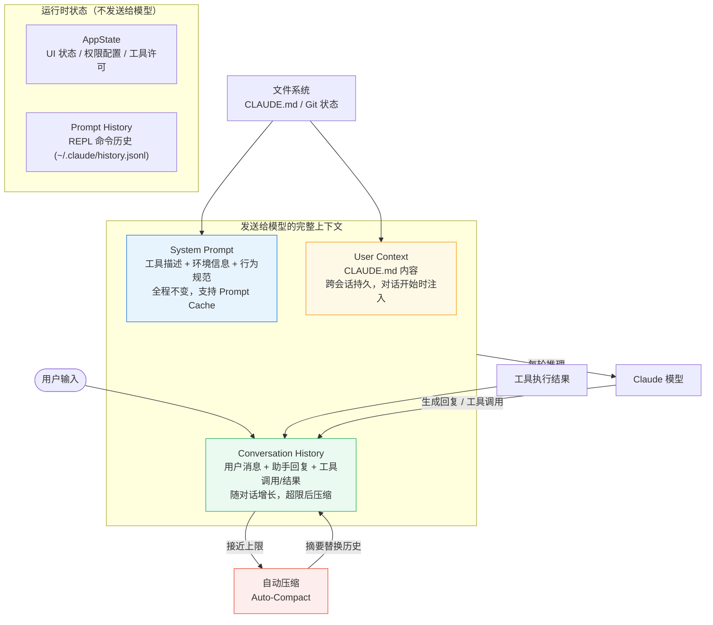
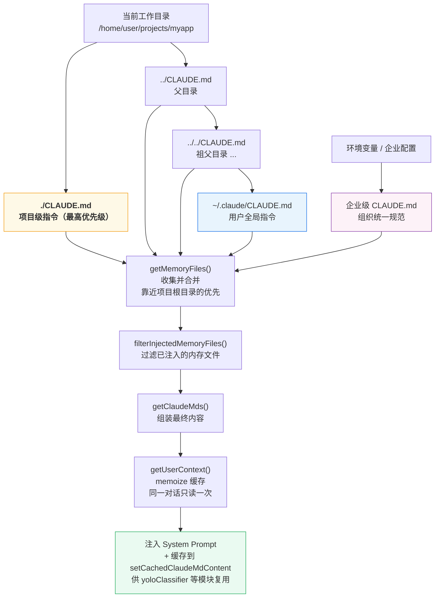
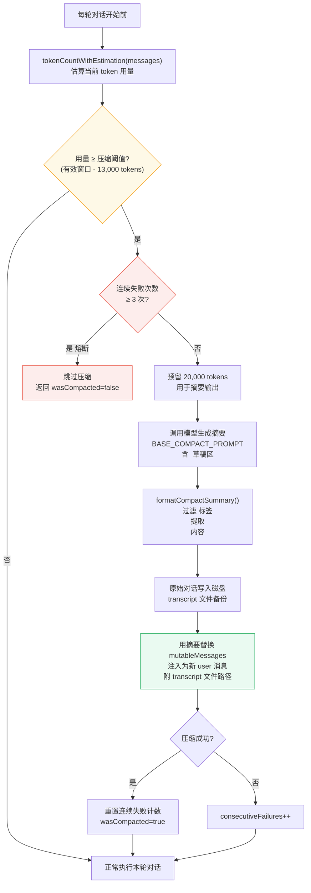
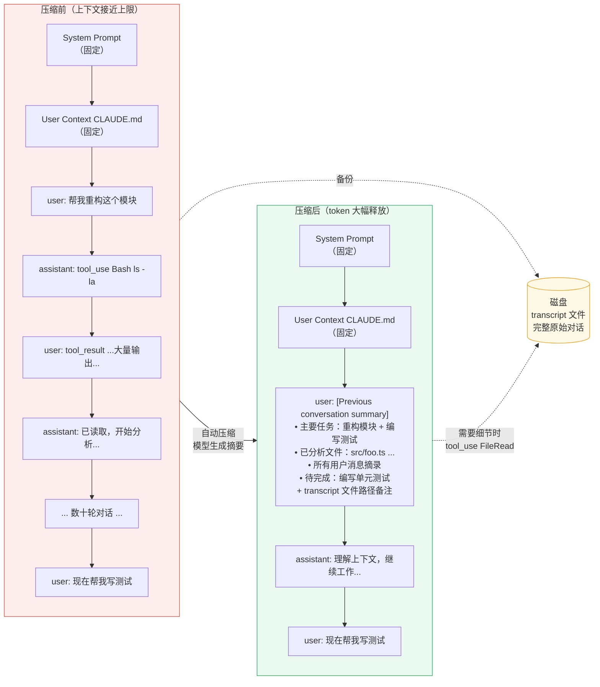
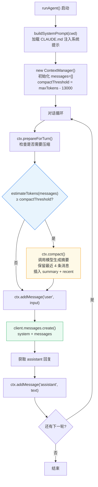
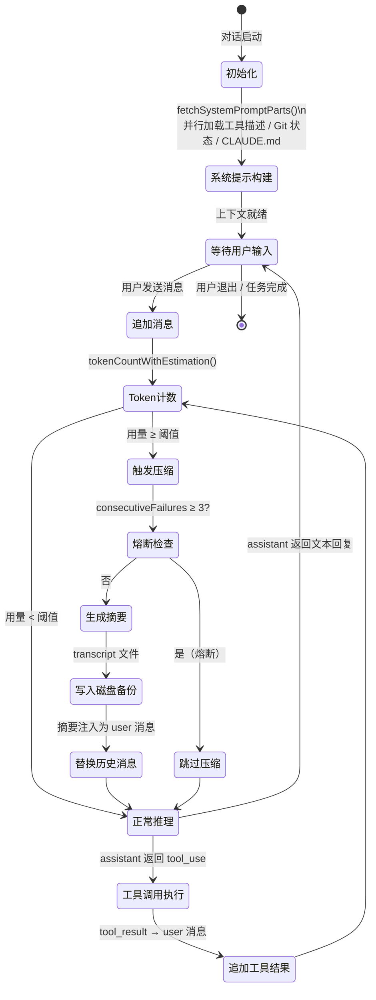

# 第四章：对话与上下文管理：Agent 的记忆系统

> 一个没有上下文的 Agent，就像一个每次开口说话都忘记了前一句话的人。它能够执行单个指令，却无法完成任何需要连贯思维的任务。

构建一个能真正"工作"的 Code Agent，上下文管理是核心挑战。你需要回答的不是"Agent 该做什么"，而是"Agent 在任何时刻**知道**什么"。这两个问题的答案，决定了 Agent 能力的上限。

本章将拆解 Claude Code 的上下文系统，从最底层的数据结构到自动压缩算法，逐层分析它如何在有限的记忆空间里维持高质量的对话状态。



---

## 一、上下文的三个层次

Claude Code 的上下文系统并不是一个扁平的消息列表。它由三个性质不同的层次叠加而成：

**System Prompt（系统提示）** 是 Agent 的"人格"与"能力声明"。它告诉模型自己是谁、有哪些工具可以使用、当前运行的环境是什么。这部分内容在一次对话启动时生成，全程不变。

**User Context（用户上下文）** 是用户提前写好的"给 Agent 的备忘录"。Claude Code 的做法是从文件系统里读取 `CLAUDE.md` 文件，将它注入到每次对话开头。用户在这里写下自己的编码规范、项目特有的约定、以及希望 Agent 记住的任何偏好。

**Conversation History（对话历史）** 是实际发生的消息流：用户的提问、助手的回复、工具调用请求、工具执行结果。这是唯一会随时间增长的部分，也是上下文管理最复杂的地方。

这三层叠加在一起，构成了模型在每次推理时能"看到"的全部信息。


---

## 二、System Prompt 的构建：fetchSystemPromptParts()

每次对话启动时，Claude Code 会调用 `fetchSystemPromptParts()` 来组装系统提示的各个部分。这个函数位于 `src/utils/queryContext.ts`，它并行地获取三个组件：

```typescript
export async function fetchSystemPromptParts({
  tools,
  mainLoopModel,
  additionalWorkingDirectories,
  mcpClients,
  customSystemPrompt,
}: {
  tools: Tools
  mainLoopModel: string
  additionalWorkingDirectories: string[]
  mcpClients: MCPServerConnection[]
  customSystemPrompt: string | undefined
}): Promise<{
  defaultSystemPrompt: string[]
  userContext: { [k: string]: string }
  systemContext: { [k: string]: string }
}> {
  const [defaultSystemPrompt, userContext, systemContext] = await Promise.all([
    customSystemPrompt !== undefined
      ? Promise.resolve([])
      : getSystemPrompt(tools, mainLoopModel, additionalWorkingDirectories, mcpClients),
    getUserContext(),
    customSystemPrompt !== undefined ? Promise.resolve({}) : getSystemContext(),
  ])
  return { defaultSystemPrompt, userContext, systemContext }
}
```

注意 `Promise.all` 的使用：这三个 I/O 操作（读取文件系统、查询 Git 状态、构建工具描述）全部并行执行，避免串行等待。

**工具描述的注入**是系统提示构建中最关键的步骤。Agent 的每个工具——无论是内置的 `BashTool`、`FileReadTool`，还是用户配置的 MCP 工具——都需要通过自然语言描述的方式告知模型。这份描述决定了模型是否能正确理解工具的用途和调用格式。

**Git 状态快照**同样会注入到系统提示中。来看 `context.ts` 中 `getGitStatus()` 的实现：

```typescript
export const getGitStatus = memoize(async (): Promise<string | null> => {
  const [branch, mainBranch, status, log, userName] = await Promise.all([
    getBranch(),
    getDefaultBranch(),
    execFileNoThrow(gitExe(), ['--no-optional-locks', 'status', '--short'], ...),
    execFileNoThrow(gitExe(), ['--no-optional-locks', 'log', '--oneline', '-n', '5'], ...),
    execFileNoThrow(gitExe(), ['config', 'user.name'], ...),
  ])

  return [
    `This is the git status at the start of the conversation. Note that this status is a snapshot in time, and will not update during the conversation.`,
    `Current branch: ${branch}`,
    `Main branch (you will usually use this for PRs): ${mainBranch}`,
    ...(userName ? [`Git user: ${userName}`] : []),
    `Status:\n${truncatedStatus || '(clean)'}`,
    `Recent commits:\n${log}`,
  ].join('\n\n')
})
```

这里有两个细节值得关注。第一，注释明确说明这是"对话开始时的快照"——Git 状态在对话过程中不会更新，模型需要理解这一点。第二，状态输出超过 2000 字符时会被截断，并附上提示告知模型可以通过 `BashTool` 运行 `git status` 获取完整信息。这是一个典型的**信息预算权衡**：提供足够的初始信息，但不浪费宝贵的 token。

`getGitStatus` 和 `getSystemContext`、`getUserContext` 都使用了 `memoize` 包装。这意味着同一次对话中多次调用只会执行一次 I/O，结果会被缓存。

> 设计洞察：系统提示是对话中开销最昂贵的部分之一，因为它在每一轮对话都要发送给 API。将它设计为不可变且可缓存的，是 Prompt Cache 能够发挥作用的前提。

---

## 三、CLAUDE.md：用户的持久化指令

`getUserContext()` 的核心任务是加载 `CLAUDE.md` 文件。这是 Claude Code 最有特色的设计之一：通过文件系统里的 Markdown 文件，让用户能够跨会话地影响 Agent 的行为。

```typescript
export const getUserContext = memoize(
  async (): Promise<{ [k: string]: string }> => {
    const shouldDisableClaudeMd =
      isEnvTruthy(process.env.CLAUDE_CODE_DISABLE_CLAUDE_MDS) ||
      (isBareMode() && getAdditionalDirectoriesForClaudeMd().length === 0)

    const claudeMd = shouldDisableClaudeMd
      ? null
      : getClaudeMds(filterInjectedMemoryFiles(await getMemoryFiles()))

    setCachedClaudeMdContent(claudeMd || null)

    return {
      ...(claudeMd && { claudeMd }),
      currentDate: `Today's date is ${getLocalISODate()}.`,
    }
  },
)
```

**CLAUDE.md 支持三个优先级层次**：

- **项目级别**：放在项目根目录或其父目录，针对特定代码库的指令。例如："这个项目使用 pnpm 而不是 npm"、"提交信息必须遵循 Conventional Commits 格式"。
- **用户级别**：放在 `~/.claude/CLAUDE.md`，对所有项目生效。适合写入个人偏好，例如代码风格要求、常用工作流。
- **企业级别**：通过环境变量或特定目录配置，供组织统一下发规范。

文件加载的过程由 `getMemoryFiles()` 完成，它会从当前工作目录向上遍历文件系统，收集沿路径所有 `CLAUDE.md` 文件。多个文件的内容会被合并，更具体的（更靠近项目根目录的）路径优先级更高。

`getUserContext` 还有一个值得注意的副作用：它将内容缓存到 `setCachedClaudeMdContent`，供系统其他模块（例如自动权限分类器 `yoloClassifier`）读取，避免重复的文件系统访问造成循环依赖。



---

## 四、对话历史的数据结构

理解上下文管理，必须先理解消息的数据结构。Claude API 定义了四种消息角色：

**user 消息**：用户发出的输入，也是工具执行结果的容器（`tool_result` 类型的 content block）。

**assistant 消息**：模型的输出，包含文本回复和工具调用请求（`tool_use` 类型的 content block）。

**system 消息**：Claude Code 内部使用的特殊消息，不会发送给 API，用于追踪压缩边界等元数据。

**attachment 消息**：用于在压缩后重新注入工具定义、MCP 指令等增量信息。

一个典型的工具调用交互在历史记录中会展开成如下结构：

```
assistant: [tool_use: { id: "abc", name: "Bash", input: { command: "ls -la" } }]
user:       [tool_result: { tool_use_id: "abc", content: "total 42\n..." }]
```

这个结构的设计是强制配对的：每个 `tool_use` 必须有对应的 `tool_result`，否则 API 会拒绝请求。这意味着对话历史的管理必须始终保持这种成对关系的完整性，在截断或压缩时不能"切断"一对工具调用。

在 `QueryEngine` 中，对话历史存储在 `mutableMessages` 字段里：

```typescript
export class QueryEngine {
  private mutableMessages: Message[]

  constructor(config: QueryEngineConfig) {
    this.config = config
    this.mutableMessages = config.initialMessages ?? []
    // ...
  }
}
```

`QueryEngine` 的每个实例对应一次对话会话，`mutableMessages` 跨轮次持久化，每次 `submitMessage()` 调用都会向其中追加新的消息。

---

## 五、上下文窗口管理：有限记忆的挑战

大语言模型的上下文窗口是有限的。对于 Claude 3.5 Sonnet，这个限制通常是 200K tokens。听起来很大，但在实际的代码开发场景中，一次读取几个大文件、运行几次工具就能消耗大量的 token。

**Token 计数**是上下文管理的基础操作。Claude Code 使用 `tokenCountWithEstimation()` 来估算当前消息列表的 token 数量：

```typescript
// 在 autoCompact.ts 中
const tokenCount = tokenCountWithEstimation(messages) - snipTokensFreed
const threshold = getAutoCompactThreshold(model)
```

注意这里是"估算"而非精确计数。精确的 token 计数需要调用 tokenizer，有一定开销。估算函数通过字符数等启发式方法快速得出近似值，足以用于触发压缩决策。

**有效上下文窗口**的计算需要为输出预留空间：

```typescript
export function getEffectiveContextWindowSize(model: string): number {
  const reservedTokensForSummary = Math.min(
    getMaxOutputTokensForModel(model),
    MAX_OUTPUT_TOKENS_FOR_SUMMARY,  // 20,000 tokens
  )
  let contextWindow = getContextWindowForModel(model, getSdkBetas())
  return contextWindow - reservedTokensForSummary
}
```

模型要输出回复，就需要留出 token 配额。`MAX_OUTPUT_TOKENS_FOR_SUMMARY` 设为 20,000，是基于压缩摘要的 p99.99 输出长度（17,387 tokens）确定的——这是一个真实的线上数据驱动的工程决策。

**工具结果截断**是控制 token 消耗的另一道防线。当 `git status` 的输出超过 2000 字符时，多余的部分会被截断并附上说明。这个设计反映了一个原则：注入上下文时，要在"提供足够信息"和"不浪费 token"之间找到平衡点。

---

## 六、自动压缩：当记忆装满时

当上下文使用量接近阈值时，Claude Code 会触发**自动压缩（Auto-Compact）**。这是整个上下文管理系统中最精妙的部分。



### 触发阈值

自动压缩的触发逻辑在 `autoCompact.ts` 中：

```typescript
export const AUTOCOMPACT_BUFFER_TOKENS = 13_000
export const WARNING_THRESHOLD_BUFFER_TOKENS = 20_000
export const MAX_OUTPUT_TOKENS_FOR_SUMMARY = 20_000

export function getAutoCompactThreshold(model: string): number {
  const effectiveContextWindow = getEffectiveContextWindowSize(model)
  return effectiveContextWindow - AUTOCOMPACT_BUFFER_TOKENS
}
```

在有效上下文窗口满之前 13,000 tokens，自动压缩就会启动。这个缓冲区的存在是为了确保压缩过程本身有足够的空间运行——压缩也是一次 API 调用，它自身也消耗 token。

### 压缩的工作原理

压缩并不是简单地删除旧消息。它的核心是**将历史对话内容总结成一段结构化文本，替换掉原始消息列表**。这段摘要由模型自身生成，使用专门设计的提示（`prompt.ts` 中的 `BASE_COMPACT_PROMPT`）：

```
Your task is to create a detailed summary of the conversation so far,
paying close attention to the user's explicit requests and your previous actions.

Your summary should include the following sections:
1. Primary Request and Intent
2. Key Technical Concepts
3. Files and Code Sections
4. Errors and fixes
5. Problem Solving
6. All user messages
7. Pending Tasks
8. Current Work
9. Optional Next Step
```

注意第 6 条："All user messages"——所有用户消息都会被逐条列出。这是因为用户的反馈和指令是最重要的上下文，必须被完整保留。

压缩的提示还有一个巧妙的设计：它要求模型先在 `<analysis>` 标签中写出思考过程，再在 `<summary>` 标签中给出最终摘要。`<analysis>` 部分在摘要生成后会被 `formatCompactSummary()` 函数过滤掉：

```typescript
export function formatCompactSummary(summary: string): string {
  let formattedSummary = summary

  // 过滤掉分析草稿——它只是帮助模型整理思路的中间产物
  formattedSummary = formattedSummary.replace(
    /<analysis>[\s\S]*?<\/analysis>/,
    '',
  )

  const summaryMatch = formattedSummary.match(/<summary>([\s\S]*?)<\/summary>/)
  if (summaryMatch) {
    const content = summaryMatch[1] || ''
    formattedSummary = formattedSummary.replace(
      /<summary>[\s\S]*?<\/summary>/,
      `Summary:\n${content.trim()}`,
    )
  }

  return formattedSummary.trim()
}
```

这是 Chain-of-Thought（思维链）的一个实用变体：用草稿区提高输出质量，但不把草稿内容保留在最终上下文中。

### 保留什么，压缩什么

压缩后，摘要会被注入为一条新的 user 消息，并附上说明：

```typescript
let baseSummary = `This session is being continued from a previous conversation
that ran out of context. The summary below covers the earlier portion of the conversation.

${formattedSummary}`

if (transcriptPath) {
  baseSummary += `\n\nIf you need specific details from before compaction
(like exact code snippets, error messages, or content you generated),
read the full transcript at: ${transcriptPath}`
}
```

**完整的原始对话被写入磁盘**（transcript 文件），不会真的丢失。如果模型需要查看压缩前的具体细节，可以通过读取文件的方式访问。这是一个优雅的降级策略：压缩优先保留高密度的语义信息，原始内容通过文件系统兜底。

### 熔断机制

自动压缩存在一个**连续失败熔断器**：

```typescript
const MAX_CONSECUTIVE_AUTOCOMPACT_FAILURES = 3

if (
  tracking?.consecutiveFailures !== undefined &&
  tracking.consecutiveFailures >= MAX_CONSECUTIVE_AUTOCOMPACT_FAILURES
) {
  return { wasCompacted: false }
}
```

如果压缩连续失败 3 次，系统会停止尝试。这个设计的背景是真实的线上问题：某些情况下上下文已经超出限制到了无法恢复的程度，继续尝试压缩只会浪费 API 调用。Bigquery 数据显示，每天有数千个会话在触发多达 3272 次的连续失败，在引入熔断前每天浪费约 25 万次 API 调用。



---

## 七、会话历史：用户命令的持久化

除了对话消息，Claude Code 还维护着另一种历史记录——**用户在 REPL 中输入的命令历史**（`history.ts`）。这与对话上下文是两件不同的事：

- **对话上下文**：发送给 API 的消息序列，影响模型的推理
- **命令历史**：存储在 `~/.claude/history.jsonl` 的本地文件，供 REPL 的上下键导航使用

命令历史的存储设计体现了几个工程细节：

```typescript
const MAX_HISTORY_ITEMS = 100
const MAX_PASTED_CONTENT_LENGTH = 1024
```

粘贴内容超过 1024 字符时，历史记录只保存内容的 hash，实际内容存储在独立的 paste store 中。这避免了 `history.jsonl` 文件因大量粘贴内容而无限膨胀。

多个并发会话（例如同时打开多个终端）写入同一个历史文件时，通过文件锁（`lockfile`）来防止数据竞争：

```typescript
release = await lock(historyPath, {
  stale: 10000,
  retries: { retries: 3, minTimeout: 50 },
})
```

---

## 八、实战：为你的 Agent 构建上下文管理器

理解了 Claude Code 的设计之后，我们可以为自己的 Agent 构建一个简化版的上下文管理器。核心要解决的问题有三个：初始化上下文、追加消息、以及在接近限制时压缩。

```typescript
import Anthropic from "@anthropic-ai/sdk";
import { readFileSync, existsSync } from "fs";
import { join } from "path";

const client = new Anthropic();

// Token 估算：简单按字符数除以 4 估算（英文约 4 字符/token，中文约 1.5 字符/token）
function estimateTokens(messages: Anthropic.MessageParam[]): number {
  const text = JSON.stringify(messages);
  return Math.ceil(text.length / 3);
}

// 加载项目级 CLAUDE.md
function loadProjectInstructions(cwd: string): string | null {
  const claudeMdPath = join(cwd, "CLAUDE.md");
  if (existsSync(claudeMdPath)) {
    return readFileSync(claudeMdPath, "utf-8");
  }
  return null;
}

// 构建系统提示（包含 CLAUDE.md 内容）
function buildSystemPrompt(cwd: string): string {
  const base = `You are a helpful coding assistant. You have access to tools for reading
and writing files, executing commands, and searching code.`;

  const projectInstructions = loadProjectInstructions(cwd);
  if (projectInstructions) {
    return `${base}\n\n## Project Instructions (from CLAUDE.md)\n\n${projectInstructions}`;
  }

  return base;
}

class ContextManager {
  private messages: Anthropic.MessageParam[] = [];
  private readonly maxTokens: number;
  private readonly compactThreshold: number;
  private readonly model: string;

  constructor(
    model: string = "claude-opus-4-5",
    maxTokens: number = 180_000,
  ) {
    this.model = model;
    this.maxTokens = maxTokens;
    // 留出 13,000 tokens 作为缓冲（参考 Claude Code 的 AUTOCOMPACT_BUFFER_TOKENS）
    this.compactThreshold = maxTokens - 13_000;
  }

  addMessage(role: "user" | "assistant", content: string): void {
    this.messages.push({ role, content });
  }

  getMessages(): Anthropic.MessageParam[] {
    return this.messages;
  }

  shouldCompact(): boolean {
    return estimateTokens(this.messages) >= this.compactThreshold;
  }

  // 压缩：用摘要替换历史消息
  async compact(): Promise<void> {
    if (this.messages.length < 4) return; // 消息太少，无需压缩

    const compactPrompt = `Create a concise summary of this conversation that preserves:
1. All user requests and requirements
2. Key decisions made
3. Files created or modified (with code snippets)
4. Current task status and next steps

Format as structured text. Be thorough but concise.`;

    // 调用模型生成摘要
    const response = await client.messages.create({
      model: this.model,
      max_tokens: 4096,
      system: compactPrompt,
      messages: this.messages,
    });

    const summary =
      response.content[0].type === "text" ? response.content[0].text : "";

    // 用摘要替换历史消息，保留最近 4 条
    const recentMessages = this.messages.slice(-4);
    this.messages = [
      {
        role: "user",
        content: `[Previous conversation summary]\n\n${summary}`,
      },
      {
        role: "assistant",
        content:
          "I understand the context from the previous session. Let me continue from where we left off.",
      },
      ...recentMessages,
    ];

    console.log(
      `[Context] Compacted to ~${estimateTokens(this.messages)} tokens`,
    );
  }

  // 每轮对话前检查是否需要压缩
  async prepareForTurn(): Promise<void> {
    if (this.shouldCompact()) {
      console.log(
        `[Context] Approaching limit (${estimateTokens(this.messages)} tokens), compacting...`,
      );
      await this.compact();
    }
  }
}

// 使用示例
async function runAgent() {
  const cwd = process.cwd();
  const systemPrompt = buildSystemPrompt(cwd);
  const ctx = new ContextManager();

  const userInputs = [
    "请读取 package.json 并告诉我这个项目的依赖",
    "帮我写一个 TypeScript 工具函数，用于深度克隆对象",
    "添加完整的 JSDoc 注释和错误处理",
  ];

  for (const input of userInputs) {
    // 压缩检查
    await ctx.prepareForTurn();

    ctx.addMessage("user", input);

    const response = await client.messages.create({
      model: "claude-opus-4-5",
      max_tokens: 4096,
      system: systemPrompt,
      messages: ctx.getMessages(),
    });

    const assistantText =
      response.content[0].type === "text"
        ? response.content[0].text
        : "[non-text response]";

    ctx.addMessage("assistant", assistantText);
    console.log(`User: ${input}`);
    console.log(`Assistant: ${assistantText.slice(0, 200)}...\n`);
  }
}

runAgent().catch(console.error);
```

这个实现抓住了 Claude Code 上下文管理的精髓：

1. **CLAUDE.md 加载**：项目指令通过文件系统注入，而非硬编码
2. **Token 估算**：快速近似计算，不依赖精确 tokenizer
3. **提前触发**：在到达限制前 13,000 tokens 就开始压缩，保留操作空间
4. **保留最近消息**：压缩时保留最近 4 条消息，确保上下文连续性



---

## 九、AppState：对话之外的状态

值得一提的是，Claude Code 还维护着一个与对话历史平行的状态系统 `AppState`。它存储的是 UI 状态、权限配置、工具许可上下文等运行时信息，而非对话内容本身：

```typescript
export type AppState = DeepImmutable<{
  settings: SettingsJson
  mainLoopModel: ModelSetting
  toolPermissionContext: ToolPermissionContext
  thinkingEnabled: boolean | undefined
  // ... 数十个字段
}>
```

`AppState` 使用 `DeepImmutable` 类型修饰，强制所有修改必须通过 `setAppState(f: (prev: AppState) => AppState)` 函数进行，这是经典的不可变状态更新模式。

这种分离有清晰的理由：对话历史需要被序列化并发送给 API，而 `AppState` 包含函数引用（任务状态、回调等），无法序列化。两种状态的生命周期和使用方式也完全不同。

> 设计原则：将"发送给模型的信息"和"运行时内部状态"严格分开。前者需要被精确控制和计费，后者是实现细节。

---

## 十、上下文是 Agent 体验的灵魂

回顾整个上下文管理系统，它的复杂性完全服务于一个核心目标：**让模型在任何时刻都能获得恰到好处的信息，既不太少（导致遗忘），也不太多（导致浪费或超限）**。

Claude Code 给我们的设计启示：

- **分层管理**：系统提示、用户指令、对话历史各司其职，互不干扰
- **提前规划**：token 预算在系统设计之初就需要确定，而不是等到超出限制后再处理
- **优雅降级**：压缩不是"删除"，而是"浓缩"——原始信息通过文件系统兜底
- **数据驱动**：压缩阈值、缓冲区大小、摘要长度，都来自真实线上数据

一个 Agent 能记住什么、忘记什么、如何在遗忘的边缘优雅地延续工作——这些决策的总和，构成了用户所体验到的 Agent "智慧"。

上下文不仅仅是技术实现，它是 Agent 给用户留下的印象。



---

## 小结

| 组件 | 职责 | 持久性 |
|------|------|--------|
| System Prompt | 工具描述、环境信息、行为规范 | 全程不变，按对话缓存 |
| User Context (CLAUDE.md) | 用户和项目级持久化指令 | 跨会话持久，按对话缓存 |
| Conversation History | 实际对话轮次和工具调用 | 随对话增长，超限后压缩 |
| AppState | UI 和运行时状态 | 内存状态，进程生命周期内 |
| Prompt History | REPL 命令历史 | 写入磁盘，跨会话持久 |

下一章，我们将深入工具系统——探索 Claude Code 如何定义、注册和执行工具，以及 MCP（Model Context Protocol）如何让工具生态变得可扩展。

```mermaid
mindmap
  root((对话与上下文管理))
    三层上下文
      System Prompt
        工具描述 prompt()
        Git 状态快照
        环境信息
      User Context
        CLAUDE.md 多级加载
        项目级 / 用户级 / 企业级
        memoize 缓存
      Conversation History
        user / assistant / system / attachment
        tool_use + tool_result 强制配对
        mutableMessages 跨轮持久化
    系统提示构建
      fetchSystemPromptParts()
      Promise.all 并行加载
      Prompt Cache 友好设计
    上下文窗口管理
      tokenCountWithEstimation 估算
      getEffectiveContextWindowSize
      预留 20000 tokens 给输出
      工具结果截断 2000 字符
    自动压缩
      阈值 有效窗口 - 13000
      BASE_COMPACT_PROMPT 生成摘要
      analysis 草稿过滤
      transcript 磁盘备份
      熔断 连续失败 3 次停止
    AppState
      DeepImmutable 不可变
      setAppState 函数式更新
      与对话历史严格分离
    命令历史
      history.jsonl 持久化
      MAX 100 条
      文件锁防并发竞争
```
