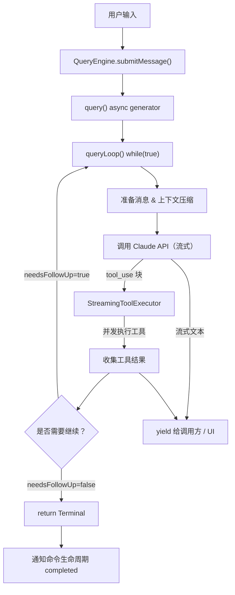
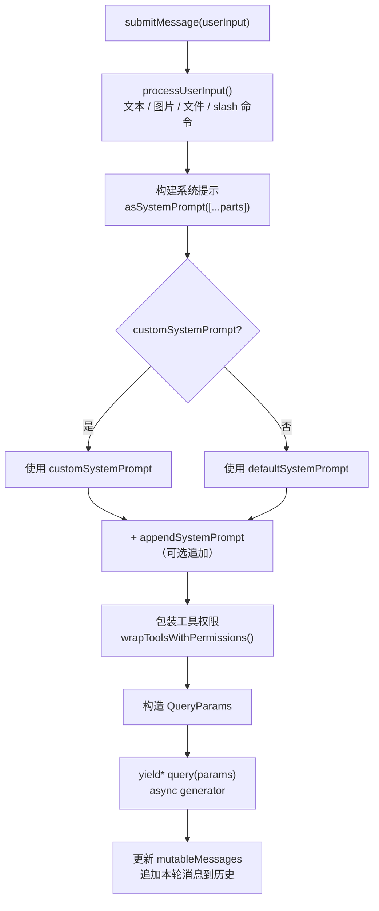
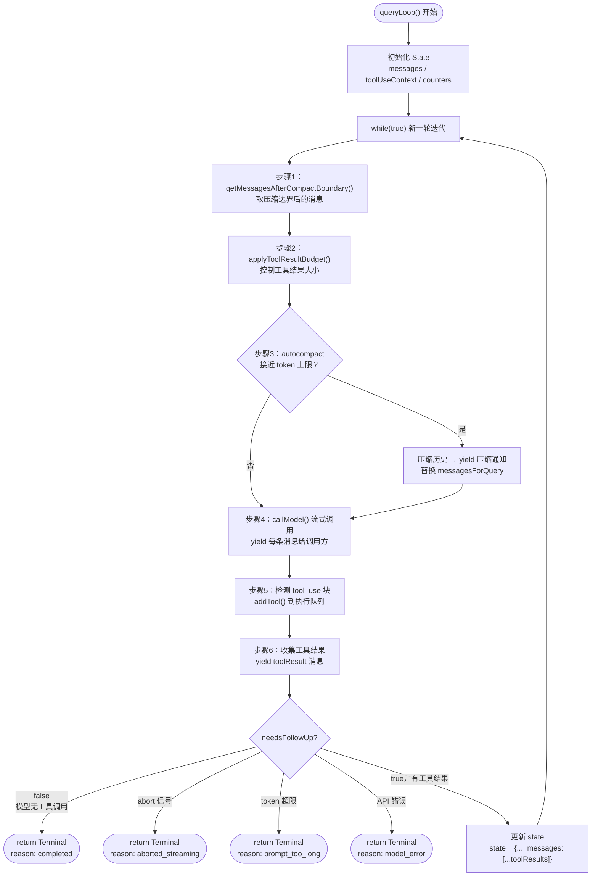
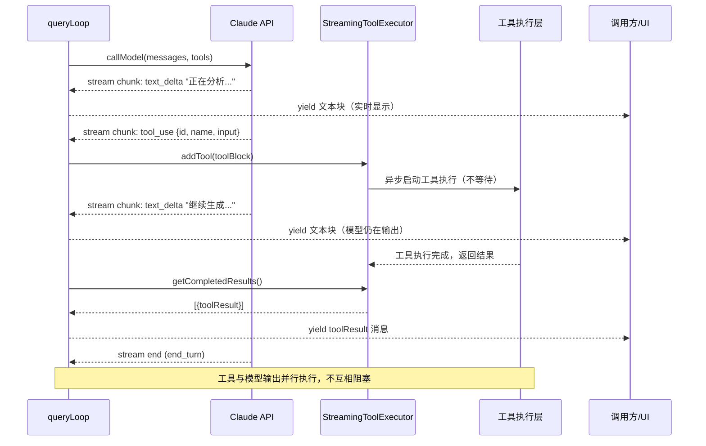
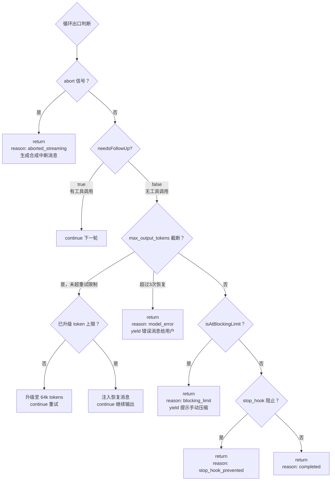
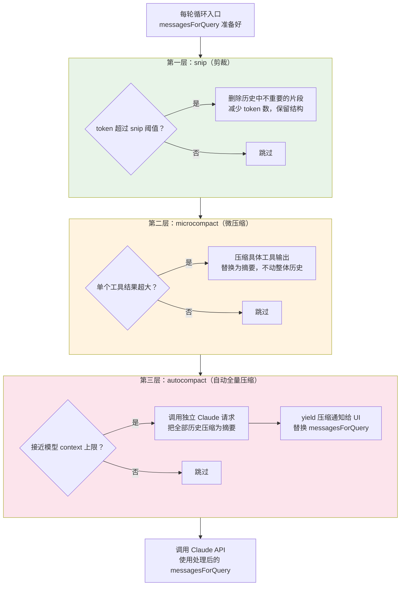
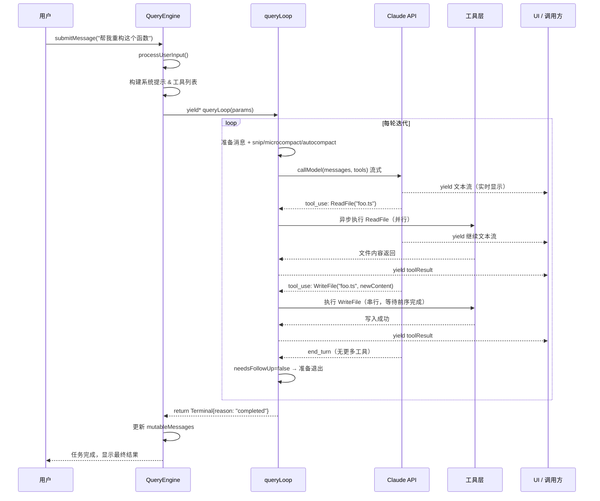

# 第五章：Agent 循环：驱动一切的核心引擎

> 如果你只能读懂 Claude Code 源码中的一个函数，那应该是 `queryLoop`。它是整个系统的心跳，是"聊天"和"Agent"之间真正的分界线。

---

## 一、开篇：从不停歇的循环

大多数人对 AI 助手的理解是"发送消息，等待回复"。这是聊天模型的工作方式。而 Agent 完全不同——它收到任务之后，会自己决定接下来做什么，调用工具，观察结果，继续思考，再调用工具，直到任务完成。

这个"自己决定接下来做什么"的过程，在代码层面只是一个 `while (true)` 循环。

Claude Code 的核心逻辑全部聚集在两个文件里：`query.ts` 负责循环本身，`QueryEngine.ts` 负责对话状态管理。理解了这两个文件，你就理解了这个 Agent 的灵魂。



---

## 二、全局视图：一次用户输入的完整旅程

当用户敲下一条消息，发生了什么？

```
用户输入
  → QueryEngine.submitMessage()
    → 处理输入，构建系统提示，准备工具列表
    → query() async generator
      → queryLoop() while(true)
        → 压缩上下文（如果需要）
        → 调用 Claude API（流式）
        → 流中出现 tool_use 块 → 立刻开始执行工具
        → 收集工具结果
        → 决策：继续还是终止？
        → 如果有工具结果，continue 下一轮
        → 如果模型说 end_turn，return
```

这个流程里有一个关键设计：整个过程是**流式**的（streaming），工具可以在模型还在生成文字的时候就开始执行。这不是优化，这是架构决策——它让 Agent 的响应速度比串行方案快得多。

---

## 三、QueryEngine.submitMessage()：一轮对话的准备工作

`QueryEngine` 是对话状态的持有者。每一次用户发送消息，都调用 `submitMessage()`。这个方法做三件核心的事：

**第一，处理用户输入。** 用户输入可能是纯文本，也可能包含图片、文件引用、斜杠命令（slash commands）。`processUserInput()` 负责把这些转换成 API 能理解的格式。

**第二，构建系统提示。** 系统提示不是静态字符串，它由多个部分动态拼接：

```typescript
const systemPrompt = asSystemPrompt([
  ...(customPrompt !== undefined ? [customPrompt] : defaultSystemPrompt),
  ...(memoryMechanicsPrompt ? [memoryMechanicsPrompt] : []),
  ...(appendSystemPrompt ? [appendSystemPrompt] : []),
])
```

默认系统提示 `defaultSystemPrompt` 包含工具使用说明、工作目录信息、当前模型能力等。如果调用方提供了 `customSystemPrompt`，则完全替换默认提示。`appendSystemPrompt` 则追加在末尾，用于动态注入额外上下文。

**第三，构造查询参数并调用 `query()`。** `submitMessage()` 把所有准备好的内容打包成 `QueryParams`，交给 `query()` 这个 async generator。

> **关键设计：** `QueryEngine` 维护 `mutableMessages` 数组，它跨越多次 `submitMessage()` 调用持久存在。这是整个对话历史的真相来源（source of truth）。每一轮对话结束后，新消息会被追加进去，供下一轮使用。



---

## 四、query()：async generator 为什么适合 Agent 循环

`query()` 是一个 async generator 函数，返回类型是 `AsyncGenerator`：

```typescript
export async function* query(
  params: QueryParams,
): AsyncGenerator<
  | StreamEvent
  | RequestStartEvent
  | Message
  | TombstoneMessage
  | ToolUseSummaryMessage,
  Terminal
> {
  const consumedCommandUuids: string[] = []
  const terminal = yield* queryLoop(params, consumedCommandUuids)
  for (const uuid of consumedCommandUuids) {
    notifyCommandLifecycle(uuid, 'completed')
  }
  return terminal
}
```

**为什么用 async generator？** 传统的函数调用要等所有工作完成才返回结果。但 Agent 循环可能运行几秒到几分钟，期间会产生大量中间消息——模型的流式输出、工具执行进度、中间状态通知。

async generator 允许我们**边生成边消费**：调用方通过 `for await` 迭代，每 `yield` 一条消息就立刻得到处理，不用等整个循环结束。这是实现实时 UI 更新的基础。

`yield*` 将控制权完全委托给 `queryLoop()`，自身只负责在循环结束后做收尾工作（通知命令生命周期）。

---

## 五、queryLoop()：驱动一切的 while(true)

`queryLoop()` 是整个系统最核心的函数。它的结构非常清晰——一个无限循环，每次迭代代表一个"思考-行动"周期：

```typescript
async function* queryLoop(
  params: QueryParams,
  consumedCommandUuids: string[],
): AsyncGenerator<...> {
  let state: State = {
    messages: params.messages,
    toolUseContext: params.toolUseContext,
    maxOutputTokensRecoveryCount: 0,
    // ... 其他状态
  }

  while (true) {
    // 步骤一：准备本轮消息
    let messagesForQuery = [...getMessagesAfterCompactBoundary(messages)]

    // 步骤二：上下文压缩（如果需要）
    const { compactionResult } = await deps.autocompact(...)

    // 步骤三：调用 Claude API（流式）
    for await (const message of deps.callModel({...})) {
      yield message  // 立刻转发给调用方
      if (message.type === 'assistant' && 含有 tool_use) {
        // 步骤四：流中出现工具调用 → 立刻加入执行队列
        streamingToolExecutor.addTool(toolBlock, message)
      }
    }

    // 步骤五：收集剩余工具结果
    for await (const update of toolUpdates) {
      yield update.message
    }

    // 步骤六：决策
    if (!needsFollowUp) {
      return { reason: 'completed' }  // 终止
    }
    // 有工具结果 → 更新 state，continue 下一轮
    state = { messages: [..., ...toolResults], ... }
  }
}
```

**状态管理的设计值得注意。** `State` 类型携带了循环迭代之间所有需要传递的信息：当前消息列表、工具上下文、错误恢复计数器、压缩追踪状态等。每次 `continue` 前都更新 `state`，而不是 9 个单独的变量赋值——这让循环的状态转换一目了然。



---

## 六、步骤详解：准备消息与上下文压缩

每轮循环开始，首先要决定**用哪些消息**发给 API。

```typescript
let messagesForQuery = [...getMessagesAfterCompactBoundary(messages)]
```

`getMessagesAfterCompactBoundary()` 只取压缩边界之后的消息。如果之前做过上下文压缩（compact），压缩边界之前的历史已经被摘要替代，不需要再发给 API。

接着是**工具结果预算控制**（tool result budget）：

```typescript
messagesForQuery = await applyToolResultBudget(
  messagesForQuery,
  toolUseContext.contentReplacementState,
  ...
)
```

工具返回的内容可能非常大（比如读取了一个大文件）。预算控制会把超大的工具结果替换成摘要或截断版本，避免 context 被单个工具结果撑爆。

然后是**自动压缩**（autocompact）。当 token 总量接近模型上限时，autocompact 会调用一个独立的 Claude 请求，把历史消息压缩成摘要：

```typescript
const { compactionResult } = await deps.autocompact(
  messagesForQuery,
  toolUseContext,
  { systemPrompt, userContext, systemContext, ... },
  querySource,
  tracking,
  snipTokensFreed,
)

if (compactionResult) {
  const postCompactMessages = buildPostCompactMessages(compactionResult)
  for (const message of postCompactMessages) {
    yield message  // 通知 UI 压缩发生了
  }
  messagesForQuery = postCompactMessages
}
```

压缩是**透明的**：调用方会收到一条压缩通知消息，但对话可以无缝继续。这是 Claude Code 能处理超长任务的关键机制。

> **设计洞见：** autocompact 在每轮循环**入口**触发，而不是在 API 返回 429 错误后触发。主动预防比被动恢复更可靠——等到 context 满了再压缩，可能已经没有空间放压缩请求本身了。

---

## 七、步骤详解：流式调用 Claude API

准备好消息后，调用模型：

```typescript
for await (const message of deps.callModel({
  messages: prependUserContext(messagesForQuery, userContext),
  systemPrompt: fullSystemPrompt,
  tools: toolUseContext.options.tools,
  signal: toolUseContext.abortController.signal,
  options: {
    model: currentModel,
    maxOutputTokensOverride,
    querySource,
    // ...
  },
})) {
  yield message  // 立刻转发流式内容
  if (message.type === 'assistant') {
    assistantMessages.push(message)
    const toolUseBlocks = message.message.content
      .filter(c => c.type === 'tool_use')
    if (toolUseBlocks.length > 0) {
      needsFollowUp = true
      for (const toolBlock of toolUseBlocks) {
        streamingToolExecutor.addTool(toolBlock, message)
      }
    }
  }
}
```

这段代码的关键在于：**每收到一个 assistant message，立刻检查它是否包含 `tool_use` 块**。如果有，立刻调用 `streamingToolExecutor.addTool()`——这意味着工具在**模型还在生成后续内容**的时候就已经开始执行了。

`yield message` 确保所有流式内容实时推送给调用方，UI 能看到模型逐字输出的效果。



---

## 八、StreamingToolExecutor：工具与模型同步执行

`StreamingToolExecutor` 是这个架构里最精妙的部分。它解决了一个核心问题：**如何在模型还在流式输出的同时，安全地执行工具？**

```typescript
export class StreamingToolExecutor {
  private tools: TrackedTool[] = []
  // ...

  addTool(block: ToolUseBlock, assistantMessage: AssistantMessage): void {
    // 判断这个工具是否"并发安全"
    const isConcurrencySafe = toolDefinition.isConcurrencySafe(parsedInput.data)
    this.tools.push({
      id: block.id,
      block,
      assistantMessage,
      status: 'queued',
      isConcurrencySafe,
      pendingProgress: [],
    })
    void this.processQueue()  // 立刻尝试调度
  }
}
```

**并发控制**是 `StreamingToolExecutor` 的核心职责。每个工具都有一个 `isConcurrencySafe` 标志：

- **并发安全**（concurrency safe）：只读工具，比如读取文件、搜索代码。多个这样的工具可以同时执行。
- **非并发安全**（not concurrency safe）：写入工具，比如修改文件、执行 bash 命令。这类工具必须串行执行。

调度逻辑简洁而严格：

```typescript
private canExecuteTool(isConcurrencySafe: boolean): boolean {
  const executingTools = this.tools.filter(t => t.status === 'executing')
  return (
    executingTools.length === 0 ||
    (isConcurrencySafe && executingTools.every(t => t.isConcurrencySafe))
  )
}
```

翻译成人话：**只有当前没有工具在执行，或者当前所有正在执行的工具都是并发安全的，才能启动一个新的并发安全工具。** 非并发安全工具必须等前面所有工具完成才能开始。

`getCompletedResults()` 在流式循环内被定期轮询，把已完成的工具结果及时 yield 出去：

```typescript
// 在 API 流式循环内
for (const result of streamingToolExecutor.getCompletedResults()) {
  if (result.message) {
    yield result.message
    toolResults.push(...)
  }
}
```

**结果的顺序保证也很重要。** 即使工具并行执行，结果必须按工具被添加的顺序 yield——这样上层代码看到的消息顺序是确定的，transcript（对话记录）也是正确的。

```mermaid
graph TD
    ADD["addTool(block)\n加入执行队列"] --> PQ["processQueue()\n尝试调度"]
    PQ --> CHECK{"canExecuteTool()?"}
    CHECK --> |"无正在执行的工具"| RUN["立即执行"]
    CHECK --> |"当前全是并发安全工具\n且新工具也是并发安全"| RUN
    CHECK --> |"当前有非并发安全工具\n或新工具非并发安全"| WAIT["等待队列，status=queued"]

    subgraph 并发安全工具（只读）
        RT1["ReadFile #1"]
        RT2["ReadFile #2"]
        RT3["SearchCode #3"]
        RT1 & RT2 & RT3 --> PARALLEL["同时执行"]
    end

    subgraph 非并发安全工具（写操作）
        WT1["BashCmd #4"] --> WT2["WriteFile #5"]
        WT2 --> WT3["BashCmd #6"]
        WT1 & WT2 & WT3 --> SERIAL["严格串行"]
    end

    RUN --> COMPLETE["完成 → status=completed\n有序放入结果队列"]
    COMPLETE --> GCR["getCompletedResults()\n按添加顺序返回结果"]
    WAIT --> |"前序工具完成后重新调度"| PQ
```

---

## 九、非流式路径：toolOrchestration.runTools()

当流式工具执行未启用时，系统使用 `runTools()`：

```typescript
export async function* runTools(
  toolUseMessages: ToolUseBlock[],
  assistantMessages: AssistantMessage[],
  canUseTool: CanUseToolFn,
  toolUseContext: ToolUseContext,
): AsyncGenerator<MessageUpdate, void> {
  let currentContext = toolUseContext
  for (const { isConcurrencySafe, blocks } of partitionToolCalls(
    toolUseMessages,
    currentContext,
  )) {
    if (isConcurrencySafe) {
      // 并发执行整批只读工具
      for await (const update of runToolsConcurrently(blocks, ...)) {
        yield { message: update.message, newContext: currentContext }
      }
    } else {
      // 串行执行写入工具
      for await (const update of runToolsSerially(blocks, ...)) {
        yield { message: update.message, newContext: currentContext }
      }
    }
  }
}
```

`partitionToolCalls()` 把工具列表分成若干批次（batch），每批要么全是并发安全的，要么是单个非并发安全工具。这个分区逻辑保证了最大并发度同时维护写操作安全性。

最大并发度可以通过环境变量控制：

```typescript
function getMaxToolUseConcurrency(): number {
  return parseInt(process.env.CLAUDE_CODE_MAX_TOOL_USE_CONCURRENCY || '', 10) || 10
}
```

---

## 十、终止条件：什么时候循环会停下来

`queryLoop()` 有多个退出路径，每个都对应一个 `Terminal` 原因：

**正常完成：** 模型没有调用任何工具（`needsFollowUp === false`），且没有错误恢复需要处理。

```typescript
if (!needsFollowUp) {
  // ... 处理各种错误恢复
  return { reason: 'completed' }
}
```

**用户中断：** abort controller 信号触发。

```typescript
if (toolUseContext.abortController.signal.aborted) {
  // 生成合成的工具结果错误消息，保持对话历史合法
  yield createUserInterruptionMessage({ toolUse: false })
  return { reason: 'aborted_streaming' }
}
```

**上下文太长（prompt too long）：** 当消息超过模型 context 上限，先尝试压缩恢复，失败则终止。

```typescript
return { reason: 'prompt_too_long' }
```

**模型错误：** API 调用失败，yield 错误消息给用户。

```typescript
return { reason: 'model_error', error }
```

**达到阻塞限制：** token 总量超过硬性上限（autocompact 关闭时），提示用户手动压缩。

```typescript
return { reason: 'blocking_limit' }
```

**Stop hook 阻止：** 自定义 hook 可以介入模型输出，如果 hook 判断需要阻止继续执行：

```typescript
return { reason: 'stop_hook_prevented' }
```



---

## 十一、错误恢复：max_output_tokens 的重试机制

当模型输出因为 `max_output_tokens` 被截断时，系统不会直接失败，而是尝试自动恢复。这个设计的常量直接写在代码注释里：

```typescript
/**
 * 思考块的规则冗长而深奥……
 * 年轻的巫师们，请牢记这些规则。
 */
const MAX_OUTPUT_TOKENS_RECOVERY_LIMIT = 3
```

恢复流程：

1. **第一步——升级 token 上限：** 如果当前用的是默认的 8k token 上限，先尝试升级到 64k 重新请求同样的内容：

```typescript
if (capEnabled && maxOutputTokensOverride === undefined) {
  state = {
    ...state,
    maxOutputTokensOverride: ESCALATED_MAX_TOKENS,
    transition: { reason: 'max_output_tokens_escalate' },
  }
  continue  // 重试
}
```

2. **第二步——注入恢复消息：** 如果升级后还是被截断，注入一条元消息（meta message）让模型从截断处继续：

```typescript
const recoveryMessage = createUserMessage({
  content: `Output token limit hit. Resume directly — no apology, no recap ` +
    `of what you were doing. Pick up mid-thought if that is where the cut happened. ` +
    `Break remaining work into smaller pieces.`,
  isMeta: true,
})
```

3. **第三步——耗尽恢复次数后放弃：** 最多重试 3 次（`MAX_OUTPUT_TOKENS_RECOVERY_LIMIT`），超过后把错误消息 yield 给用户。

> **这个机制揭示了一个深层问题：** 长输出任务（比如写一篇长文、重构一个大文件）天然不稳定。好的 Agent 设计会主动把大任务拆小，而不是依赖重试机制兜底。

---

## 十二、auto-compact 中途压缩：上下文溢出的优雅处理

`autocompact` 在每轮循环入口检查 token 预算：

```typescript
const { isAtBlockingLimit } = calculateTokenWarningState(
  tokenCountWithEstimation(messagesForQuery) - snipTokensFreed,
  toolUseContext.options.mainLoopModel,
)
if (isAtBlockingLimit) {
  yield createAssistantAPIErrorMessage({
    content: PROMPT_TOO_LONG_ERROR_MESSAGE,
    error: 'invalid_request',
  })
  return { reason: 'blocking_limit' }
}
```

当接近但未到达上限时，autocompact 触发压缩请求。压缩完成后，`messagesForQuery` 被替换为压缩后的版本，当前轮循环继续执行（不是 `continue` 到下一轮，而是继续当前轮的后续步骤）。

`buildPostCompactMessages()` 生成压缩后的消息列表，其中包含一条摘要消息，记录了被压缩的内容要点。这个摘要是给**模型**看的——下一轮循环时，模型从摘要里重建对历史的理解。

除了 autocompact，还有两种更精细的压缩策略：

- **microcompact（微压缩）：** 只压缩具体的工具结果，不压缩整体历史。适合工具输出特别大的场景。
- **snip（剪裁）：** 删除历史中不重要的部分，保留结构但减少 token 数。

这三种策略在每轮循环入口**按顺序**应用：先 snip，再 microcompact，再 autocompact——从轻量到重量，尽量保留最多的上下文信息。



---

## 十三、代码实战：用 50 行构建一个最小 Agent 循环

理解了原理，让我们用伪代码还原核心结构。这不是 Claude Code 的实际代码，但忠实还原了它的架构模式：

```typescript
async function* minimalAgentLoop(
  userMessage: string,
  tools: Tool[],
  callModel: ModelCaller,
  executeTools: ToolExecutor,
) {
  // 初始化对话历史
  let messages: Message[] = [
    { role: 'user', content: userMessage }
  ]

  const MAX_TURNS = 50
  let turnCount = 0

  while (true) {
    if (turnCount++ > MAX_TURNS) {
      yield { type: 'error', content: '达到最大轮次限制' }
      return
    }

    // 1. 流式调用模型
    let assistantContent: ContentBlock[] = []
    let hasToolUse = false

    for await (const chunk of callModel(messages, tools)) {
      yield chunk  // 实时转发给调用方

      if (chunk.type === 'content_block') {
        assistantContent.push(chunk.block)
        if (chunk.block.type === 'tool_use') {
          hasToolUse = true
        }
      }
    }

    // 2. 记录 assistant 消息
    const assistantMessage = {
      role: 'assistant' as const,
      content: assistantContent,
    }
    messages.push(assistantMessage)

    // 3. 如果没有工具调用，任务完成
    if (!hasToolUse) {
      return
    }

    // 4. 执行所有工具，收集结果
    const toolUseBlocks = assistantContent.filter(
      b => b.type === 'tool_use'
    )
    const toolResults: ToolResultBlock[] = []

    for (const toolUse of toolUseBlocks) {
      const result = await executeTools(toolUse)
      yield { type: 'tool_result', result }  // 实时推送结果
      toolResults.push({
        type: 'tool_result',
        tool_use_id: toolUse.id,
        content: result.output,
        is_error: result.isError,
      })
    }

    // 5. 把工具结果追加到消息历史，进入下一轮
    messages.push({
      role: 'user',
      content: toolResults,
    })
    // while(true) 继续
  }
}
```

这 50 行代码实现了 Agent 循环的最小可行版本。Claude Code 的 `queryLoop()` 在这个骨架上增加了：

- 流式工具执行（工具与模型并行）
- 三层上下文压缩
- 错误恢复（max_output_tokens、prompt too long、API 错误）
- 模型回退（fallback model）
- Stop hooks
- Token 预算追踪
- 详细的 analytics 事件

但核心结构是一样的：**yield 消息，执行工具，追加结果，continue。**

---

## 十四、一个被忽视的细节：`transition` 字段

`State` 类型有一个 `transition` 字段，初看不起眼：

```typescript
type State = {
  // ...
  transition: Continue | undefined
}

type Continue =
  | { reason: 'max_output_tokens_recovery'; attempt: number }
  | { reason: 'max_output_tokens_escalate' }
  | { reason: 'reactive_compact_retry' }
  | { reason: 'collapse_drain_retry'; committed: number }
  | { reason: 'stop_hook_blocking' }
  | { reason: 'token_budget_continuation' }
```

每次 `continue` 时，`transition` 记录了**为什么继续**。这个字段的注释说得直白：

> "Lets tests assert recovery paths fired without inspecting message contents."

这是**可测试性设计**。测试代码不需要解析复杂的消息内容来判断系统走了哪条恢复路径，只需检查 `state.transition.reason` 就够了。一个好的设计，在系统内部为自己的可验证性留出了接口。

---

## 十五、结语：循环是 Chat 与 Agent 的真正分界线

回到开篇的问题：聊天模型和 Agent 的本质区别是什么？

答案就在 `while (true)` 里。

聊天模型发送一次请求，收到一次回复，结束。Agent 的循环让模型在**行动的反馈中**调整下一步——调用工具、观察结果、再次思考、再次行动，直到任务自然终止。

Claude Code 的 `queryLoop()` 展示了这个概念的一个生产级实现：流式架构让延迟最小化，并发工具执行让吞吐最大化，多层错误恢复让长任务可靠，自动压缩让上下文无限延伸。

这些不是独立的功能，而是一个整体设计的不同侧面。核心洞见只有一句话：

> **Agent 不是"更聪明的聊天"，而是"能在循环中行动的系统"。** 循环是基础，其他一切都建立在它之上。



---

## 延伸阅读

- `src/src/query.ts` — queryLoop() 完整实现
- `src/src/QueryEngine.ts` — submitMessage() 和会话状态管理
- `src/src/services/tools/StreamingToolExecutor.ts` — 流式工具并发执行
- `src/src/services/tools/toolOrchestration.ts` — runTools() 非流式路径
- `src/src/services/compact/autoCompact.ts` — 自动压缩触发逻辑
- `src/src/query/transitions.ts` — Terminal 和 Continue 类型定义
