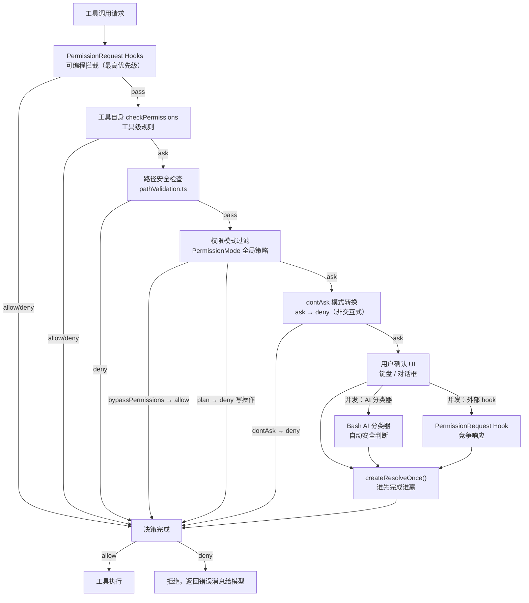
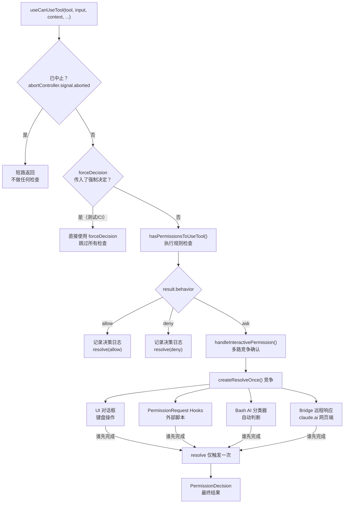
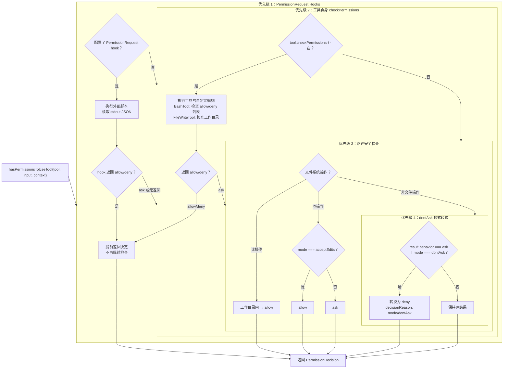
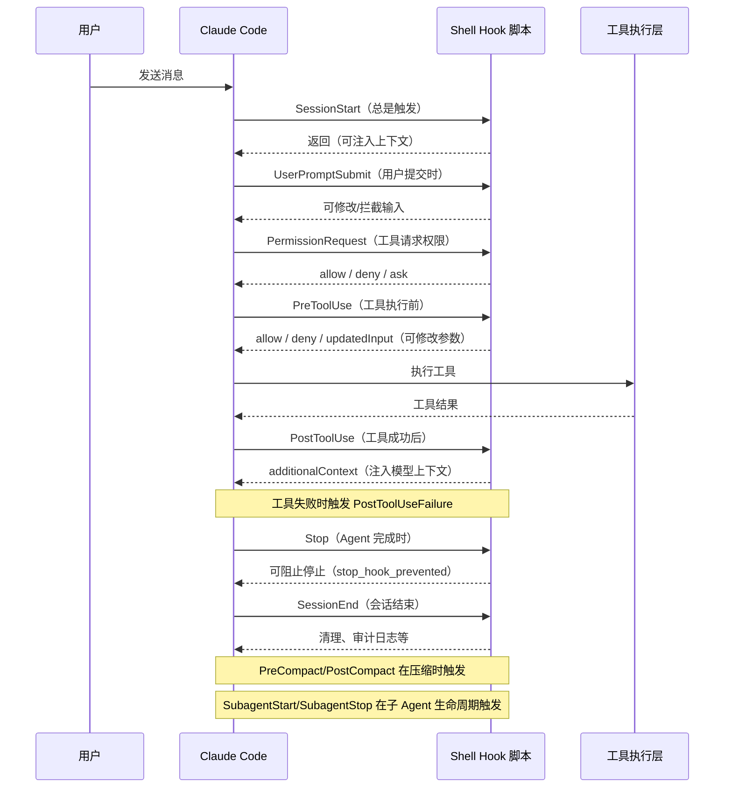
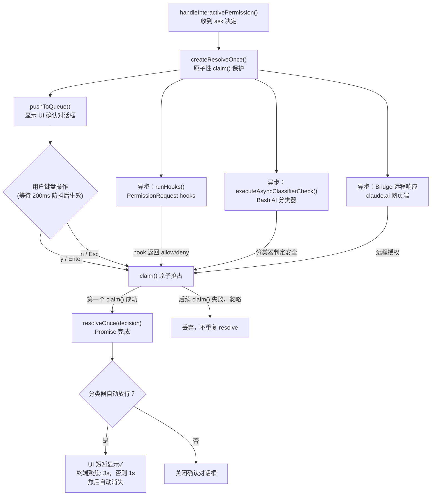
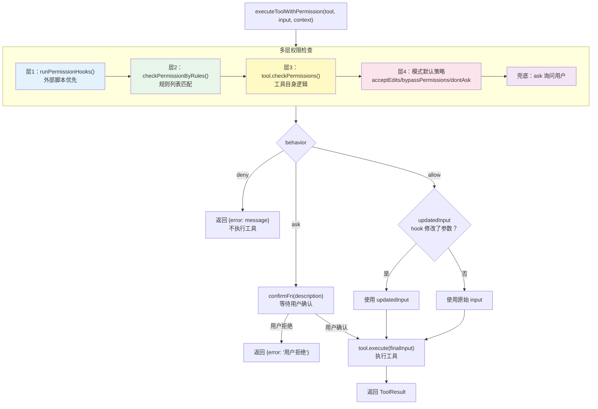

# 第六章：权限系统与 Hooks：给 Agent 装上安全带

> 一个没有边界的 Agent，不是助手，是定时炸弹。

## 为什么权限是 Agent 的命脉

给 Claude Code 一把锤子，它就能用来钉钉子。给它 `bash` 工具，它就能执行任意 shell 命令。给它文件写入权限，它就能修改系统上的任何文件。

能力越大，风险越大。

一个能自主运行的 Code Agent，必须回答这个问题：**谁来决定它能做什么，不能做什么？**

Claude Code 的答案是一套多层防御体系：配置规则、权限模式、用户确认流程、AI 分类器，以及可以拦截任何工具调用的 Hooks。本章将逐层拆解这套体系，从源码层面理解它为何设计成现在的样子。



---

## 权限模型：allow / deny / ask 三态

Claude Code 每次工具调用，最终都会落入三种结果之一：

- **allow** — 直接执行，不需要用户确认
- **deny** — 拒绝执行，向模型返回拒绝消息
- **ask** — 暂停，等待用户明确授权

这三态贯穿整个权限系统。在源码 `src/types/permissions.ts` 中可以看到：

```typescript
export type PermissionBehavior = 'allow' | 'deny' | 'ask'

export type PermissionDecision =
  | PermissionAllowDecision
  | PermissionDenyDecision
  | { behavior: 'ask'; message: string; ... }
```

每个 `PermissionDecision` 不只携带行为结果，还包含 `decisionReason`——记录这个决定是谁做出的（配置规则、用户、hook、AI 分类器……）。这对审计和调试至关重要。

> **关键洞察**：allow/deny/ask 不是枚举值，而是完整的数据结构。`allow` 可以携带修改后的 `updatedInput`，让 hook 在允许执行前调整工具参数；`deny` 携带拒绝原因；`ask` 携带待展示给用户的上下文信息。

---

## 权限模式：五档速度控制

在单次工具决策之上，还有一个全局的**权限模式（PermissionMode）**，控制整个 Agent 会话的授权策略。源码 `src/types/permissions.ts`：

```typescript
export const EXTERNAL_PERMISSION_MODES = [
  'acceptEdits',
  'bypassPermissions',
  'default',
  'plan',
  'dontAsk',
] as const

export type PermissionMode = ExternalPermissionMode | 'auto' | 'bubble'
```

各模式含义：

| 模式 | 含义 | 典型场景 |
|------|------|----------|
| `default` | 常规模式，危险操作需询问用户 | 日常交互使用 |
| `acceptEdits` | 自动接受文件编辑，不询问 | 批量代码生成 |
| `plan` | 只允许只读操作，禁止写入 | 规划阶段 |
| `bypassPermissions` | 绕过所有权限检查 | CI/CD 自动化（高风险） |
| `auto` | AI 分类器自动判定 | 启用 TRANSCRIPT_CLASSIFIER 特性时 |
| `dontAsk` | `ask` 直接转 `deny`，不询问用户 | 完全非交互式场景 |

`bypassPermissions` 模式在 UI 上标记为红色 `error` 颜色，这是有意为之的警示设计。`acceptEdits` 则用 `autoAccept` 色，表示"自动但受控"。

`ToolPermissionContext` 是承载这一切的数据结构，存储在 `AppState` 中：

```typescript
export type ToolPermissionContext = {
  readonly mode: PermissionMode
  readonly additionalWorkingDirectories: ReadonlyMap<string, ...>
  readonly rules: ToolPermissionRules
  readonly awaitAutomatedChecksBeforeDialog?: boolean
  readonly prePlanMode?: PermissionMode
}
```

`prePlanMode` 保存进入 `plan` 模式之前的原始模式，退出时可以还原。这种"模式栈"设计让状态切换是可逆的。

```mermaid
stateDiagram-v2
    [*] --> default: 会话启动

    default --> acceptEdits: 用户开启"自动接受编辑"
    default --> plan: 进入规划模式\n(保存 prePlanMode)
    default --> bypassPermissions: CI/CD 启动参数\n⚠️ 高风险，标红色
    default --> dontAsk: 非交互式场景

    acceptEdits --> default: 关闭自动接受
    acceptEdits --> plan: 进入规划模式

    plan --> default: 退出规划模式\n(还原 prePlanMode)
    plan --> acceptEdits: 退出到 acceptEdits\n(prePlanMode=acceptEdits)

    bypassPermissions --> default: 重置权限模式

    dontAsk --> default: 恢复交互式

    default --> auto: 启用 TRANSCRIPT_CLASSIFIER\nAI 自动判定

    note right of bypassPermissions: 绕过所有权限检查\nhooks 仍然执行
    note right of plan: 只读操作\n禁止写入
    note right of dontAsk: ask → deny\n完全非交互
```

---

## useCanUseTool：权限系统的总闸门

每次 Claude 调用工具，都要经过 `useCanUseTool` 这个 React hook。它是整个权限系统的入口，负责编排后续所有检查流程。

```typescript
export type CanUseToolFn = (
  tool: ToolType,
  input: Input,
  toolUseContext: ToolUseContext,
  assistantMessage: AssistantMessage,
  toolUseID: string,
  forceDecision?: PermissionDecision,
) => Promise<PermissionDecision>
```

它的核心逻辑可以概括为四步：

**第一步：检查是否已中止**

```typescript
if (ctx.resolveIfAborted(resolve)) {
  return
}
```

如果用户已经按下 Ctrl+C，立即短路，不再进行任何检查。

**第二步：调用 hasPermissionsToUseTool**

这是真正执行权限规则检查的函数，返回初步的 `PermissionDecision`。

**第三步：根据结果分支处理**

```typescript
switch (result.behavior) {
  case 'allow':
    // 直接放行，记录日志
    resolve(ctx.buildAllow(...))
    break
  case 'deny':
    // 直接拒绝，记录日志
    resolve(result)
    break
  case 'ask':
    // 需要用户介入——进入复杂的 ask 流程
    handleInteractivePermission({ ctx, ... }, resolve)
    break
}
```

**第四步（仅 ask 路径）：多路竞争**

`ask` 路径最复杂。系统会同时发起多个异步操作，谁先返回结果谁赢：

1. 本地 UI 对话框（键盘操作）
2. PermissionRequest hooks（外部脚本）
3. Bash AI 分类器（自动判断是否安全）
4. Bridge 模式下的远程响应（claude.ai 网页端）
5. Channel 通知（Telegram、iMessage 等）

这种**竞争式多路合并**设计确保了无论通过哪种渠道授权，都能快速响应。

> **关键洞察**：`useCanUseTool` 的签名中有 `forceDecision` 参数。这是一个逃生舱——调用方可以强制注入决定，跳过所有检查。测试和 CI/CD 场景会用到它。



---

## hasPermissionsToUseTool：规则引擎

`hasPermissionsToUseTool`（`src/utils/permissions/permissions.ts`）是真正执行规则匹配的地方。它按优先级依次检查：

**1. PermissionRequest Hooks（最高优先级）**

先运行用户配置的 `PermissionRequest` hooks，如果 hook 返回了 `allow` 或 `deny`，直接采用，不再继续检查。

**2. 工具自身的 checkPermissions**

每个工具都可以实现自己的权限检查逻辑：

```typescript
// Tool 接口中
checkPermissions?: (
  input: Input,
  context: ToolPermissionContext,
) => Promise<PermissionDecision>
```

`BashTool` 的 `checkPermissions` 会检查命令是否匹配用户配置的 allow/deny 规则列表。`FileWriteTool` 则检查目标路径是否在允许的工作目录内。

**3. 路径验证（文件系统工具）**

`pathValidation.ts` 实现了路径安全检查，核心逻辑：

```typescript
// 写操作需要 acceptEdits 模式才能自动放行
if (operationType === 'read' || context.mode === 'acceptEdits') {
  return { allowed: true }
}
// 否则 ask 用户
```

读操作在工作目录内总是允许；写操作需要明确授权。

**4. dontAsk 模式转换**

```typescript
if (result.behavior === 'ask') {
  if (appState.toolPermissionContext.mode === 'dontAsk') {
    return { behavior: 'deny', decisionReason: { type: 'mode', mode: 'dontAsk' } }
  }
}
```

这个转换在函数末尾，确保任何路径都无法绕过它。



---

## React Hooks 解剖：Claude Code 的神经系统

注意区分两类"hooks"：一类是 React hooks（函数名以 `use` 开头），另一类是 shell hooks（settings.json 中配置的命令）。Claude Code 大量使用前者来组织状态和副作用，运行在 Ink 终端框架上。

### useCanUseTool — 权限总闸

已在上方详解。它用 `useCallback` 包裹，依赖 `setToolUseConfirmQueue` 和 `setToolPermissionContext` 两个状态 setter，确保 React 的渲染周期与异步权限检查正确协调。

### useMergedTools — 工具装配线

```typescript
export function useMergedTools(
  initialTools: Tools,
  mcpTools: Tools,
  toolPermissionContext: ToolPermissionContext,
): Tools {
  return useMemo(() => {
    const assembled = assembleToolPool(toolPermissionContext, mcpTools)
    return mergeAndFilterTools(initialTools, assembled, toolPermissionContext.mode)
  }, [initialTools, mcpTools, toolPermissionContext, ...])
}
```

它做三件事：
1. 调用 `assembleToolPool` 合并内置工具和 MCP 工具
2. 应用 deny 规则过滤禁用工具
3. 根据当前权限模式（`plan` 模式会进一步限制）过滤可用工具

`useMemo` 的依赖数组保证只在相关状态变化时重新计算，避免每次渲染都重建工具列表。

### useSwarmInitialization — 多 Agent 协调

```typescript
export function useSwarmInitialization(
  setAppState: SetAppState,
  initialMessages: Message[] | undefined,
  { enabled = true }: { enabled?: boolean } = {},
): void {
  useEffect(() => {
    if (!enabled) return
    if (isAgentSwarmsEnabled()) {
      // 检测是否为恢复的 teammate 会话
      const teamName = firstMessage?.teamName
      const agentName = firstMessage?.agentName

      if (teamName && agentName) {
        // 恢复模式：从 transcript 消息中读取团队上下文
        initializeTeammateContextFromSession(setAppState, teamName, agentName)
      } else {
        // 新启动模式：从环境变量读取
        const context = getDynamicTeamContext?.()
        if (context) {
          initializeTeammateHooks(setAppState, getSessionId(), context)
        }
      }
    }
  }, [setAppState, initialMessages, enabled])
}
```

这个 hook 在多 Agent（Swarm）模式下初始化 teammate 上下文。它能区分**恢复的会话**（团队信息存在 transcript 中）和**全新启动**（信息来自环境变量），体现了 Claude Code 对会话持久化的深度考量。

### useVimInput — 键盘输入的完整状态机

```typescript
export function useVimInput(props: UseVimInputProps): VimInputState {
  const vimStateRef = React.useRef<VimState>(createInitialVimState())
  const [mode, setMode] = useState<VimMode>('INSERT')

  const textInput = useTextInput({ ...props, inputFilter: undefined })
  // ...
}
```

Claude Code 内置了完整的 Vim 编辑模式（INSERT、NORMAL、VISUAL……）。`useVimInput` 建立在 `useTextInput` 之上，通过状态机管理模式切换。`vimStateRef` 用 `useRef` 而非 `useState`，是为了避免每次按键都触发重渲染——Vim 状态频繁变化，用 ref 持有中间状态，只在需要更新 UI 时才 setState。

> **关键洞察**：`useTextInput` 的 `inputFilter` 在 `useVimInput` 中被设为 `undefined` 传入，但 Vim 层自己在 `handleVimInput` 顶部执行这个 filter。这是有意设计：确保即使走了 Vim 的各种快捷键路径，filter 也一定会执行一次，不会因为中途 return 而跳过。

---

## Shell Hooks：外部脚本的拦截点

现在说第二类 hooks：Shell hooks，也就是用户在 `settings.json` 中配置的外部脚本钩子。

完整的 Hook 事件列表（`src/entrypoints/sdk/coreTypes.ts`）：

```typescript
export const HOOK_EVENTS = [
  'PreToolUse',         // 工具执行前
  'PostToolUse',        // 工具执行后（成功）
  'PostToolUseFailure', // 工具执行后（失败）
  'Notification',       // 系统通知
  'UserPromptSubmit',   // 用户提交消息时
  'SessionStart',       // 会话开始
  'SessionEnd',         // 会话结束
  'Stop',               // Agent 停止
  'StopFailure',        // Agent 停止（异常）
  'SubagentStart',      // 子 Agent 启动
  'SubagentStop',       // 子 Agent 停止
  'PreCompact',         // 上下文压缩前
  'PostCompact',        // 上下文压缩后
  'PermissionRequest',  // 权限请求时
  'PermissionDenied',   // 权限被拒绝时
  'Setup',              // 环境初始化
  'TeammateIdle',       // Teammate 空闲
  'TaskCreated',        // 任务创建
  'TaskCompleted',      // 任务完成
] as const
```

### Hook 的配置格式

在 `settings.json` 中配置 hook：

```json
{
  "hooks": {
    "PreToolUse": [
      {
        "matcher": "Bash",
        "hooks": [
          {
            "type": "command",
            "command": "my-security-checker --tool bash --input $CLAUDE_TOOL_INPUT"
          }
        ]
      }
    ],
    "PostToolUse": [
      {
        "matcher": ".*",
        "hooks": [
          {
            "type": "command",
            "command": "audit-logger.sh"
          }
        ]
      }
    ]
  }
}
```

### PreToolUse：拦截与修改

`PreToolUse` hook 可以做三件事：

1. **允许** — 输出 `{"hookEventName": "PreToolUse", "permissionDecision": "allow"}`
2. **拒绝** — 输出 `{"hookEventName": "PreToolUse", "permissionDecision": "deny", "permissionDecisionReason": "reason"}`
3. **修改输入** — 输出 `{"permissionDecision": "allow", "updatedInput": {...}}`，可以在执行前修改工具参数

修改输入是一个强大但危险的功能。可以用它实现"将所有 bash 命令的 `rm -rf` 替换为 `echo BLOCKED`"这类安全策略。

### PostToolUse：注入上下文

```typescript
// src/types/hooks.ts
z.object({
  hookEventName: z.literal('PostToolUse'),
  additionalContext: z.string().optional(),
  updatedMCPToolOutput: z.string().optional(),
})
```

`PostToolUse` hook 可以通过 `additionalContext` 向对话中注入信息，模型在下一轮会看到这些内容。这可以实现"自动运行 linter 并把结果反馈给 Claude"的工作流。

### SessionStart：环境初始化

```typescript
type SessionStartHooksOptions = {
  sessionId: string
}
```

`SessionStart` 在每个会话开始时执行，适合做环境检查、加载上下文、设置项目特定的规则。源码中 `SessionStart` 和 `Setup` 都是"总是触发"的事件（`ALWAYS_EMITTED_HOOK_EVENTS`），其他事件需要显式启用。

### PermissionRequest：程序化权限控制

这是权限系统最强大的扩展点。当工具请求权限时，如果配置了 `PermissionRequest` hook，它会先于用户对话框执行：

```typescript
// src/utils/hooks.ts（权限检查 hook 执行逻辑）
for await (const hookResult of executePermissionRequestHooks(
  tool.name, toolUseID, input, toolUseContext, permissionMode, suggestions,
)) {
  if (hookResult.permissionRequestResult) {
    const decision = hookResult.permissionRequestResult
    if (decision.behavior === 'allow') {
      return handleHookAllow(...)
    } else if (decision.behavior === 'deny') {
      return buildDeny(...)
    }
    // 'ask' 则继续向下，展示用户对话框
  }
}
```

用外部脚本实现的权限策略可以访问任意外部系统——LDAP 权限系统、公司安全策略 API、审计日志服务。



---

## 交互式确认流：竞争与协作

当权限系统得出 `ask` 结论时，进入 `handleInteractivePermission`（`src/hooks/toolPermission/handlers/interactiveHandler.ts`）。

这个函数展示了一个精心设计的**多路竞争**模式：

```typescript
function handleInteractivePermission(params, resolve): void {
  const { resolve: resolveOnce, isResolved, claim } = createResolveOnce(resolve)

  // 将确认请求推入队列，显示 UI 对话框
  ctx.pushToQueue({ onAllow, onReject, onAbort, recheckPermission, ... })

  // 同时异步执行：hooks
  void (async () => {
    const hookDecision = await ctx.runHooks(...)
    if (!hookDecision || !claim()) return  // claim() 是原子操作
    resolveOnce(hookDecision)
  })()

  // 同时异步执行：Bash AI 分类器
  void executeAsyncClassifierCheck(result.pendingClassifierCheck, {
    onAllow: decisionReason => {
      if (!claim()) return  // 用户可能已经先点击了
      resolveOnce(ctx.buildAllow(ctx.input, { decisionReason }))
    }
  })
}
```

`createResolveOnce` 是一个防止多次 resolve 的工具：

```typescript
function createResolveOnce<T>(resolve: (value: T) => void): ResolveOnce<T> {
  let claimed = false
  return {
    claim() {
      if (claimed) return false
      claimed = true
      return true  // 原子性：只有第一个调用者返回 true
    },
    resolve(value: T) { ... },
    isResolved() { return claimed },
  }
}
```

这种设计保证了无论哪条路径（用户点击、hook 返回、分类器判断、远程响应）先完成，Promise 只会被 resolve 一次，不会出现竞争条件。

还有一个细节：分类器自动通过后，UI 上会短暂显示一个"检查通过"的对话框，然后自动消失：

```typescript
// 终端聚焦时显示 3 秒，否则 1 秒
const checkmarkMs = getTerminalFocused() ? 3000 : 1000
checkmarkTransitionTimer = setTimeout(() => {
  ctx.removeFromQueue()
}, checkmarkMs)
```

这个设计让用户知道"AI 分类器刚才自动放行了这个操作"，保持透明度。

### 防手抖设计

```typescript
onUserInteraction() {
  const GRACE_PERIOD_MS = 200
  if (Date.now() - permissionPromptStartTimeMs < GRACE_PERIOD_MS) {
    return  // 忽略前 200ms 的输入
  }
  userInteracted = true
  clearClassifierChecking(ctx.toolUseID)
}
```

对话框弹出后的前 200 毫秒，任何键盘输入都被忽略。这防止了"对话框弹出时用户恰好在打字"导致的误操作。



---

## 防御纵深：不只是一道墙

看完整个权限系统，可以总结出 Claude Code 的安全哲学：**没有单点防御**。

```
用户输入
    ↓
PermissionRequest Hooks（可编程拦截）
    ↓
工具自身 checkPermissions（工具级规则）
    ↓
路径安全检查（文件系统边界）
    ↓
权限模式过滤（全局策略）
    ↓
dontAsk 转换（非交互兜底）
    ↓
用户确认 UI（人在回路）
    ↓
AI 分类器（自动安全判断）
    ↓
工具执行
```

每一层都可以独立拒绝操作，都会记录决策日志（`logPermissionDecision`），都能追溯原因。即使 bypass 了某一层，其他层仍在工作。

`bypassPermissions` 模式之所以存在，是因为 CI/CD 场景确实需要完全自动化。但它被明确标记为危险（红色），被限制在可审计的范围内（hooks 仍然执行），不是一个"悄悄绕过一切"的后门。

> **关键洞察**：权限系统的每个决策都携带 `decisionReason`，记录决策来源是 `config`（规则）、`user`（人工）、`hook`（外部脚本）还是 `classifier`（AI）。这不只是日志，它让整个系统的行为可解释、可审计。

---

## 实战：为你的 Agent 实现权限系统

基于以上分析，为自己的 Agent 实现权限系统的最小骨架：

```typescript
// 1. 定义权限决策类型
type PermissionDecision =
  | { behavior: 'allow'; updatedInput?: Record<string, unknown> }
  | { behavior: 'deny'; message: string }
  | { behavior: 'ask'; description: string }

// 2. 定义权限检查函数签名
type CheckPermissionFn = (
  toolName: string,
  input: Record<string, unknown>,
  context: { mode: PermissionMode; rules: PermissionRule[] },
) => Promise<PermissionDecision>

// 3. 实现规则匹配
async function checkPermissionByRules(
  toolName: string,
  input: Record<string, unknown>,
  rules: PermissionRule[],
): Promise<PermissionDecision | null> {
  for (const rule of rules) {
    if (rule.toolPattern.test(toolName)) {
      if (rule.type === 'allow') return { behavior: 'allow' }
      if (rule.type === 'deny') return { behavior: 'deny', message: rule.reason }
    }
  }
  return null  // 无匹配规则，继续向下检查
}

// 4. 组合多层检查
async function hasPermissionToUseTool(
  toolName: string,
  input: Record<string, unknown>,
  context: PermissionContext,
): Promise<PermissionDecision> {
  // 层 1：运行 hooks
  const hookDecision = await runPermissionHooks(toolName, input)
  if (hookDecision) return hookDecision

  // 层 2：规则匹配
  const ruleDecision = await checkPermissionByRules(toolName, input, context.rules)
  if (ruleDecision) return ruleDecision

  // 层 3：工具自身检查
  const tool = findTool(toolName)
  if (tool?.checkPermissions) {
    const toolDecision = await tool.checkPermissions(input, context)
    if (toolDecision.behavior !== 'ask') return toolDecision
  }

  // 层 4：默认策略
  if (context.mode === 'acceptEdits') return { behavior: 'allow' }
  if (context.mode === 'bypassPermissions') return { behavior: 'allow' }
  if (context.mode === 'dontAsk') return { behavior: 'deny', message: '非交互式模式拒绝' }

  // 最终：询问用户
  return {
    behavior: 'ask',
    description: `允许 ${toolName} 执行？`,
  }
}

// 5. 执行前的统一入口
async function executeToolWithPermission(
  tool: Tool,
  input: Record<string, unknown>,
  context: PermissionContext,
  confirmFn: (description: string) => Promise<boolean>,
): Promise<ToolResult> {
  const decision = await hasPermissionToUseTool(tool.name, input, context)

  if (decision.behavior === 'deny') {
    return { error: decision.message }
  }

  if (decision.behavior === 'ask') {
    const confirmed = await confirmFn(decision.description)
    if (!confirmed) return { error: '用户拒绝' }
  }

  // allow 或用户确认后，使用 updatedInput（可能被 hook 修改过）
  const finalInput = decision.behavior === 'allow'
    ? (decision.updatedInput ?? input)
    : input

  return tool.execute(finalInput)
}
```

关键点：
- 每一层独立返回，不通过异常控制流
- hook 在规则匹配之前执行，优先级最高
- `ask` 是最终兜底，而非默认
- `updatedInput` 的传递链确保 hook 修改的参数能到达执行层



---

## 小结：信任是设计出来的

权限系统看起来繁琐，但每一层都有其存在的理由：

- **PermissionRequest hooks**：让外部系统参与决策，打通企业安全基础设施
- **工具级 checkPermissions**：让工具自己知道自己的边界
- **路径安全检查**：文件系统操作的硬性约束
- **权限模式**：全局策略开关，适应不同使用场景
- **用户确认 UI**：人在回路，最终防线
- **AI 分类器**：大规模自动化时的智能加速
- **多路竞争 + 一次 resolve**：并发安全的确认机制

这套系统的核心信念是：**Agent 不能自己决定自己能做什么**。每个权限都需要来源——来自配置、来自用户、来自外部脚本、来自 AI 判断——并且这个来源必须被记录。

下一章，我们将看 Claude Code 如何通过 MCP 协议和 Skills 系统把这套能力开放给外部扩展。

---

**本章涉及的核心源码文件**：

- `src/hooks/useCanUseTool.tsx` — 权限系统入口 hook
- `src/hooks/toolPermission/PermissionContext.ts` — 权限上下文与决策构建
- `src/hooks/toolPermission/handlers/interactiveHandler.ts` — 交互式确认流程
- `src/utils/permissions/permissions.ts` — hasPermissionsToUseTool 规则引擎
- `src/utils/permissions/pathValidation.ts` — 文件路径安全检查
- `src/utils/permissions/PermissionMode.ts` — 权限模式配置
- `src/types/permissions.ts` — 权限类型定义
- `src/hooks/useMergedTools.ts` — 工具装配 hook
- `src/hooks/useSwarmInitialization.ts` — 多 Agent 初始化 hook
- `src/hooks/useVimInput.ts` — Vim 输入 hook
- `src/entrypoints/sdk/coreTypes.ts` — Hook 事件类型定义
- `src/utils/hooks.ts` — Shell hooks 执行引擎
