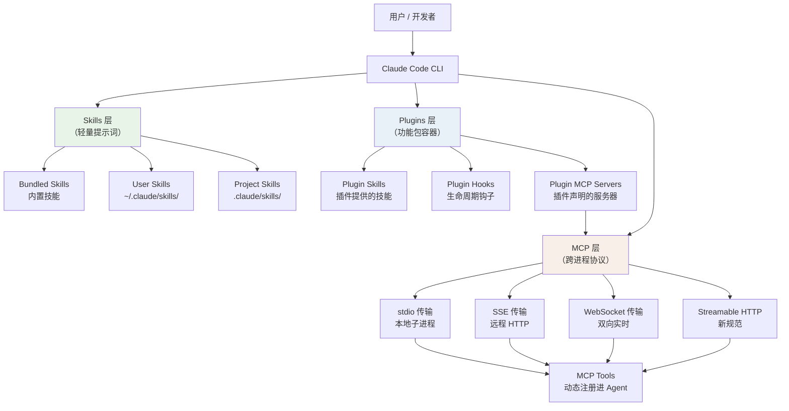
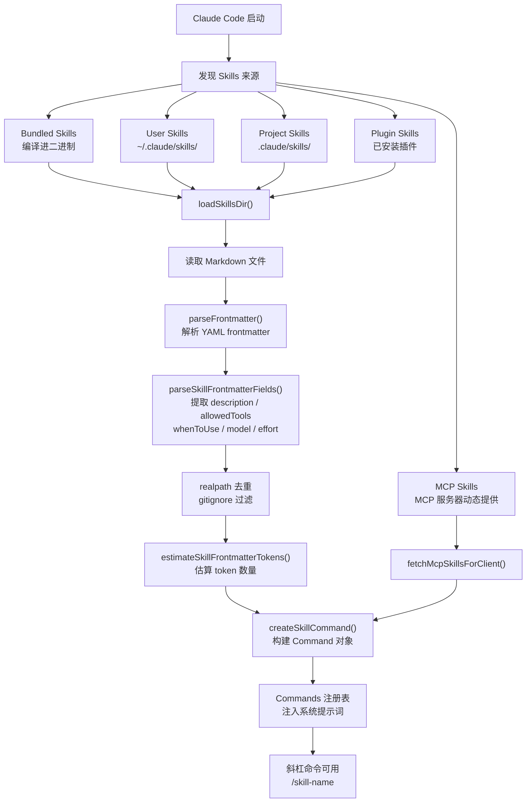
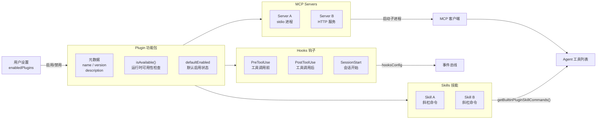
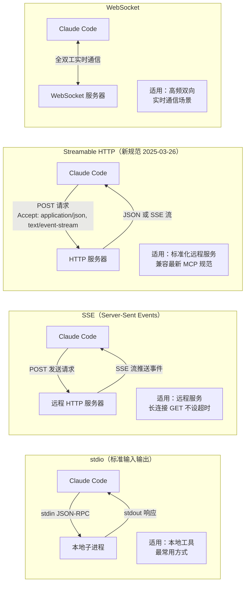
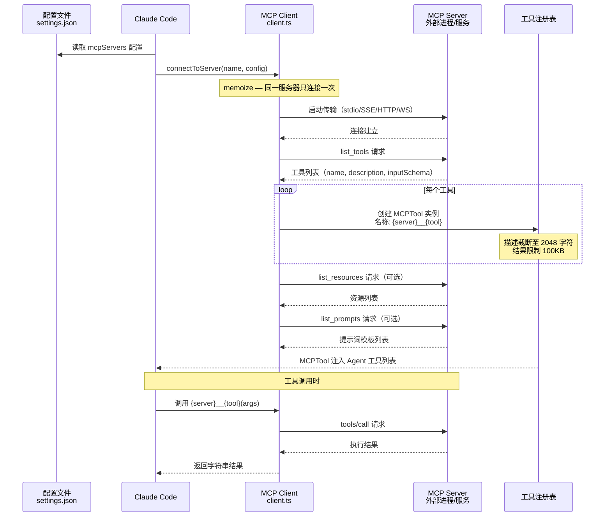
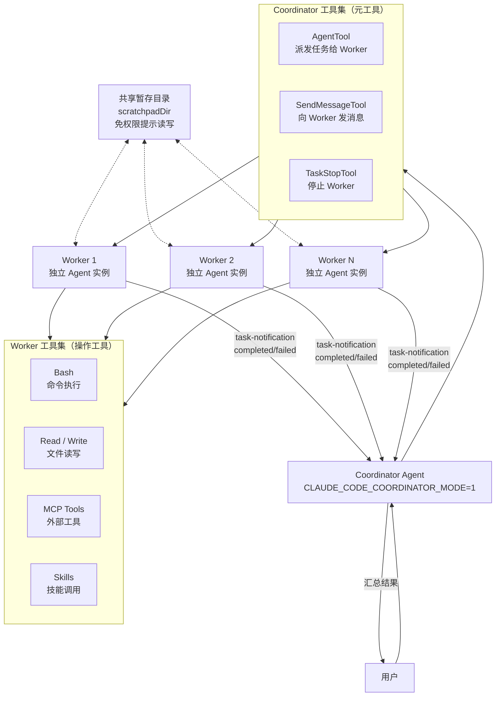

# 第七章：插件、Skills 与 MCP：打造可无限扩展的 Agent

> 一个优秀的工具，是那种能够超越创造者想象力的工具。Claude Code 的核心设计哲学之一，就是把自身做成一个平台，而不仅仅是一个程序。

每一个工程师在第一次用 Claude Code 完成某项重复性任务后，都会产生同一个念头：能不能把这个过程固化下来，下次直接调用？Claude Code 的答案是三层扩展机制：**Skills**（技能）、**Plugins**（插件）和 **MCP**（Model Context Protocol）。这三者共同构成了一套从轻量脚本到跨进程工具调用的完整生态。



---

## 一、三种扩展方式，各司其职

在动手写代码之前，先搞清楚这三者的边界：

- **Skills** 是最轻量的扩展单元。本质上是一段 Markdown 文件，写明"让模型做什么"。你可以把它理解为 Agent 的"操作手册"，用斜杠命令触发，例如 `/commit`、`/review`。
- **Plugins** 是 Skills 的组合容器，还可以附带 Hooks 配置和 MCP 服务器声明。一个 Plugin 等于一个功能包，可以在 `/plugin` UI 界面统一启用或禁用。
- **MCP** 是跨进程的工具协议。外部进程（或远程服务）通过标准协议暴露工具，Claude Code 的 MCP 客户端连接这些进程，把它们的工具动态注册进 Agent 的工具列表。

三者并不互斥，而是互相嵌套：Plugin 可以包含 Skills，Plugin 也可以声明 MCP 服务器，MCP 服务器反过来可以动态提供 Skills。

---

## 二、Skills 系统：把操作手册变成斜杠命令

### 一个 Skill 是什么？

最简单的 Skill 就是项目目录下 `.claude/skills/` 里的一个 Markdown 文件。文件开头是 YAML frontmatter，描述这个技能的元数据；正文是给模型看的提示词。

```markdown
---
description: 提交当前改动并写规范的 commit message
argument-hint: "[范围]"
allowed-tools: [Bash]
when_to_use: 当用户想提交代码改动时
---

检查 `git diff --staged` 的内容，按照 Conventional Commits 规范撰写 commit message，
然后执行 `git commit`。如果没有 staged 内容，先提示用户。
```

Frontmatter 中的字段直接映射到 `Command` 类型的属性。关键字段：

| 字段 | 作用 |
|------|------|
| `description` | 模型用来判断何时调用此技能 |
| `allowed-tools` | 限制此技能可以使用哪些工具 |
| `when_to_use` | 补充说明，写给模型看的触发条件 |
| `context: fork` | 以独立子 Agent 运行（而非内联） |
| `model` | 指定运行此技能的模型 |
| `effort` | 控制模型推理深度 |

`loadSkillsDir.ts` 中的 `parseSkillFrontmatterFields()` 函数负责解析这些字段：

```typescript
// src/skills/loadSkillsDir.ts
export function parseSkillFrontmatterFields(
  frontmatter: FrontmatterData,
  markdownContent: string,
  resolvedName: string,
): {
  description: string
  allowedTools: string[]
  whenToUse: string | undefined
  executionContext: 'fork' | undefined
  model: ReturnType<typeof parseUserSpecifiedModel> | undefined
  effort: EffortValue | undefined
  // ...
}
```

> **洞察**：`when_to_use` 字段不是给用户看的文档，而是直接注入到模型的上下文中，影响模型对"什么时候该调用哪个技能"的判断。写好这个字段，比写好 description 更重要。

### Skill 的三个来源

Claude Code 在启动时会从多个位置发现并注册 Skills，来源标记在 `LoadedFrom` 类型里：

```typescript
// src/skills/loadSkillsDir.ts
export type LoadedFrom =
  | 'commands_DEPRECATED'  // 旧版 .claude/commands/ 目录（已废弃）
  | 'skills'               // .claude/skills/ 目录（推荐）
  | 'plugin'               // 来自已安装插件
  | 'managed'              // 来自策略管理路径
  | 'bundled'              // 编译进二进制的内置技能
  | 'mcp'                  // 来自 MCP 服务器动态提供
```

按优先级排列：

1. **Bundled Skills**（内置技能）：编译进 CLI 二进制，无需任何配置即可使用。`src/skills/bundled/` 目录下有 `simplify.ts`、`loop.ts`、`verify.ts` 等十余个内置技能，通过 `registerBundledSkill()` 在模块初始化时注册。

2. **User Skills**（用户技能）：存放在 `~/.claude/skills/`，对所有项目生效。

3. **Project Skills**（项目技能）：存放在项目的 `.claude/skills/`，只在当前项目生效，可以覆盖用户级技能。

4. **Plugin Skills**（插件技能）：由已安装插件提供，通过 `getBuiltinPluginSkillCommands()` 加载。

5. **MCP Skills**（MCP 技能）：由 MCP 服务器动态暴露，通过 `fetchMcpSkillsForClient` 获取。

### Skill 发现：loadSkillsDir()

`loadSkillsDir.ts` 里的核心加载逻辑遍历目录、解析 Markdown、构建 `Command` 对象：

```typescript
// 从指定目录发现并加载所有技能文件
const skills = await loadMarkdownFilesForSubdir(skillsPath)
for (const file of skills) {
  const frontmatter = parseFrontmatter(file.content)
  const fields = parseSkillFrontmatterFields(
    frontmatter,
    file.content,
    file.name,
  )
  const command = createSkillCommand({
    skillName: file.name,
    markdownContent: file.content,
    source,          // 'userSettings' | 'projectSettings' | ...
    loadedFrom,      // 'skills' | 'plugin' | ...
    ...fields,
  })
  commands.push(command)
}
```

加载过程中会自动做**去重**（通过 `realpath` 解析符号链接的真实路径）和 **gitignore 过滤**（通过 `isPathGitignored()`），确保不会重复加载或加载不该加载的文件。

技能的 token 数量也会被估算（`estimateSkillFrontmatterTokens()`），这个数字用于控制注入到系统提示词中的技能列表长度，防止上下文爆炸。



### Bundled Skills 的安全文件提取

内置技能有一个特殊机制：它们可以携带附属文件（通过 `files` 字段），这些文件在技能首次被调用时懒加载解压到磁盘。代码里对这个过程的安全性处理相当严格：

```typescript
// src/skills/bundledSkills.ts
const SAFE_WRITE_FLAGS =
  process.platform === 'win32'
    ? 'wx'
    : fsConstants.O_WRONLY |
      fsConstants.O_CREAT |
      fsConstants.O_EXCL |
      O_NOFOLLOW  // 防止符号链接攻击

async function safeWriteFile(p: string, content: string): Promise<void> {
  const fh = await open(p, SAFE_WRITE_FLAGS, 0o600) // 仅所有者可读写
  try {
    await fh.writeFile(content, 'utf8')
  } finally {
    await fh.close()
  }
}
```

`O_EXCL` 保证不覆盖已有文件，`O_NOFOLLOW` 阻止最终路径组件是符号链接，`0o600` 确保文件权限严格。这是防御性编程的典型案例。

---

## 三、Plugin 系统：技能的组合与生命周期管理

### 内置插件与市场插件

Plugin ID 的格式揭示了一切：

- `episodic-memory@builtin` — 内置插件，由 CLI 自带
- `my-tool@marketplace` — 市场插件，从外部安装

`builtinPlugins.ts` 管理内置插件注册表：

```typescript
// src/plugins/builtinPlugins.ts
const BUILTIN_PLUGINS: Map<string, BuiltinPluginDefinition> = new Map()

export function registerBuiltinPlugin(
  definition: BuiltinPluginDefinition,
): void {
  BUILTIN_PLUGINS.set(definition.name, definition)
}
```

每个插件定义包含：

```typescript
type BuiltinPluginDefinition = {
  name: string
  description: string
  version: string
  defaultEnabled?: boolean          // 默认是否启用
  isAvailable?: () => boolean       // 运行时可用性检查
  skills?: BundledSkillDefinition[] // 插件提供的技能
  hooks?: HooksSettings             // 插件注册的钩子
  mcpServers?: McpServerConfig[]    // 插件声明的 MCP 服务器
}
```

### Plugin 的启用/禁用状态

用户的偏好持久化在用户设置里（`settings.enabledPlugins`），加载时合并决策：

```typescript
// src/plugins/builtinPlugins.ts
const userSetting = settings?.enabledPlugins?.[pluginId]
const isEnabled =
  userSetting !== undefined
    ? userSetting === true
    : (definition.defaultEnabled ?? true)
```

优先级：用户显式设置 > 插件默认值 > 全局默认（true）。

`isAvailable()` 提供运行时门控，比如某个插件只在特定 OS 或连接了特定服务时才可用，这个检查在插件列表构建时执行，不可用的插件完全不出现。

### Plugin 能提供什么？

一个 Plugin 可以同时提供三样东西：

1. **Skills**：通过 `getBuiltinPluginSkillCommands()` 在启动时注册，行为与普通 Bundled Skills 完全一致。
2. **Hooks**：在特定事件（如工具调用前后、会话开始结束）执行自定义脚本，`hooksConfig` 字段直接映射到 `HooksSettings` 类型。
3. **MCP Servers**：声明需要随插件一起启动的 MCP 服务器，`mcpServers` 字段携带完整的服务器配置。

> **洞察**：Plugin 和 Skill 的根本区别在于**生命周期管理**。Skill 是无状态的提示词片段，Plugin 是有状态的功能单元——它可以持久化启用状态，可以管理长期运行的后台进程（MCP 服务器），可以在多个生命周期事件上注册回调。



---

## 四、MCP：让 Agent 接入世界上的任何工具

### MCP 是什么？

**Model Context Protocol** 是 Anthropic 提出的开放协议，解决的问题是：如何让 AI Agent 以标准化方式调用外部工具，而不需要把每个工具都硬编码进 Agent 本身？

MCP 定义了三种原语：
- **Tools**（工具）：Agent 可以调用的函数，有输入 schema 和返回值
- **Resources**（资源）：Agent 可以读取的只读数据，如文件、数据库记录
- **Prompts**（提示词）：服务器端预定义的提示词模板

MCP 服务器可以是本地子进程，也可以是远程 HTTP 服务。协议本身和传输层是分离的。

### MCP Client 实现

`src/services/mcp/client.ts` 是整个 MCP 客户端的核心，超过 3000 行。入口是 `connectToServer()`：

```typescript
// src/services/mcp/client.ts
export const connectToServer = memoize(
  async (name: string, serverRef: ScopedMcpServerConfig) => {
    // ...根据传输类型创建不同的 Transport...
  }
)
```

注意 `memoize`——对同一个服务器的连接请求只建立一次，后续复用缓存的连接对象。连接超时默认 30 秒（`MCP_TIMEOUT` 环境变量可覆盖）。

### 四种传输类型

```typescript
// 进口声明揭示了所有支持的传输
import { StdioClientTransport } from '@modelcontextprotocol/sdk/client/stdio.js'
import { SSEClientTransport } from '@modelcontextprotocol/sdk/client/sse.js'
import {
  StreamableHTTPClientTransport,
} from '@modelcontextprotocol/sdk/client/streamableHttp.js'
import { WebSocketTransport } from '../../utils/mcpWebSocketTransport.js'
```

**stdio（标准输入输出）**：最常用的本地传输方式。Claude Code 启动子进程，通过 stdin/stdout 进行 JSON-RPC 通信：

```typescript
transport = new StdioClientTransport({
  command: serverConfig.command,
  args: serverConfig.args,
  env: subprocessEnv(serverConfig.env),
})
```

**SSE（Server-Sent Events）**：用于连接远程 HTTP 服务器，服务器通过 SSE 流推送事件，客户端通过 POST 发送请求。SSE 连接是长连接，Claude Code 专门处理了这种情况，GET 请求不添加超时：

```typescript
// GET 请求是长连接 SSE 流，不设超时
if (method === 'GET') {
  return baseFetch(url, init)
}
```

**Streamable HTTP**：MCP 2025-03-26 规范的新传输方式，POST 请求可以返回 JSON 或 SSE 流。Claude Code 在每个请求上强制设置 `Accept: application/json, text/event-stream`，确保与严格遵循规范的服务器兼容。

**WebSocket**：用于双向实时通信场景。



### MCP 工具如何变成 Claude Code 工具

这是整个 MCP 集成最关键的一步。连接成功后，客户端调用 `list_tools` 获取服务器暴露的工具列表，然后为每个工具创建一个 `MCPTool` 实例：

`MCPTool.ts` 定义了一个通用的工具骨架：

```typescript
// src/tools/MCPTool/MCPTool.ts
export const MCPTool = buildTool({
  isMcp: true,
  name: 'mcp',                    // 在 mcpClient.ts 中被覆盖为真实名称
  maxResultSizeChars: 100_000,

  // 输入 schema 使用 passthrough，因为 MCP 工具自己定义 schema
  get inputSchema(): InputSchema {
    return inputSchema()           // z.object({}).passthrough()
  },

  async call() {
    return { data: '' }            // 在 mcpClient.ts 中被覆盖为真实调用逻辑
  },

  async checkPermissions(): Promise<PermissionResult> {
    return {
      behavior: 'passthrough',
      message: 'MCPTool requires permission.',
    }
  },
})
```

`MCPTool` 是一个**模板**，真正的工具在 `client.ts` 里通过覆盖 `name`、`description`、`call` 等字段创建具体实例。每个 MCP 服务器的每个工具对应一个独立的 `MCPTool` 实例，工具名格式是 `{serverName}__{toolName}`（`buildMcpToolName()` 函数生成）。

工具结果有专门的截断和验证逻辑：

```typescript
// 100KB 的结果限制，超出则截断
maxResultSizeChars: 100_000

// MCP 工具描述的上限（防止 OpenAPI 生成的超长描述）
const MAX_MCP_DESCRIPTION_LENGTH = 2048
```

### 认证处理

MCP 支持 OAuth 认证。`auth.ts` 实现了完整的 OAuth 流程，包括：
- 发现认证端点（`.well-known/oauth-authorization-server`）
- 本地监听回调端口
- Token 刷新与失效处理

对于 claude.ai 代理连接，有专门的 `createClaudeAiProxyFetch()`，在每个请求上附加 Bearer token，遇到 401 时自动刷新并重试一次。还有一个 15 分钟的认证状态缓存（`mcp-needs-auth-cache.json`），避免反复向已知需要认证的服务器发送无效请求。

```typescript
// 认证失败缓存，避免频繁重试
const MCP_AUTH_CACHE_TTL_MS = 15 * 60 * 1000 // 15 分钟
```

### MCP Resources 和 Prompts

除工具外，MCP 还支持两种原语：

**Resources**：对应 `ListMcpResourcesTool` 和 `ReadMcpResourceTool`，让 Agent 能枚举并读取服务器暴露的资源（文件、数据库记录、API 响应等）。Resources 是只读的，适合让服务器控制哪些上下文信息可以被读取。

**Prompts**：服务器端预定义的提示词模板，通过 `ListPromptsResult` 和 `PromptMessage` 类型处理。这使得 MCP 服务器可以提供标准化的工作流模板，类似于 Skills，但由服务器动态生成和控制。

### MCP Skills：动态技能发现

一个高级特性：MCP 服务器可以动态暴露 Skills，这通过 `fetchMcpSkillsForClient` 实现。为了避免循环依赖（`client.ts → mcpSkills.ts → loadSkillsDir.ts → ... → client.ts`），代码用了一个巧妙的注册表模式：

```typescript
// src/skills/mcpSkillBuilders.ts
let builders: MCPSkillBuilders | null = null

export function registerMCPSkillBuilders(b: MCPSkillBuilders): void {
  builders = b
}

export function getMCPSkillBuilders(): MCPSkillBuilders {
  if (!builders) {
    throw new Error(
      'MCP skill builders not registered — loadSkillsDir.ts has not been evaluated yet',
    )
  }
  return builders
}
```

`loadSkillsDir.ts` 在模块初始化时调用 `registerMCPSkillBuilders()`，把自己的两个函数注入进去。这样 `client.ts` 在需要构建 Skill 对象时，通过 `getMCPSkillBuilders()` 间接调用 `loadSkillsDir.ts` 的函数，打破了循环。这个技巧——**依赖注入打破循环依赖**——在大型 TypeScript 项目里相当实用。



---

## 五、Coordinator 模式：多 Agent 编排

Skills 和 MCP 解决了"给单个 Agent 增加能力"的问题。Coordinator 模式解决的是另一个层次的问题：**如何让一个 Agent 去调度多个 Agent**？

### Coordinator 是什么？

通过环境变量 `CLAUDE_CODE_COORDINATOR_MODE=1` 启动的 Claude Code 实例，进入 Coordinator 模式。在这个模式下：

- Agent 获得一套**精简的工具集**：`AgentTool`（派发任务）、`SendMessageTool`（向已有 Worker 发消息）、`TaskStopTool`（停止 Worker）
- Worker 带有**完整工具集**（Bash、文件读写、MCP 工具、Skills 等）
- Coordinator 不直接执行代码，只负责拆解任务、派发、汇总

```typescript
// src/coordinator/coordinatorMode.ts
export function getCoordinatorSystemPrompt(): string {
  return `You are Claude Code, an AI assistant that orchestrates software engineering tasks across multiple workers.

## 1. Your Role
You are a **coordinator**. Your job is to:
- Help the user achieve their goal
- Direct workers to research, implement and verify code changes
- Synthesize results and communicate with the user
- Answer questions directly when possible — don't delegate work that you can handle without tools
`
}
```

### Worker 的工具边界

Coordinator 在上下文里明确告诉模型 Worker 有哪些工具：

```typescript
// src/coordinator/coordinatorMode.ts
export function getCoordinatorUserContext(
  mcpClients: ReadonlyArray<{ name: string }>,
  scratchpadDir?: string,
): { [k: string]: string } {
  const workerTools = Array.from(ASYNC_AGENT_ALLOWED_TOOLS)
    .filter(name => !INTERNAL_WORKER_TOOLS.has(name))
    .sort()
    .join(', ')

  let content = `Workers spawned via the ${AGENT_TOOL_NAME} tool have access to these tools: ${workerTools}`

  if (mcpClients.length > 0) {
    const serverNames = mcpClients.map(c => c.name).join(', ')
    content += `\n\nWorkers also have access to MCP tools from connected MCP servers: ${serverNames}`
  }

  if (scratchpadDir) {
    content += `\n\nScratchpad directory: ${scratchpadDir}\n` +
      `Workers can read and write here without permission prompts.`
  }

  return { workerToolsContext: content }
}
```

这段代码揭示了 Coordinator 的工作方式：它不需要了解 MCP 工具的细节，只需知道哪些服务器的名字，然后告诉模型"Worker 可以用这些服务器的工具"。具体工具的调用由 Worker 自己完成。

### Worker 结果的接收

Worker 的执行结果以**用户角色消息**的形式回到 Coordinator，包裹在 `<task-notification>` XML 标签中：

```xml
<task-notification>
  <task-id>{agentId}</task-id>
  <status>completed|failed|killed</status>
  <summary>{人类可读的摘要}</summary>
  <result>{Worker 的最终回复}</result>
  <usage>
    <total_tokens>N</total_tokens>
    <tool_uses>N</tool_uses>
    <duration_ms>N</duration_ms>
  </usage>
</task-notification>
```

系统提示词明确告诫 Coordinator："Worker 结果和系统通知是内部信号，不是对话伙伴——永远不要感谢或确认它们。"这个细节体现了对模型行为的精细控制：省去无意义的"收到，已确认"，直接处理结果。

> **洞察**：Coordinator 模式的本质是**工具集的分层**。Coordinator 层的工具是元工具（控制 Agent 的工具），Worker 层的工具是操作工具（控制代码和系统的工具）。通过限制 Coordinator 只能用元工具，强制它保持"指挥"而非"执行"的角色。

还有一个可选的**共享暂存目录**（scratchpad）机制：Coordinator 可以提供一个目录路径，所有 Worker 对这个目录有免权限提示的读写权。这使得跨 Worker 的知识共享成为可能——Worker A 的发现可以写入暂存目录，Worker B 读取并基于此继续工作，无需 Coordinator 中转。



---

## 六、实战：创建自定义 Skill 和 MCP 服务器

### 创建一个项目级 Skill

在项目根目录创建 `.claude/skills/changelog.md`：

```markdown
---
description: 根据 git log 生成本次发布的 CHANGELOG 条目
argument-hint: "[版本号]"
allowed-tools: [Bash]
when_to_use: 用户想生成 CHANGELOG 或查看版本变更内容时
---

获取参数作为版本号（如未提供则使用 "Unreleased"）。

执行 `git log --oneline $(git describe --tags --abbrev=0)..HEAD` 获取最近的提交列表。

按照 Keep a Changelog 格式整理提交，分类为：
- Added（新功能）
- Changed（变更）
- Fixed（修复）
- Removed（删除）

输出格式化的 Markdown 段落，可直接粘贴到 CHANGELOG.md。
```

保存后，直接在 Claude Code 中输入 `/changelog 1.2.0` 即可调用。

### 创建一个 MCP 服务器

以 Node.js 为例，创建一个暴露数据库查询工具的 MCP 服务器：

```javascript
// db-mcp-server.js
import { Server } from '@modelcontextprotocol/sdk/server/index.js'
import { StdioServerTransport } from '@modelcontextprotocol/sdk/server/stdio.js'

const server = new Server(
  { name: 'db-tools', version: '1.0.0' },
  { capabilities: { tools: {} } }
)

server.setRequestHandler('tools/list', async () => ({
  tools: [{
    name: 'query_users',
    description: '查询用户表，支持按邮箱或用户名过滤',
    inputSchema: {
      type: 'object',
      properties: {
        filter: { type: 'string', description: '过滤条件（可选）' }
      }
    }
  }]
}))

server.setRequestHandler('tools/call', async (request) => {
  if (request.params.name === 'query_users') {
    const { filter } = request.params.arguments
    // ... 实际查询逻辑
    return {
      content: [{ type: 'text', text: JSON.stringify(results) }]
    }
  }
})

const transport = new StdioServerTransport()
await server.connect(transport)
```

在 Claude Code 的 MCP 配置中注册这个服务器：

```json
// .claude/settings.json 或 ~/.claude/settings.json
{
  "mcpServers": {
    "db-tools": {
      "command": "node",
      "args": ["./db-mcp-server.js"],
      "env": {
        "DATABASE_URL": "${DATABASE_URL}"
      }
    }
  }
}
```

连接后，`db-tools__query_users` 工具会自动出现在 Agent 的工具列表中。注意环境变量的 `${DATABASE_URL}` 语法——MCP 客户端会在启动子进程前展开这些变量（`envExpansion.ts` 处理）。

```mermaid
flowchart LR
    subgraph Dev["开发者操作"]
        Write["编写 MCP 服务器\ndb-mcp-server.js\n实现 tools/list\n实现 tools/call"]
        Config["配置 settings.json\nmcpServers:\n  db-tools:\n    command: node\n    args: ./db-mcp-server.js\n    env: DATABASE_URL"]
    end

    subgraph Startup["Claude Code 启动"]
        EnvExpand["envExpansion.ts\n展开 ${DATABASE_URL}"]
        SpawnProc["启动子进程\nnode ./db-mcp-server.js"]
        ListTools["list_tools 请求\n获取工具列表"]
        Register["注册为 MCPTool\n名称: db-tools__query_users"]
    end

    subgraph Runtime["运行时调用"]
        AgentDecide["Agent 决定调用工具"]
        CallTool["tools/call 请求\n传入参数"]
        ExecLogic["服务器执行查询逻辑"]
        ReturnResult["返回 JSON 结果"]
    end

    Write --> Config
    Config --> EnvExpand
    EnvExpand --> SpawnProc
    SpawnProc --> ListTools
    ListTools --> Register
    Register --> AgentDecide
    AgentDecide --> CallTool
    CallTool --> ExecLogic
    ExecLogic --> ReturnResult
    ReturnResult --> AgentDecide
```



---

## 七、把工具变成平台

Skills、Plugins、MCP 三者形成了一个完整的扩展生态：

- **Skills** 是最低摩擦的入口。一个 Markdown 文件，五分钟，就能把一个重复流程固化为斜杠命令。没有编程要求，Prompt 工程师就能完成。

- **Plugins** 是 Skills 的打包和分发单元。把相关 Skills、Hooks、MCP 服务器打包成一个可启用/禁用的功能包，适合团队内部分发或生态系统建设。

- **MCP** 是真正的"无限扩展"。它把扩展的边界推到了 Claude Code 进程之外——任何能启动一个进程、实现 MCP 协议的程序，都可以成为 Claude Code 的工具提供者。数据库、CI 系统、监控平台、代码分析服务——都可以通过 MCP 接入。

- **Coordinator 模式**是这套机制的顶层。当单个 Agent 的能力边界遇到任务复杂度的上限时，Coordinator 把任务拆散，把工具分层，让多个 Agent 协同完成。

> 真正意义上的平台，是那种让用户能做出创造者未曾设想的事情的东西。Claude Code 通过把扩展机制标准化、分层化，正在走向这个目标。

代码、工具、Agent——三个层次的可编程性，构成了一个可以持续生长的系统。下一章，我们将深入 Claude Code 的权限系统，理解这套开放扩展机制背后的安全边界是如何设计的。

---

*本章涉及的核心源文件：*
- `/src/skills/loadSkillsDir.ts` — Skill 发现与解析
- `/src/skills/bundledSkills.ts` — 内置 Skill 注册机制
- `/src/skills/mcpSkillBuilders.ts` — 循环依赖破解模式
- `/src/plugins/builtinPlugins.ts` — 内置 Plugin 管理
- `/src/services/mcp/client.ts` — MCP 客户端核心
- `/src/tools/MCPTool/MCPTool.ts` — MCP 工具包装器
- `/src/coordinator/coordinatorMode.ts` — Coordinator 模式实现
