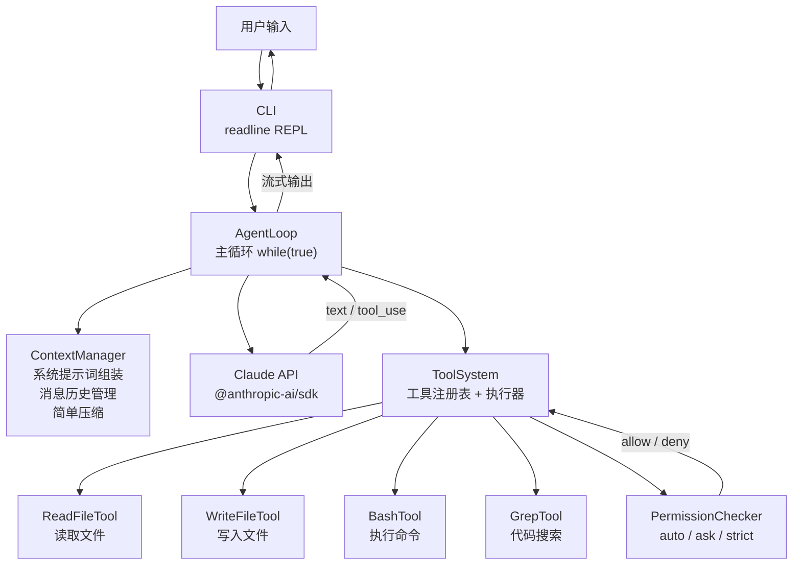
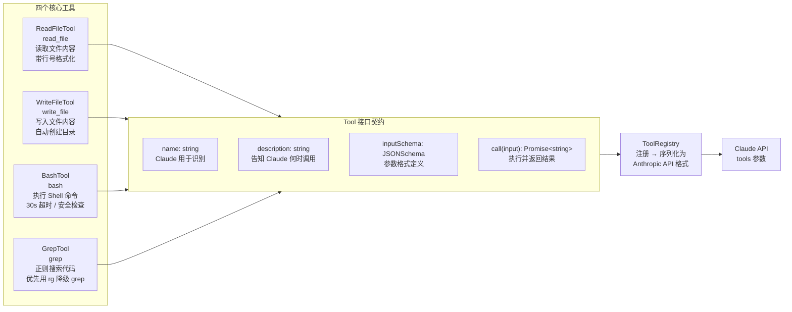
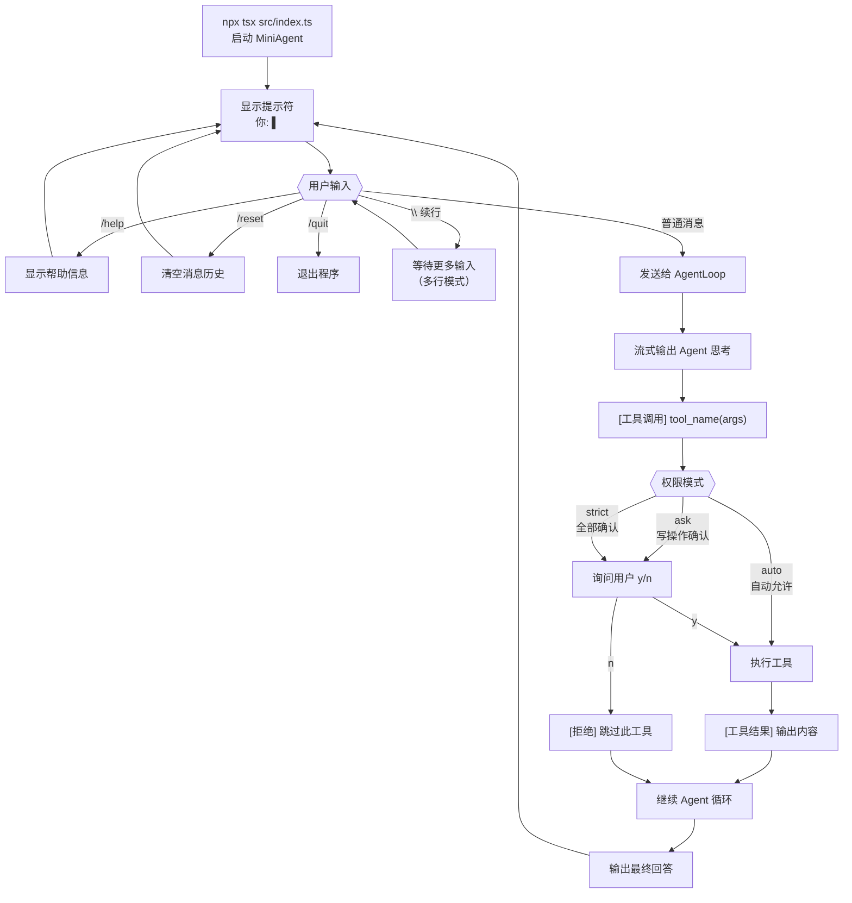
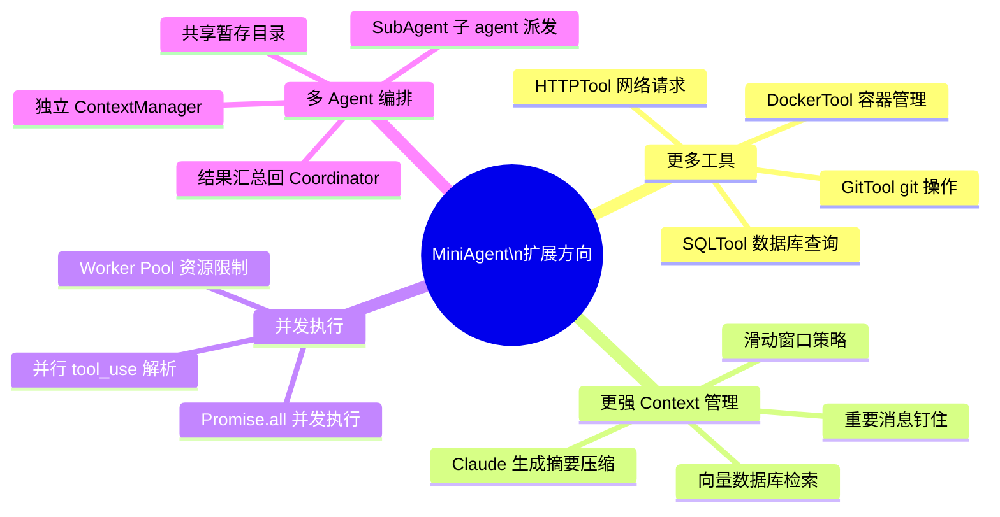
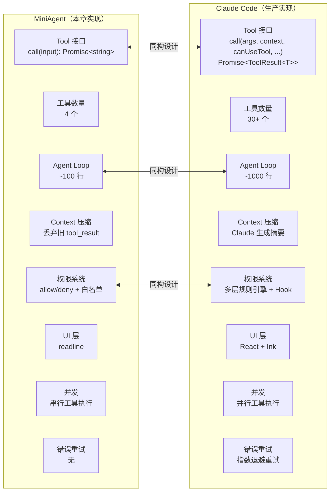
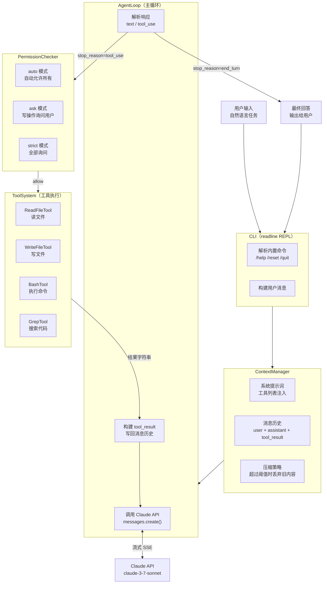

# 第八章：实战——从零构建你自己的 Code Agent

经过前七章的拆解，你已经看清楚了 Claude Code 的骨架：Tool 接口、agent loop、context 管理、权限系统。现在是动手的时候了。

这一章我们从零搭建一个叫做 **MiniAgent** 的 Code Agent。它不是玩具——它具备真正的文件读写、命令执行、代码搜索能力，以及一个可以和它对话的 REPL 界面。代码全部可运行，跟着做完你就有了一个属于自己的 Agent。



---

## 1. 我们要构建什么

**MiniAgent** 的核心组件：

- **CLI**：readline REPL，接受用户输入，展示输出
- **ToolSystem**：工具注册表 + 工具执行器
- **AgentLoop**：`while(true)` 驱动的主循环，调用 Claude API、执行工具
- **ContextManager**：系统提示词组装、消息历史管理、简单压缩

技术栈选择很简单：TypeScript、`@anthropic-ai/sdk`、Node.js 内置的 `readline`。不引入任何框架，代码直接对应概念。

> 好的 agent 架构往往比你想象的简单。复杂性来自于边缘情况的处理，而不是核心结构。

---

## 2. 第一步：项目初始化

创建项目目录：

```bash
mkdir mini-agent && cd mini-agent
npm init -y
```

**package.json** — 关键配置：

```json
{
  "name": "mini-agent",
  "version": "0.1.0",
  "type": "module",
  "scripts": {
    "start": "node --loader ts-node/esm src/index.ts",
    "build": "tsc",
    "dev": "tsx src/index.ts"
  },
  "dependencies": {
    "@anthropic-ai/sdk": "^0.39.0"
  },
  "devDependencies": {
    "@types/node": "^22.0.0",
    "tsx": "^4.0.0",
    "typescript": "^5.0.0"
  }
}
```

**tsconfig.json**：

```json
{
  "compilerOptions": {
    "target": "ES2022",
    "module": "ESNext",
    "moduleResolution": "bundler",
    "strict": true,
    "outDir": "./dist",
    "rootDir": "./src",
    "esModuleInterop": true,
    "skipLibCheck": true
  },
  "include": ["src/**/*"]
}
```

安装依赖：

```bash
npm install
```

项目结构如下：

```
mini-agent/
  src/
    index.ts          # 入口
    types.ts          # Tool 接口定义
    tools/
      ReadFileTool.ts
      WriteFileTool.ts
      BashTool.ts
      GrepTool.ts
    ToolRegistry.ts   # 工具注册表
    ContextManager.ts # 上下文管理
    AgentLoop.ts      # Agent 主循环
    CLI.ts            # REPL 界面
  package.json
  tsconfig.json
```

---

## 3. 第二步：定义 Tool 接口

Claude Code 的 `Tool.ts` 有数百行类型定义，支撑了 React 渲染、权限系统、MCP 协议等复杂场景。我们的版本只保留核心契约。

新建 `src/types.ts`：

```typescript
// src/types.ts

/**
 * JSON Schema 对象类型描述符
 */
export interface JSONSchema {
  type: string;
  properties?: Record<string, JSONSchema>;
  required?: string[];
  description?: string;
  items?: JSONSchema;
  enum?: unknown[];
}

/**
 * Tool 接口 — MiniAgent 的核心契约
 *
 * 每个工具必须：
 * 1. 声明自己的名字和用途（供 Claude 理解何时调用它）
 * 2. 声明输入参数的 JSON Schema
 * 3. 实现 call() — 接收 Claude 传来的参数，返回字符串结果
 */
export interface Tool {
  /** 工具名，Claude 用这个名字来调用工具 */
  name: string;

  /** 自然语言描述，告诉 Claude 这个工具能做什么、何时用它 */
  description: string;

  /** 输入参数的 JSON Schema，Claude 按此格式传参 */
  inputSchema: JSONSchema;

  /**
   * 执行工具
   * @param input Claude 传来的参数对象
   * @returns 工具执行结果（字符串），将作为 tool_result 返回给 Claude
   */
  call(input: Record<string, unknown>): Promise<string>;
}

/**
 * 消息类型 — 对应 Anthropic API 的 message 格式
 */
export type MessageRole = "user" | "assistant";

export interface TextBlock {
  type: "text";
  text: string;
}

export interface ToolUseBlock {
  type: "tool_use";
  id: string;
  name: string;
  input: Record<string, unknown>;
}

export interface ToolResultBlock {
  type: "tool_result";
  tool_use_id: string;
  content: string;
}

export type ContentBlock = TextBlock | ToolUseBlock | ToolResultBlock;

export interface Message {
  role: MessageRole;
  content: ContentBlock[] | string;
}

/**
 * 权限决策结果
 */
export type PermissionDecision = "allow" | "deny";

export interface PermissionRequest {
  toolName: string;
  input: Record<string, unknown>;
  description: string;
}
```

> 注意 `call()` 返回 `Promise<string>`，这是刻意的简化。Claude Code 的工具返回复杂的 `ToolResult<T>` 对象，携带新消息、上下文修改器等。我们的版本用纯字符串，足够演示核心流程。

---

## 4. 第三步：实现核心工具

### ReadFileTool

```typescript
// src/tools/ReadFileTool.ts
import { readFile } from "node:fs/promises";
import { resolve } from "node:path";
import type { Tool } from "../types.js";

export const ReadFileTool: Tool = {
  name: "read_file",
  description:
    "读取文件内容。当你需要查看某个文件时使用此工具。" +
    "返回文件的完整文本内容。",
  inputSchema: {
    type: "object",
    properties: {
      path: {
        type: "string",
        description: "要读取的文件路径（绝对路径或相对于工作目录的路径）",
      },
    },
    required: ["path"],
  },

  async call(input) {
    const path = input["path"] as string;
    if (!path) {
      return "错误：缺少 path 参数";
    }

    try {
      const absolutePath = resolve(process.cwd(), path);
      const content = await readFile(absolutePath, "utf-8");

      // 防止超大文件淹没 context
      const MAX_CHARS = 50_000;
      if (content.length > MAX_CHARS) {
        return (
          content.slice(0, MAX_CHARS) +
          `\n\n[文件被截断，共 ${content.length} 字符，只显示前 ${MAX_CHARS} 字符]`
        );
      }

      return content;
    } catch (err) {
      const error = err as NodeJS.ErrnoException;
      if (error.code === "ENOENT") {
        return `错误：文件不存在: ${path}`;
      }
      if (error.code === "EACCES") {
        return `错误：没有读取权限: ${path}`;
      }
      return `错误：${error.message}`;
    }
  },
};
```

### WriteFileTool

```typescript
// src/tools/WriteFileTool.ts
import { writeFile, mkdir } from "node:fs/promises";
import { resolve, dirname } from "node:path";
import type { Tool } from "../types.js";

export const WriteFileTool: Tool = {
  name: "write_file",
  description:
    "将内容写入文件。如果文件不存在则创建，如果存在则覆盖。" +
    "会自动创建所需的父目录。",
  inputSchema: {
    type: "object",
    properties: {
      path: {
        type: "string",
        description: "要写入的文件路径",
      },
      content: {
        type: "string",
        description: "要写入文件的内容",
      },
    },
    required: ["path", "content"],
  },

  async call(input) {
    const path = input["path"] as string;
    const content = input["content"] as string;

    if (!path) return "错误：缺少 path 参数";
    if (content === undefined) return "错误：缺少 content 参数";

    try {
      const absolutePath = resolve(process.cwd(), path);

      // 自动创建父目录
      await mkdir(dirname(absolutePath), { recursive: true });
      await writeFile(absolutePath, content, "utf-8");

      return `成功写入文件: ${path} (${content.length} 字符)`;
    } catch (err) {
      return `错误：${(err as Error).message}`;
    }
  },
};
```

### BashTool

BashTool 是最强大也最危险的工具。我们加入基本的安全检查：

```typescript
// src/tools/BashTool.ts
import { exec } from "node:child_process";
import { promisify } from "node:util";
import type { Tool } from "../types.js";

const execAsync = promisify(exec);

// 危险命令黑名单 — 生产环境应当更严格
const DANGEROUS_PATTERNS = [
  /rm\s+-rf\s+[\/~]/,      // rm -rf / 或 rm -rf ~
  /:\s*\(\s*\)\s*\{/,      // fork bomb
  /dd\s+if=/,              // dd 覆写磁盘
  /mkfs/,                  // 格式化文件系统
  />\s*\/dev\/[sh]d/,      // 写入磁盘设备
  /chmod\s+-R\s+777\s+\//,  // 递归修改根目录权限
];

export const BashTool: Tool = {
  name: "bash",
  description:
    "在 shell 中执行命令并返回输出。" +
    "适合运行测试、查看目录结构、执行构建命令等。" +
    "超时时间为 30 秒。",
  inputSchema: {
    type: "object",
    properties: {
      command: {
        type: "string",
        description: "要执行的 shell 命令",
      },
      timeout: {
        type: "number",
        description: "超时时间（毫秒），默认 30000",
      },
    },
    required: ["command"],
  },

  async call(input) {
    const command = input["command"] as string;
    const timeout = (input["timeout"] as number) ?? 30_000;

    if (!command) return "错误：缺少 command 参数";

    // 安全检查
    for (const pattern of DANGEROUS_PATTERNS) {
      if (pattern.test(command)) {
        return `拒绝执行：命令 "${command}" 匹配危险模式，已阻止`;
      }
    }

    try {
      const { stdout, stderr } = await execAsync(command, {
        timeout,
        cwd: process.cwd(),
        // 限制输出大小，防止撑爆 context
        maxBuffer: 1024 * 1024, // 1MB
      });

      const output = [
        stdout.trim() && `STDOUT:\n${stdout.trim()}`,
        stderr.trim() && `STDERR:\n${stderr.trim()}`,
      ]
        .filter(Boolean)
        .join("\n\n");

      return output || "(命令执行成功，无输出)";
    } catch (err) {
      const error = err as { killed?: boolean; code?: number; stderr?: string; message: string };
      if (error.killed) {
        return `错误：命令超时（>${timeout}ms）`;
      }
      return [
        `命令退出码: ${error.code ?? "unknown"}`,
        error.stderr?.trim() && `STDERR:\n${error.stderr.trim()}`,
        `错误: ${error.message}`,
      ]
        .filter(Boolean)
        .join("\n");
    }
  },
};
```

### GrepTool

```typescript
// src/tools/GrepTool.ts
import { exec } from "node:child_process";
import { promisify } from "node:util";
import type { Tool } from "../types.js";

const execAsync = promisify(exec);

export const GrepTool: Tool = {
  name: "grep",
  description:
    "在文件中搜索匹配某个模式的内容。支持正则表达式。" +
    "返回匹配行及其行号。适合在代码库中查找函数定义、变量使用等。",
  inputSchema: {
    type: "object",
    properties: {
      pattern: {
        type: "string",
        description: "要搜索的正则表达式或字符串",
      },
      path: {
        type: "string",
        description: "搜索的文件或目录路径，默认为当前目录",
      },
      include: {
        type: "string",
        description: '文件名匹配模式，例如 "*.ts" 或 "*.{js,ts}"',
      },
    },
    required: ["pattern"],
  },

  async call(input) {
    const pattern = input["pattern"] as string;
    const path = (input["path"] as string) ?? ".";
    const include = input["include"] as string | undefined;

    if (!pattern) return "错误：缺少 pattern 参数";

    // 使用 ripgrep（如果可用）或回退到 grep
    const useRipgrep = await hasRipgrep();

    let command: string;
    if (useRipgrep) {
      command = [
        "rg",
        "--line-number",
        "--no-heading",
        "--color=never",
        include ? `--glob '${include}'` : "",
        `'${pattern.replace(/'/g, "'\\''")}'`,
        path,
      ]
        .filter(Boolean)
        .join(" ");
    } else {
      command = [
        "grep",
        "-rn",
        "--color=never",
        include ? `--include='${include}'` : "",
        `'${pattern.replace(/'/g, "'\\''")}'`,
        path,
      ]
        .filter(Boolean)
        .join(" ");
    }

    try {
      const { stdout } = await execAsync(command, {
        cwd: process.cwd(),
        maxBuffer: 512 * 1024,
      });

      const lines = stdout.trim().split("\n");
      if (lines.length > 200) {
        return (
          lines.slice(0, 200).join("\n") +
          `\n\n[结果被截断，共 ${lines.length} 行，只显示前 200 行]`
        );
      }

      return stdout.trim() || "没有找到匹配结果";
    } catch (err) {
      const error = err as { code?: number; message: string };
      // exit code 1 means no matches (not an error)
      if (error.code === 1) return "没有找到匹配结果";
      return `错误：${error.message}`;
    }
  },
};

async function hasRipgrep(): Promise<boolean> {
  try {
    await execAsync("which rg");
    return true;
  } catch {
    return false;
  }
}
```



---

## 5. 第四步：构建工具注册表

工具注册表负责两件事：持有工具实例，以及把工具转换成 Anthropic API 需要的格式。

```typescript
// src/ToolRegistry.ts
import type { Tool } from "./types.js";

/**
 * ToolRegistry — 工具注册表
 *
 * Claude Code 的 tools.ts 维护了二十余个工具的注册列表，
 * 并支持按 feature flag 动态开关。
 * 我们的版本保持极简：注册、查找、序列化。
 */
export class ToolRegistry {
  private tools = new Map<string, Tool>();

  /** 注册一个工具 */
  register(tool: Tool): this {
    if (this.tools.has(tool.name)) {
      throw new Error(`工具 "${tool.name}" 已经注册`);
    }
    this.tools.set(tool.name, tool);
    return this;
  }

  /** 批量注册 */
  registerAll(tools: Tool[]): this {
    for (const tool of tools) {
      this.register(tool);
    }
    return this;
  }

  /** 按名字查找工具 */
  find(name: string): Tool | undefined {
    return this.tools.get(name);
  }

  /** 获取所有已注册工具 */
  all(): Tool[] {
    return Array.from(this.tools.values());
  }

  /**
   * 将工具列表序列化为 Anthropic API 格式
   *
   * API 期望的格式：
   * {
   *   name: string,
   *   description: string,
   *   input_schema: JSONSchema
   * }
   */
  toAPIFormat(): Array<{
    name: string;
    description: string;
    input_schema: Tool["inputSchema"];
  }> {
    return this.all().map((tool) => ({
      name: tool.name,
      description: tool.description,
      input_schema: tool.inputSchema,
    }));
  }
}
```

---

## 6. 第五步：构建上下文管理器

Claude Code 的 context.ts 负责组装系统提示词，包含 git 状态、CLAUDE.md 内容、工作目录等十余个动态片段。我们的版本专注于三个核心职责：组装系统提示词、维护消息历史、简单压缩。

```typescript
// src/ContextManager.ts
import type { Message, ContentBlock, ToolResultBlock } from "./types.js";

/**
 * ContextManager — 上下文管理器
 *
 * 负责：
 * 1. 组装系统提示词
 * 2. 维护消息历史
 * 3. 当 context 过长时进行简单压缩
 */
export class ContextManager {
  private messages: Message[] = [];

  /** 最大保留的消息轮数（一轮 = user + assistant） */
  private readonly maxTurns: number;

  /** 触发压缩的消息数阈值 */
  private readonly compactionThreshold: number;

  constructor(options: { maxTurns?: number; compactionThreshold?: number } = {}) {
    this.maxTurns = options.maxTurns ?? 20;
    this.compactionThreshold = options.compactionThreshold ?? 40;
  }

  /**
   * 组装系统提示词
   *
   * Claude Code 的系统提示词非常复杂，包含工具使用规范、安全指引、
   * 工作目录信息、git 状态等。我们保留骨架，你可以按需扩展。
   */
  buildSystemPrompt(): string {
    const now = new Date().toISOString();
    const cwd = process.cwd();

    return `你是 MiniAgent，一个强大的代码助手。你运行在用户的计算机上，可以直接读写文件、执行命令。

## 基本信息
- 当前时间：${now}
- 工作目录：${cwd}
- 操作系统：${process.platform}

## 工具使用原则
1. 优先使用工具获取真实信息，不要凭记忆猜测文件内容
2. 读取文件后再修改，不要假设文件结构
3. 执行破坏性操作前，先确认用户意图
4. 命令执行失败时，分析错误并尝试修复

## 回复风格
- 用中文回复
- 操作完成后，简洁地告知结果
- 遇到歧义时，主动询问而不是猜测

## 安全约束
- 不执行会损坏系统的命令
- 不读取明显的敏感文件（/etc/shadow 等）
- 对于删除操作，始终二次确认`;
  }

  /** 添加用户消息 */
  addUserMessage(text: string): void {
    this.messages.push({
      role: "user",
      content: [{ type: "text", text }],
    });
  }

  /** 添加 assistant 消息 */
  addAssistantMessage(content: ContentBlock[]): void {
    this.messages.push({
      role: "assistant",
      content,
    });
  }

  /** 添加工具结果（追加到最后一个 user 消息，或创建新的） */
  addToolResults(results: ToolResultBlock[]): void {
    // Anthropic API 要求 tool_result 放在 user 角色的消息里
    const lastMessage = this.messages[this.messages.length - 1];

    if (lastMessage && lastMessage.role === "user" && Array.isArray(lastMessage.content)) {
      // 追加到现有的 user 消息
      lastMessage.content.push(...results);
    } else {
      // 创建新的 user 消息
      this.messages.push({
        role: "user",
        content: results,
      });
    }
  }

  /** 获取当前所有消息 */
  getMessages(): Message[] {
    return this.messages;
  }

  /**
   * 简单压缩策略：丢弃最旧的工具结果内容
   *
   * Claude Code 有精心设计的压缩机制，会调用 Claude 本身来生成摘要。
   * 这里我们用最简单的策略：当消息数超过阈值时，
   * 把早期 tool_result 的内容替换为占位符。
   */
  maybeCompact(): boolean {
    if (this.messages.length < this.compactionThreshold) {
      return false;
    }

    // 保留最近 maxTurns * 2 条消息
    const keepFrom = Math.max(0, this.messages.length - this.maxTurns * 2);

    // 对需要丢弃区间内的消息，清空 tool_result 内容
    for (let i = 0; i < keepFrom; i++) {
      const msg = this.messages[i];
      if (Array.isArray(msg.content)) {
        for (const block of msg.content) {
          if (block.type === "tool_result") {
            (block as ToolResultBlock).content = "[内容已压缩以节省 context 空间]";
          }
        }
      }
    }

    return true;
  }

  /** 清空历史（新会话用） */
  reset(): void {
    this.messages = [];
  }

  /** 当前消息数 */
  get messageCount(): number {
    return this.messages.length;
  }
}
```

> 真正的 context 压缩是个难题。Claude Code 用 Claude 本身来总结历史对话，生成摘要后替换原始消息。我们的策略是"丢弃旧工具结果"，简单但够用。生产级 agent 需要更智能的策略。

---

## 7. 第六步：构建权限检查器

权限系统是 agent 安全性的守门人。简单实现一个基于白名单的检查器：

```typescript
// src/PermissionChecker.ts
import * as readline from "node:readline";
import type { PermissionDecision, PermissionRequest } from "./types.js";

/**
 * PermissionChecker — 权限检查器
 *
 * Claude Code 有复杂的权限系统：
 * - 规则匹配（alwaysAllow / alwaysDeny / alwaysAsk）
 * - 模式匹配（"Bash(git *)" 这样的细粒度规则）
 * - 用户交互确认
 *
 * 我们实现三种模式：auto（全允许）、ask（总是询问写操作）、strict（总是询问）
 */
export class PermissionChecker {
  private mode: "auto" | "ask" | "strict";
  private rl: readline.Interface;

  /** 只读工具，无需确认 */
  private readonly readOnlyTools = new Set(["read_file", "grep"]);

  /** 总是需要确认的高危操作关键词 */
  private readonly dangerousKeywords = ["rm ", "delete", "drop ", "truncate"];

  constructor(
    mode: "auto" | "ask" | "strict",
    rl: readline.Interface
  ) {
    this.mode = mode;
    this.rl = rl;
  }

  async check(request: PermissionRequest): Promise<PermissionDecision> {
    // 只读工具在非 strict 模式下直接放行
    if (this.mode === "auto" && this.readOnlyTools.has(request.toolName)) {
      return "allow";
    }

    // auto 模式：全部放行（适合信任环境）
    if (this.mode === "auto") {
      return "allow";
    }

    // 检查是否包含高危关键词
    const inputStr = JSON.stringify(request.input).toLowerCase();
    const isDangerous = this.dangerousKeywords.some((kw) =>
      inputStr.includes(kw)
    );

    // ask 模式：只读工具放行，写操作和高危操作询问
    if (this.mode === "ask") {
      if (this.readOnlyTools.has(request.toolName) && !isDangerous) {
        return "allow";
      }
    }

    // 需要询问用户
    return this.askUser(request, isDangerous);
  }

  private async askUser(
    request: PermissionRequest,
    isDangerous: boolean
  ): Promise<PermissionDecision> {
    const prefix = isDangerous ? "⚠️  高危操作" : "需要确认";
    console.log(`\n${prefix}: ${request.toolName}`);
    console.log(`描述: ${request.description}`);
    console.log(`参数: ${JSON.stringify(request.input, null, 2)}`);

    return new Promise((resolve) => {
      this.rl.question("允许执行? [y/N] ", (answer) => {
        const decision = answer.toLowerCase() === "y" ? "allow" : "deny";
        resolve(decision);
      });
    });
  }
}
```

---

## 8. 第七步：构建 Agent 主循环

这是整个 agent 的心脏。Claude Code 的 `query.ts` 超过千行，处理了流式输出、工具并发、压缩触发、错误重试等复杂逻辑。我们的版本保留核心骨架：

```typescript
// src/AgentLoop.ts
import Anthropic from "@anthropic-ai/sdk";
import type { ContextManager } from "./ContextManager.js";
import type { ToolRegistry } from "./ToolRegistry.js";
import type { PermissionChecker } from "./PermissionChecker.js";
import type {
  ContentBlock,
  TextBlock,
  ToolUseBlock,
  ToolResultBlock,
} from "./types.js";

/**
 * AgentLoop — Agent 主循环
 *
 * 核心逻辑（与 Claude Code query.ts 的骨架相同）：
 *
 * while (true) {
 *   response = await callClaudeAPI(messages)
 *   if (response.stop_reason === "end_turn") break   // Claude 认为任务完成
 *   if (response.stop_reason === "tool_use") {
 *     results = await executeTools(response.tool_calls)
 *     messages.push(results)
 *     continue  // 继续循环，把工具结果喂给 Claude
 *   }
 * }
 */
export class AgentLoop {
  private client: Anthropic;
  private model: string;

  constructor(
    private context: ContextManager,
    private registry: ToolRegistry,
    private permissions: PermissionChecker,
    options: { model?: string } = {}
  ) {
    this.client = new Anthropic();
    this.model = options.model ?? "claude-opus-4-5";
  }

  /**
   * 处理一轮用户输入，运行 agent 直到任务完成或出错
   *
   * @param userInput 用户的原始输入
   * @param onText 流式文本回调（每个文本片段触发一次）
   * @returns 最终的 assistant 文本回复
   */
  async run(
    userInput: string,
    onText: (delta: string) => void
  ): Promise<string> {
    // 1. 把用户输入加入消息历史
    this.context.addUserMessage(userInput);

    // 2. 触发压缩检查
    if (this.context.maybeCompact()) {
      console.log("\n[系统: 已压缩历史消息以节省空间]\n");
    }

    let fullResponse = "";
    let turnCount = 0;
    const MAX_TURNS = 20; // 防止无限循环

    // 3. Agent 主循环
    while (turnCount < MAX_TURNS) {
      turnCount++;

      // 4. 调用 Claude API（流式）
      const { contentBlocks, stopReason } = await this.callAPI(onText);

      // 5. 将 assistant 回复加入历史
      this.context.addAssistantMessage(contentBlocks);

      // 提取文本内容
      const textContent = contentBlocks
        .filter((b): b is TextBlock => b.type === "text")
        .map((b) => b.text)
        .join("");
      fullResponse += textContent;

      // 6. 判断终止条件
      if (stopReason === "end_turn") {
        // Claude 认为任务完成，退出循环
        break;
      }

      if (stopReason === "tool_use") {
        // 7. 提取所有 tool_use 块
        const toolUseBlocks = contentBlocks.filter(
          (b): b is ToolUseBlock => b.type === "tool_use"
        );

        if (toolUseBlocks.length === 0) break;

        // 8. 执行工具（串行，生产环境可并行）
        const toolResults = await this.executeTools(toolUseBlocks);

        // 9. 把工具结果加入消息历史，继续循环
        this.context.addToolResults(toolResults);
        continue;
      }

      // 其他 stop_reason（max_tokens 等），退出
      break;
    }

    if (turnCount >= MAX_TURNS) {
      console.warn("\n[警告: 达到最大轮次限制]\n");
    }

    return fullResponse;
  }

  /**
   * 调用 Claude API，流式返回内容
   */
  private async callAPI(onText: (delta: string) => void): Promise<{
    contentBlocks: ContentBlock[];
    stopReason: string;
  }> {
    const messages = this.context.getMessages();
    const systemPrompt = this.context.buildSystemPrompt();

    const contentBlocks: ContentBlock[] = [];
    let stopReason = "end_turn";

    // 使用流式 API
    const stream = await this.client.messages.stream({
      model: this.model,
      max_tokens: 8096,
      system: systemPrompt,
      tools: this.registry.toAPIFormat(),
      // Anthropic SDK 期望的消息格式
      messages: messages.map((msg) => ({
        role: msg.role,
        content: msg.content,
      })) as Anthropic.MessageParam[],
    });

    // 收集流式内容
    let currentTextBlock: { type: "text"; text: string } | null = null;
    let currentToolBlock: ToolUseBlock | null = null;
    let currentToolInput = "";

    for await (const event of stream) {
      if (event.type === "content_block_start") {
        if (event.content_block.type === "text") {
          currentTextBlock = { type: "text", text: "" };
          currentToolBlock = null;
        } else if (event.content_block.type === "tool_use") {
          currentToolBlock = {
            type: "tool_use",
            id: event.content_block.id,
            name: event.content_block.name,
            input: {},
          };
          currentToolInput = "";
          currentTextBlock = null;
        }
      } else if (event.type === "content_block_delta") {
        if (event.delta.type === "text_delta" && currentTextBlock) {
          currentTextBlock.text += event.delta.text;
          onText(event.delta.text); // 实时推送给调用方
        } else if (
          event.delta.type === "input_json_delta" &&
          currentToolBlock
        ) {
          currentToolInput += event.delta.partial_json;
        }
      } else if (event.type === "content_block_stop") {
        if (currentTextBlock) {
          contentBlocks.push(currentTextBlock);
          currentTextBlock = null;
        } else if (currentToolBlock) {
          try {
            currentToolBlock.input = JSON.parse(currentToolInput || "{}");
          } catch {
            currentToolBlock.input = {};
          }
          contentBlocks.push(currentToolBlock);
          currentToolBlock = null;
          currentToolInput = "";
        }
      } else if (event.type === "message_delta") {
        stopReason = event.delta.stop_reason ?? "end_turn";
      }
    }

    return { contentBlocks, stopReason };
  }

  /**
   * 执行工具调用列表
   */
  private async executeTools(
    toolUseBlocks: ToolUseBlock[]
  ): Promise<ToolResultBlock[]> {
    const results: ToolResultBlock[] = [];

    for (const block of toolUseBlocks) {
      console.log(`\n[工具调用] ${block.name}(${JSON.stringify(block.input)})`);

      const tool = this.registry.find(block.name);

      if (!tool) {
        results.push({
          type: "tool_result",
          tool_use_id: block.id,
          content: `错误：未找到工具 "${block.name}"`,
        });
        continue;
      }

      // 权限检查
      const decision = await this.permissions.check({
        toolName: block.name,
        input: block.input,
        description: tool.description,
      });

      if (decision === "deny") {
        results.push({
          type: "tool_result",
          tool_use_id: block.id,
          content: `用户拒绝了此工具调用`,
        });
        console.log(`[权限] 已拒绝 ${block.name}`);
        continue;
      }

      // 执行工具
      try {
        const result = await tool.call(block.input);
        results.push({
          type: "tool_result",
          tool_use_id: block.id,
          content: result,
        });
        console.log(`[工具结果] ${result.slice(0, 100)}${result.length > 100 ? "..." : ""}`);
      } catch (err) {
        const errorMsg = `工具执行异常: ${(err as Error).message}`;
        results.push({
          type: "tool_result",
          tool_use_id: block.id,
          content: errorMsg,
        });
        console.error(`[工具错误] ${errorMsg}`);
      }
    }

    return results;
  }
}
```

```mermaid
sequenceDiagram
    participant User as 用户
    participant CLI as CLI REPL
    participant Loop as AgentLoop
    participant Ctx as ContextManager
    participant API as Claude API
    participant Tools as ToolSystem

    User->>CLI: 输入任务
    CLI->>Loop: run(userMessage, onDelta)

    Loop->>Ctx: addUserMessage(text)
    Ctx-->>Loop: 当前消息历史

    loop Agent 主循环
        Loop->>API: messages.create(messages, tools)
        API-->>Loop: 流式响应

        alt stop_reason = "end_turn"
            Loop->>CLI: 输出最终文本
            Loop-->>CLI: 循环结束
        else stop_reason = "tool_use"
            Loop->>CLI: 输出思考文本（流式）

            loop 每个 tool_use block
                Loop->>Tools: checkPermission(tool, input)
                Tools-->>Loop: allow / deny

                alt allow
                    Loop->>Tools: executeTool(name, input)
                    Tools-->>Loop: 结果字符串
                    Loop->>CLI: 显示 [工具调用] + [工具结果]
                else deny
                    Loop->>Ctx: 添加拒绝消息
                end
            end

            Loop->>Ctx: addAssistantMessage(tool_use blocks)
            Loop->>Ctx: addUserMessage(tool_result blocks)

            Note over Ctx: 检查是否需要压缩\n（丢弃旧 tool_result）
        end
    end
```

---

## 9. 第八步：构建 CLI REPL

```typescript
// src/CLI.ts
import * as readline from "node:readline";
import type { AgentLoop } from "./AgentLoop.js";

/**
 * CLI — 命令行 REPL 界面
 *
 * 提供：
 * - 多行输入支持（\\ 续行）
 * - 内置命令（/help、/reset、/quit）
 * - 流式输出展示
 */
export class CLI {
  private rl: readline.Interface;

  constructor(private agent: AgentLoop) {
    this.rl = readline.createInterface({
      input: process.stdin,
      output: process.stdout,
      terminal: true,
    });
  }

  /** 获取 readline 接口（供 PermissionChecker 使用） */
  getReadline(): readline.Interface {
    return this.rl;
  }

  /** 启动 REPL */
  async start(): Promise<void> {
    console.log("MiniAgent 已启动。输入 /help 查看可用命令。");
    console.log("─".repeat(50));

    while (true) {
      const input = await this.prompt();

      if (!input.trim()) continue;

      // 内置命令处理
      if (input.startsWith("/")) {
        const handled = await this.handleCommand(input.trim());
        if (handled === "quit") break;
        continue;
      }

      // 发送给 agent
      try {
        process.stdout.write("\nMiniAgent: ");

        await this.agent.run(input, (delta) => {
          process.stdout.write(delta);
        });

        console.log("\n" + "─".repeat(50));
      } catch (err) {
        console.error(`\n[错误] ${(err as Error).message}\n`);
      }
    }

    this.rl.close();
    console.log("\n再见！");
  }

  /** 读取一行用户输入 */
  private prompt(): Promise<string> {
    return new Promise((resolve) => {
      this.rl.question("\n你: ", resolve);
    });
  }

  /** 处理内置命令，返回 "quit" 表示退出 */
  private async handleCommand(command: string): Promise<string | void> {
    switch (command) {
      case "/help":
        console.log(`
可用命令：
  /help    显示此帮助
  /reset   清空对话历史，开始新会话
  /quit    退出 MiniAgent
  /status  显示当前状态
        `);
        break;

      case "/reset":
        // AgentLoop 持有 ContextManager 的引用，需要暴露 reset 方法
        // 这里通过事件或直接调用实现
        console.log("[会话已重置]");
        break;

      case "/quit":
      case "/exit":
        return "quit";

      case "/status":
        console.log(`[状态] REPL 运行中`);
        break;

      default:
        console.log(`未知命令: ${command}。输入 /help 查看可用命令。`);
    }
  }
}
```

---

## 10. 组装：入口文件

把所有组件连接起来：

```typescript
// src/index.ts
import { ReadFileTool } from "./tools/ReadFileTool.js";
import { WriteFileTool } from "./tools/WriteFileTool.js";
import { BashTool } from "./tools/BashTool.js";
import { GrepTool } from "./tools/GrepTool.js";
import { ToolRegistry } from "./ToolRegistry.js";
import { ContextManager } from "./ContextManager.js";
import { PermissionChecker } from "./PermissionChecker.js";
import { AgentLoop } from "./AgentLoop.js";
import { CLI } from "./CLI.js";

async function main() {
  // 1. 组装工具注册表
  const registry = new ToolRegistry();
  registry.registerAll([
    ReadFileTool,
    WriteFileTool,
    BashTool,
    GrepTool,
  ]);

  // 2. 创建上下文管理器
  const context = new ContextManager({
    maxTurns: 20,
    compactionThreshold: 40,
  });

  // 3. 创建 CLI（先创建，因为 PermissionChecker 需要它的 readline 实例）
  // 这里用一个临时的 readline 接口，CLI 启动时会接管
  const { createInterface } = await import("node:readline");
  const rl = createInterface({ input: process.stdin, output: process.stdout });

  // 4. 从环境变量读取权限模式
  const permMode = (process.env["MINI_AGENT_PERMISSION"] ?? "ask") as
    | "auto"
    | "ask"
    | "strict";

  const permissions = new PermissionChecker(permMode, rl);

  // 5. 读取模型配置
  const model = process.env["MINI_AGENT_MODEL"] ?? "claude-opus-4-5";

  // 6. 创建 agent loop
  const agent = new AgentLoop(context, registry, permissions, { model });

  // 7. 启动 CLI
  console.log(`
╔════════════════════════════════════╗
║         MiniAgent v0.1.0          ║
║  权限模式: ${permMode.padEnd(6)}  模型: ${model.slice(-10).padStart(10)}  ║
╚════════════════════════════════════╝
  `);

  const cli = new CLI(agent);

  // 处理 Ctrl+C
  process.on("SIGINT", () => {
    console.log("\n\n收到中断信号，正在退出...");
    process.exit(0);
  });

  await cli.start();
}

main().catch((err) => {
  console.error("启动失败:", err);
  process.exit(1);
});
```

### 运行 MiniAgent

```bash
# 设置 API key
export ANTHROPIC_API_KEY="sk-ant-..."

# auto 模式（不询问权限，适合测试）
MINI_AGENT_PERMISSION=auto npx tsx src/index.ts

# ask 模式（写操作需要确认，默认）
npx tsx src/index.ts

# strict 模式（所有操作都询问）
MINI_AGENT_PERMISSION=strict npx tsx src/index.ts
```



---

## 11. 实测：MiniAgent 完整交互示例

启动后，你可以这样和它对话：

```
你: 帮我看看当前目录有什么文件，然后读取 package.json 的内容

MiniAgent:
[工具调用] bash({"command":"ls -la"})
[工具结果] total 48
drwxr-xr-x  8 user  staff   256 Mar 31 10:00 .
...

[工具调用] read_file({"path":"package.json"})
[工具结果] {
  "name": "mini-agent",
  ...
}

当前目录包含以下主要文件：
- `src/` 目录：包含所有源代码文件
- `package.json`：项目配置，使用 ESM 模块，主要依赖是 @anthropic-ai/sdk

package.json 显示这是一个 TypeScript 项目，版本 0.1.0。
──────────────────────────────────────────────────

你: 帮我在 src/ 目录下搜索所有包含 "Tool" 的 TypeScript 文件

MiniAgent:
[工具调用] grep({"pattern":"Tool","path":"src","include":"*.ts"})
[工具结果] src/tools/ReadFileTool.ts:1:import type { Tool } from "../types.js";
...

找到以下包含 "Tool" 的文件：
1. `src/types.ts` - 定义了 Tool 接口
2. `src/tools/ReadFileTool.ts` - 读文件工具实现
...
```

---

## 12. 扩展方向

MiniAgent 现在可以运行了。以下是几个可以自己探索的扩展方向：

### 扩展 1：添加 MCP 支持

MCP (Model Context Protocol) 让你的 agent 可以连接外部工具服务器。安装 `@modelcontextprotocol/sdk`，然后：

```typescript
// 从 MCP 服务器动态加载工具
import { Client } from "@modelcontextprotocol/sdk/client/index.js";
import { StdioClientTransport } from "@modelcontextprotocol/sdk/client/stdio.js";

async function loadMCPTools(command: string, args: string[]): Promise<Tool[]> {
  const transport = new StdioClientTransport({ command, args });
  const client = new Client({ name: "mini-agent", version: "0.1.0" });
  await client.connect(transport);

  const { tools } = await client.listTools();

  return tools.map((mcpTool) => ({
    name: `mcp__${mcpTool.name}`,
    description: mcpTool.description ?? "",
    inputSchema: mcpTool.inputSchema as Tool["inputSchema"],
    async call(input) {
      const result = await client.callTool({
        name: mcpTool.name,
        arguments: input,
      });
      return result.content
        .filter((c) => c.type === "text")
        .map((c) => (c as { text: string }).text)
        .join("\n");
    },
  }));
}

// 使用时：
const mcpTools = await loadMCPTools("npx", ["-y", "@modelcontextprotocol/server-filesystem", "."]);
registry.registerAll(mcpTools);
```

### 扩展 2：流式 UI 优化

当前的流式输出很朴素。你可以用 `ink` 库构建更好的终端 UI：

```typescript
// 用 ink 渲染工具调用状态
import { render, Box, Text } from "ink";
import Spinner from "ink-spinner";

function ToolStatus({ toolName, status }: { toolName: string; status: "running" | "done" | "error" }) {
  return (
    <Box>
      {status === "running" && <Spinner type="dots" />}
      {status === "done" && <Text color="green">✓</Text>}
      {status === "error" && <Text color="red">✗</Text>}
      <Text> {toolName}</Text>
    </Box>
  );
}
```

### 扩展 3：Skill 系统

Claude Code 的 skill 系统让 agent 可以加载预定义的行为模式。简单实现：

```typescript
// src/skills/SkillSystem.ts
interface Skill {
  name: string;
  trigger: RegExp;        // 触发关键词
  systemPromptAppend: string;  // 追加到系统提示词的内容
  preProcess?: (input: string) => string;  // 预处理用户输入
}

class SkillSystem {
  private skills: Skill[] = [];

  register(skill: Skill) {
    this.skills.push(skill);
  }

  // 根据用户输入匹配 skill
  match(input: string): Skill | undefined {
    return this.skills.find(s => s.trigger.test(input));
  }
}
```

### 扩展 4：多 Agent 协调

让 MiniAgent 能够派生子 Agent 处理子任务：

```typescript
// 在 BashTool 或专用工具里，用 AgentLoop 派生子 agent
async function runSubAgent(task: string, context: ContextManager): Promise<string> {
  // 子 agent 有自己的独立 context
  const subContext = new ContextManager({ maxTurns: 10 });
  const subAgent = new AgentLoop(subContext, registry, autoPermissions);

  let result = "";
  await subAgent.run(task, (delta) => { result += delta; });
  return result;
}
```



---

## 13. 与 Claude Code 的对比

你现在构建的 MiniAgent 和 Claude Code 共享相同的核心模式，区别在于工程复杂度：

| 特性 | MiniAgent | Claude Code |
|------|-----------|-------------|
| Tool 接口 | `call(input): Promise<string>` | `call(args, context, canUseTool, ...): Promise<ToolResult<T>>` |
| 工具数量 | 4 | 30+ |
| Agent loop | ~100 行 | ~1000 行 |
| Context 压缩 | 丢弃旧 tool_result | Claude 生成摘要 |
| 权限系统 | allow/deny + 白名单 | 多层规则引擎 + hook |
| UI 层 | readline | React + Ink |
| 并发 | 串行工具执行 | 并行工具执行 |
| 错误重试 | 无 | 指数退避重试 |

两者的架构是同构的。**复杂度来自生产需求，不来自设计本身。**



---

## 14. 完整代码索引

你在这一章构建的所有文件：

```
src/
  index.ts          # 入口，组装所有组件
  types.ts          # Tool 接口和消息类型
  ToolRegistry.ts   # 工具注册表
  ContextManager.ts # 上下文管理（系统提示词 + 消息历史 + 压缩）
  PermissionChecker.ts  # 权限检查（allow/deny/ask）
  AgentLoop.ts      # Agent 主循环（调用 API + 执行工具）
  CLI.ts            # REPL 界面
  tools/
    ReadFileTool.ts   # 读文件
    WriteFileTool.ts  # 写文件
    BashTool.ts       # 执行命令（含安全检查）
    GrepTool.ts       # 搜索代码
```

总计约 600 行 TypeScript，实现了一个功能完整的 Code Agent。

---

## 15. 结语

你已经构建了一个真正的 Code Agent。

它能读写文件，能执行命令，能在代码库里搜索，能在循环里持续思考直到任务完成。和 Claude Code 共用同一个核心架构：Tool 接口定义能力边界，agent loop 驱动推理与执行，context 管理保持记忆，权限系统守护安全。

从这里开始，方向有很多。你可以加入更多工具，可以用 MCP 接入外部服务，可以构建多 agent 系统，可以把 REPL 换成 Web UI。每一步都是在同一个骨架上生长。

真正重要的是：你不再是在用一个黑盒，你理解了它是怎么运作的。



---

*下一章：在生产环境中运行 Agent——日志、监控、成本控制与多租户隔离。*
